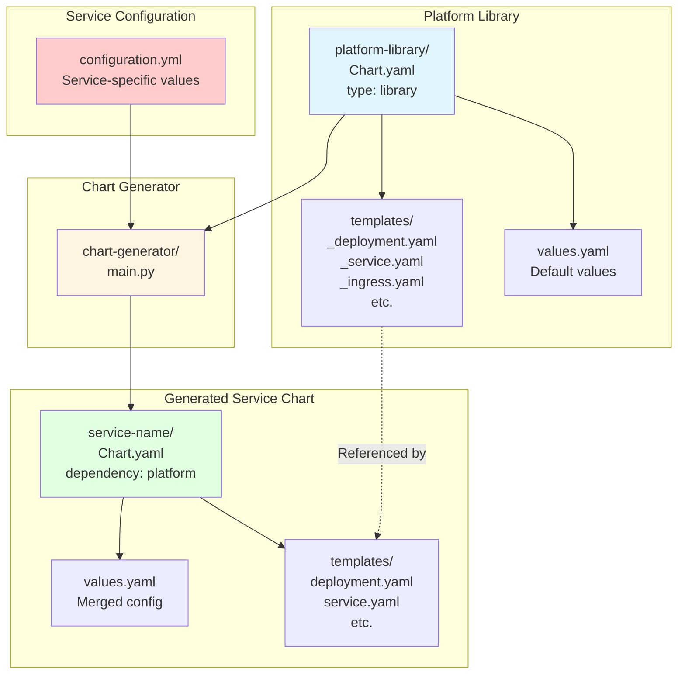
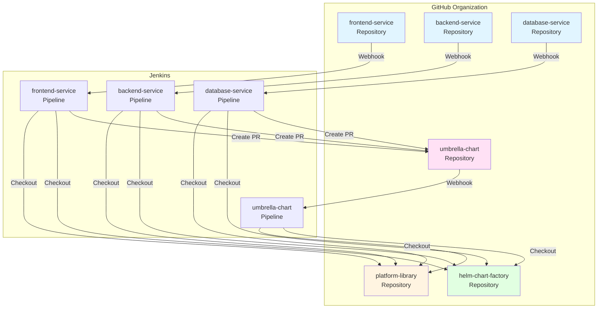
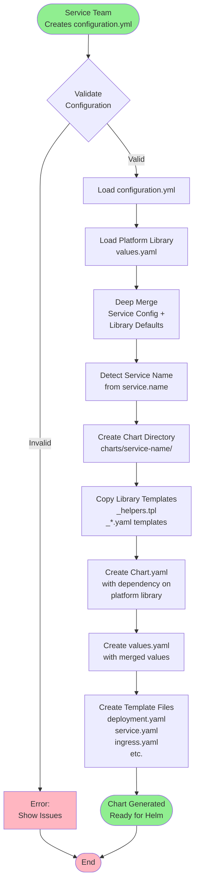
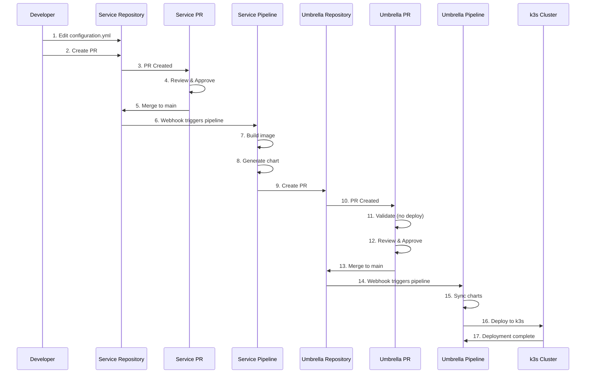
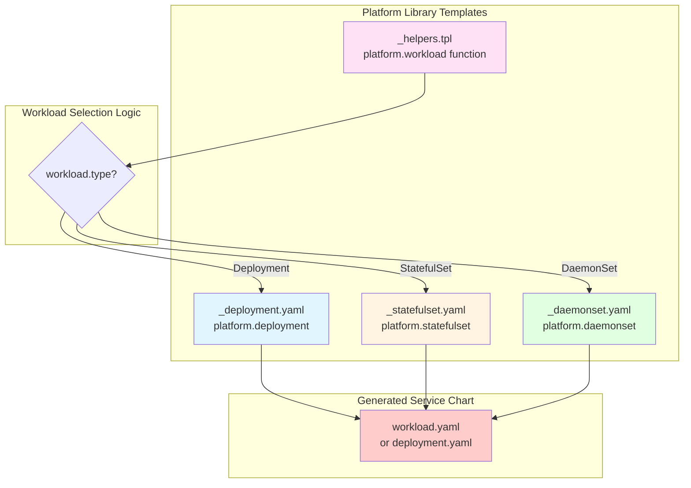
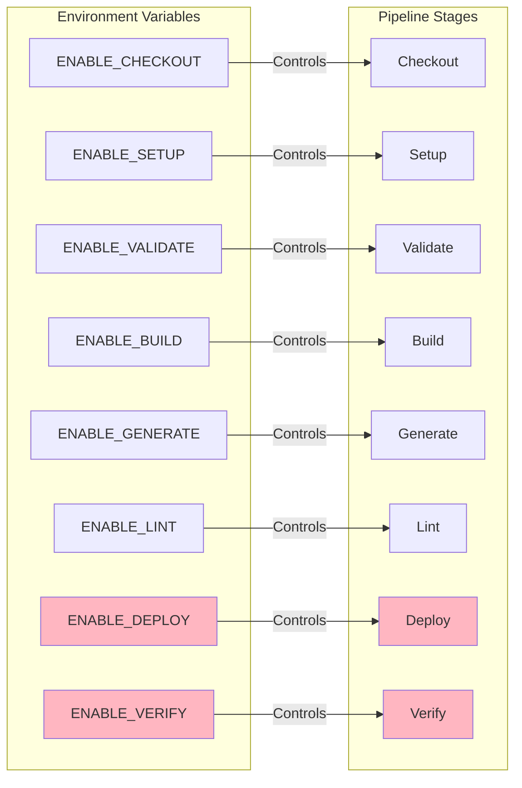
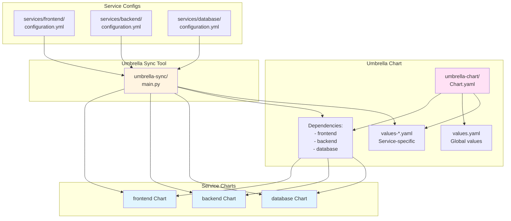
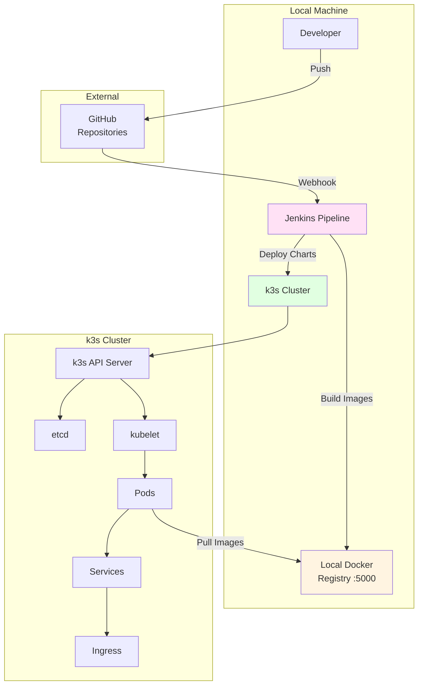

# Architecture Decision Records (ADR)

This document contains Architecture Decision Records (ADRs) for the Helm Chart Factory system. ADRs capture important architectural decisions along with their context, consequences, and alternatives considered.

## Table of Contents

1. [ADR-001: Library Chart Pattern for Platform Standardization](#adr-001-library-chart-pattern-for-platform-standardization)
2. [ADR-002: Multi-Repository Architecture](#adr-002-multi-repository-architecture)
3. [ADR-003: Configuration-Driven Chart Generation](#adr-003-configuration-driven-chart-generation)
4. [ADR-004: Pull Request-Based Workflow](#adr-004-pull-request-based-workflow)
5. [ADR-005: Support for Multiple Workload Types](#adr-005-support-for-multiple-workload-types)
6. [ADR-006: Stage Toggles for Pipeline Flexibility](#adr-006-stage-toggles-for-pipeline-flexibility)
7. [ADR-007: Umbrella Chart for Service Orchestration](#adr-007-umbrella-chart-for-service-orchestration)
8. [ADR-008: Local Development Environment with k3s](#adr-008-local-development-environment-with-k3s)

---

## ADR-001: Library Chart Pattern for Platform Standardization

**Status:** Accepted  
**Date:** 2024-11-14  
**Deciders:** Platform Team  
**Tags:** helm, charts, standardization

### Context

Service teams need to deploy applications to Kubernetes using Helm charts, but each team creating their own charts leads to:
- Inconsistent security practices
- Duplication of best practices code
- Difficulty maintaining standards across teams
- Risk of misconfiguration

### Decision

We will use Helm's **library chart pattern** to create a centralized `platform-library` chart that contains reusable templates and best practices. Service teams submit a `configuration.yml` file (similar to `values.yaml`), and a chart generator tool automatically creates service-specific Helm charts that depend on the platform library.

### Architecture



### Consequences

**Positive:**
- ✅ Centralized best practices enforcement
- ✅ Consistent security contexts, resource limits, and probes
- ✅ Easy to update standards across all services
- ✅ Service teams focus on application config, not Kubernetes manifests
- ✅ Reduced risk of misconfiguration

**Negative:**
- ⚠️ Platform team must maintain library chart
- ⚠️ Changes to library chart affect all services
- ⚠️ Service teams have less flexibility (by design)

**Neutral:**
- Service charts are generated, not manually maintained
- Requires chart generator tool

### Alternatives Considered

1. **Shared Templates Repository**: Teams copy templates manually
   - ❌ Rejected: No enforcement, templates get out of sync

2. **Helm Plugin**: Create a Helm plugin for standardization
   - ❌ Rejected: More complex, harder to maintain

3. **Kustomize Overlays**: Use Kustomize for standardization
   - ❌ Rejected: Less mature ecosystem, fewer features

---

## ADR-002: Multi-Repository Architecture

**Status:** Accepted  
**Date:** 2024-11-14  
**Deciders:** Platform Team, DevOps Team  
**Tags:** git, repositories, ci-cd

### Context

The system needs to support:
- Platform team maintaining library chart independently
- Service teams owning their service code and configuration
- Centralized umbrella chart for deployment orchestration
- CI/CD pipelines that can trigger independently

### Decision

We will use a **multi-repository architecture** with separate GitHub repositories:
- `platform-library` - Platform team's library chart
- `*-service` repositories - Each service has its own repository
- `umbrella-chart` - Umbrella chart repository
- `helm-chart-factory` - Tools and documentation repository

### Architecture



### Consequences

**Positive:**
- ✅ Clear ownership boundaries
- ✅ Independent versioning and releases
- ✅ Service teams can work independently
- ✅ Platform team controls library chart evolution
- ✅ Fine-grained access control per repository
- ✅ Independent CI/CD pipelines

**Negative:**
- ⚠️ More repositories to manage
- ⚠️ Requires coordination for cross-repo changes
- ⚠️ More complex webhook configuration

**Neutral:**
- Requires tooling to sync across repositories
- PR-based workflow adds review step

### Alternatives Considered

1. **Monorepo**: Single repository with all services
   - ❌ Rejected: Harder to manage permissions, all teams see all code

2. **Two Repositories**: Platform repo + Services repo
   - ❌ Rejected: Services repo becomes bottleneck, harder to scale

3. **Git Submodules**: Use submodules for library chart
   - ❌ Rejected: Submodules are complex and error-prone

---

## ADR-003: Configuration-Driven Chart Generation

**Status:** Accepted  
**Date:** 2024-11-14  
**Deciders:** Platform Team  
**Tags:** automation, code-generation, helm

### Context

Service teams need Helm charts but shouldn't need to:
- Write Helm templates
- Understand Kubernetes resource details
- Maintain chart structure
- Keep up with best practice changes

### Decision

We will use a **configuration-driven approach** where:
1. Service teams create a `configuration.yml` file (similar to `values.yaml`)
2. A Python tool (`chart-generator`) reads the configuration
3. The tool merges service config with platform library defaults
4. The tool generates a complete Helm chart structure
5. Generated charts reference platform library templates

### Process Flow



### Consequences

**Positive:**
- ✅ Service teams only write YAML configuration
- ✅ No Helm template knowledge required
- ✅ Consistent chart structure across all services
- ✅ Easy to update generation logic
- ✅ Can add new features by updating generator

**Negative:**
- ⚠️ Less flexibility for edge cases
- ⚠️ Requires generator tool maintenance
- ⚠️ Generated charts may be harder to debug

**Neutral:**
- Charts are generated, not committed to git (usually)
- Generator can be extended for new features

### Alternatives Considered

1. **Helm Scaffold**: Use `helm create` and customize
   - ❌ Rejected: Teams would still need Helm knowledge

2. **Template Repository**: Copy templates and customize
   - ❌ Rejected: No enforcement, templates diverge

3. **Helmfile**: Use Helmfile for configuration
   - ❌ Rejected: Adds another tool, less standard

---

## ADR-004: Pull Request-Based Workflow

**Status:** Accepted  
**Date:** 2024-11-14  
**Deciders:** Platform Team, DevOps Team  
**Tags:** git, workflow, ci-cd

### Context

We need a workflow that:
- Allows review before changes are deployed
- Prevents direct pushes to production
- Provides audit trail
- Enables rollback
- Supports multiple environments

### Decision

We will use a **pull request-based workflow**:
1. Service teams create PRs in their service repositories
2. PRs are reviewed and merged to `main`
3. Merging to `main` triggers service pipeline
4. Service pipeline creates PR to umbrella-chart repository
5. Umbrella PR is reviewed and merged
6. Merging umbrella PR triggers deployment

### Workflow Diagram



### Consequences

**Positive:**
- ✅ Review process before deployment
- ✅ No direct pushes to production
- ✅ Clear audit trail
- ✅ Easy rollback (revert PR)
- ✅ Validation before merge
- ✅ Can test PR changes without deploying

**Negative:**
- ⚠️ More steps in workflow
- ⚠️ Requires PR reviewers
- ⚠️ Slower deployment cycle

**Neutral:**
- PRs can be auto-merged with proper checks
- Can add status checks for automation

### Alternatives Considered

1. **Direct Push to Main**: Merge directly, deploy automatically
   - ❌ Rejected: No review, higher risk

2. **Feature Branches**: Use feature branches with auto-merge
   - ❌ Rejected: Less control, harder to review

3. **GitOps with ArgoCD**: Use ArgoCD for GitOps
   - ⚠️ Considered: May adopt later, but PR workflow provides better control for POC

---

## ADR-005: Support for Multiple Workload Types

**Status:** Accepted  
**Date:** 2024-11-14  
**Deciders:** Platform Team  
**Tags:** kubernetes, workloads, flexibility

### Context

Different services have different requirements:
- Stateless web apps → Deployment
- Databases → StatefulSet (persistent storage, stable identity)
- Node agents → DaemonSet (one per node)

Using only Deployment limits flexibility and forces workarounds.

### Decision

We will support **multiple Kubernetes workload types**:
- **Deployment** (default) - For stateless applications
- **StatefulSet** - For stateful applications with persistent storage
- **StatefulSet** - For stateful applications with persistent storage
- **DaemonSet** - For node-level agents

Service teams specify workload type in `configuration.yml`:

```yaml
workload:
  type: StatefulSet  # or Deployment, DaemonSet
```

### Architecture



### Consequences

**Positive:**
- ✅ Supports diverse service requirements
- ✅ No workarounds needed
- ✅ Proper Kubernetes resource types
- ✅ StatefulSet gets persistent storage automatically
- ✅ DaemonSet schedules correctly

**Negative:**
- ⚠️ More templates to maintain
- ⚠️ HPA only works with Deployment/StatefulSet
- ⚠️ Some features workload-specific

**Neutral:**
- Default remains Deployment (backward compatible)
- Can add more workload types later

### Alternatives Considered

1. **Deployment Only**: Force all services to use Deployment
   - ❌ Rejected: Databases need StatefulSet, agents need DaemonSet

2. **Separate Generators**: Different generators per workload type
   - ❌ Rejected: Too much duplication, harder to maintain

3. **Custom Resources**: Create custom workload resources
   - ❌ Rejected: Adds complexity, not standard Kubernetes

---

## ADR-006: Stage Toggles for Pipeline Flexibility

**Status:** Accepted  
**Date:** 2024-11-14  
**Deciders:** Platform Team, DevOps Team  
**Tags:** jenkins, ci-cd, flexibility

### Context

During POC, we need to:
- Skip deployment stages (no k3s cluster available)
- Test chart generation without deployment
- Enable/disable features as needed
- Support different environments (dev, staging, prod)

### Decision

We will add **environment variable toggles** for all Jenkins pipeline stages. Each stage checks an `ENABLE_*` environment variable before executing. Defaults are set for POC (deployment disabled).

### Toggle Structure



### Consequences

**Positive:**
- ✅ Flexible pipeline configuration
- ✅ POC can skip deployment
- ✅ Easy to enable/disable features
- ✅ Supports multiple environments
- ✅ Can test individual stages

**Negative:**
- ⚠️ More environment variables to manage
- ⚠️ Must document all toggles
- ⚠️ Risk of misconfiguration

**Neutral:**
- Defaults set for POC
- Can override per job or globally

### Alternatives Considered

1. **Separate Pipelines**: Different pipelines for POC vs production
   - ❌ Rejected: Duplication, harder to maintain

2. **Pipeline Parameters**: Use Jenkins parameters
   - ⚠️ Considered: Good for interactive use, but env vars simpler for automation

3. **Feature Flags**: Use feature flag service
   - ❌ Rejected: Overkill for this use case

---

## ADR-007: Umbrella Chart for Service Orchestration

**Status:** Accepted  
**Date:** 2024-11-14  
**Deciders:** Platform Team  
**Tags:** helm, orchestration, deployment

### Context

We need to:
- Deploy multiple services together
- Manage dependencies between services
- Coordinate updates across services
- Provide single deployment point

### Decision

We will use an **umbrella chart** pattern where:
1. Umbrella chart depends on all service charts
2. Service configurations are stored in `services/` directory
3. Umbrella sync tool automatically updates dependencies
4. Single `helm install` deploys all services

### Architecture



### Consequences

**Positive:**
- ✅ Single deployment command
- ✅ Coordinated updates
- ✅ Shared configuration
- ✅ Dependency management
- ✅ Atomic deployments

**Negative:**
- ⚠️ All services deploy together
- ⚠️ One failure affects all
- ⚠️ Requires sync tool

**Neutral:**
- Can deploy individual charts if needed
- Umbrella chart is auto-generated

### Alternatives Considered

1. **Individual Deployments**: Deploy each service separately
   - ❌ Rejected: No coordination, harder to manage

2. **Helmfile**: Use Helmfile for multi-chart deployment
   - ⚠️ Considered: Good alternative, but umbrella chart is more standard

3. **Kustomize**: Use Kustomize overlays
   - ❌ Rejected: Less mature, fewer features

---

## ADR-008: Local Development Environment with k3s

**Status:** Accepted  
**Date:** 2024-11-14  
**Deciders:** Platform Team, DevOps Team  
**Tags:** kubernetes, local-development, testing

### Context

We need a local Kubernetes environment for:
- Testing chart generation
- Validating deployments
- POC demonstrations
- Developer onboarding

Options include: minikube, kind, k3s, Docker Desktop Kubernetes.

### Decision

We will use **k3s** as the local Kubernetes environment because:
- Lightweight and fast startup
- Single binary, easy installation
- Full Kubernetes API compatibility
- Good for CI/CD pipelines
- Works well in containers

### Architecture



### Consequences

**Positive:**
- ✅ Fast startup (< 30 seconds)
- ✅ Low resource usage
- ✅ Full Kubernetes API
- ✅ Good for CI/CD
- ✅ Easy to reset/cleanup

**Negative:**
- ⚠️ Some differences from production clusters
- ⚠️ Single node (no HA testing)
- ⚠️ Limited storage options

**Neutral:**
- Can switch to other solutions later
- Production can use different distribution

### Alternatives Considered

1. **minikube**: Local Kubernetes
   - ⚠️ Considered: Heavier, slower startup

2. **kind**: Kubernetes in Docker
   - ⚠️ Considered: Good for CI, but more complex setup

3. **Docker Desktop Kubernetes**: Built-in K8s
   - ❌ Rejected: Platform-specific, licensing issues

4. **Production-like Cluster**: Use cloud cluster
   - ❌ Rejected: Cost, complexity, not local

---

## Summary

These ADRs document the key architectural decisions for the Helm Chart Factory system:

1. **Library Chart Pattern** - Centralized best practices
2. **Multi-Repository Architecture** - Clear ownership boundaries
3. **Configuration-Driven Generation** - Simplified developer experience
4. **Pull Request Workflow** - Review and audit trail
5. **Multiple Workload Types** - Flexibility for different services
6. **Stage Toggles** - Pipeline flexibility for POC and production
7. **Umbrella Chart** - Coordinated multi-service deployment
8. **k3s for Local Development** - Fast, lightweight testing environment

Each decision balances trade-offs between flexibility, maintainability, and ease of use, with a focus on enabling service teams while maintaining platform standards.

