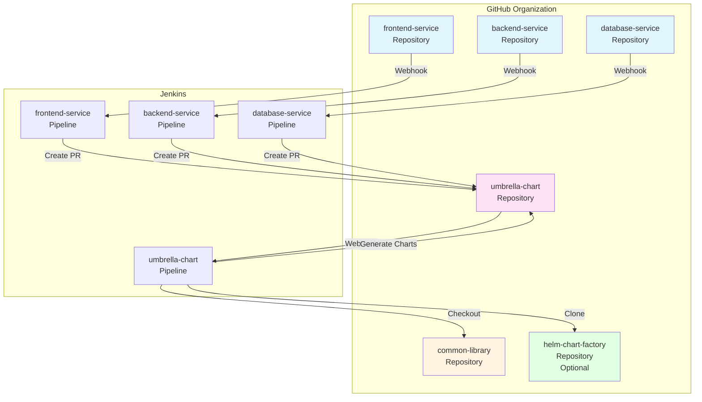
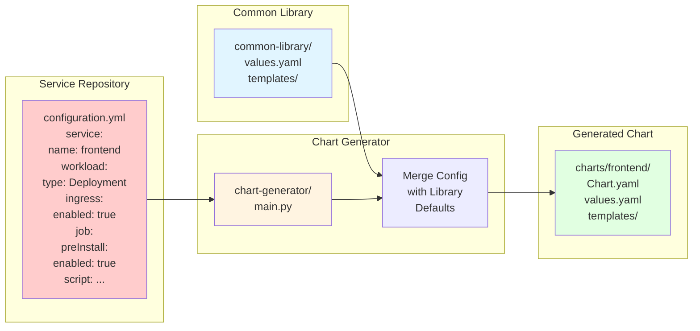
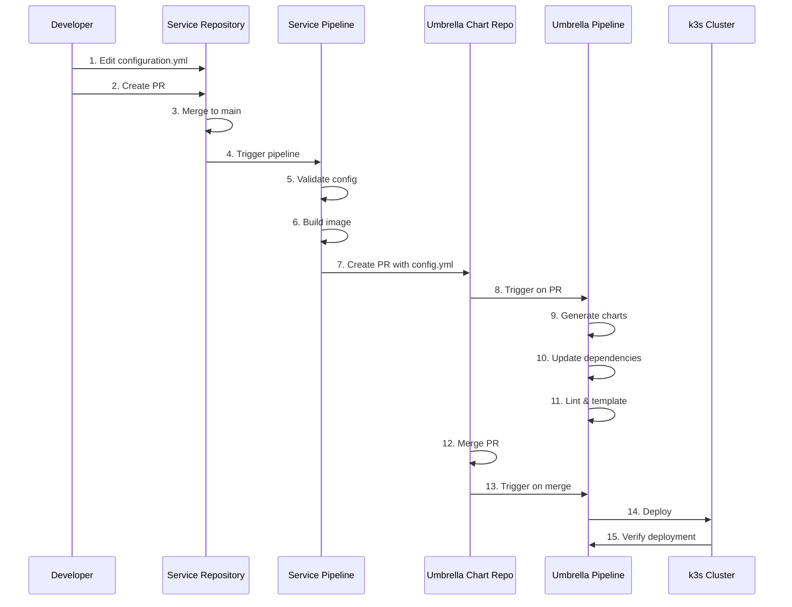
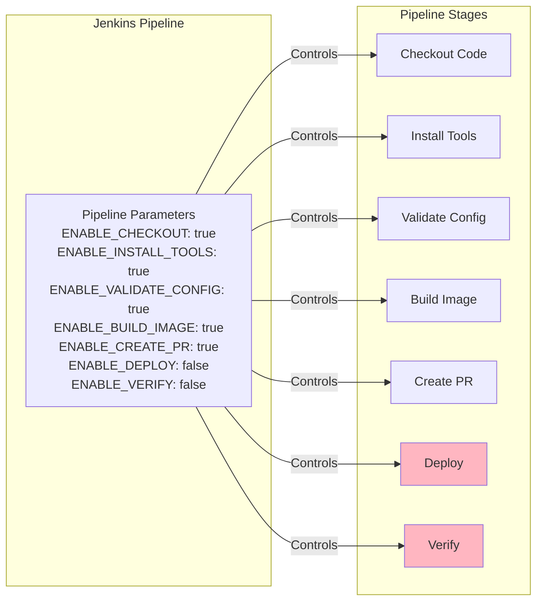
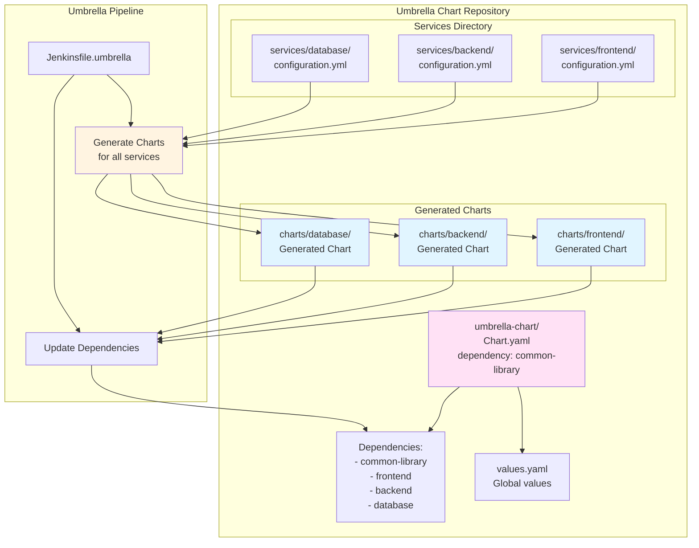
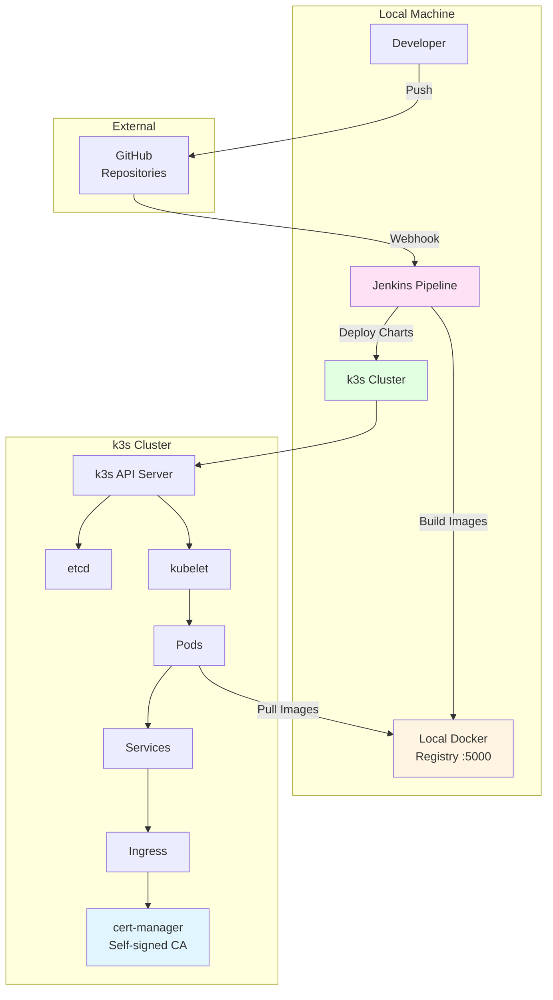
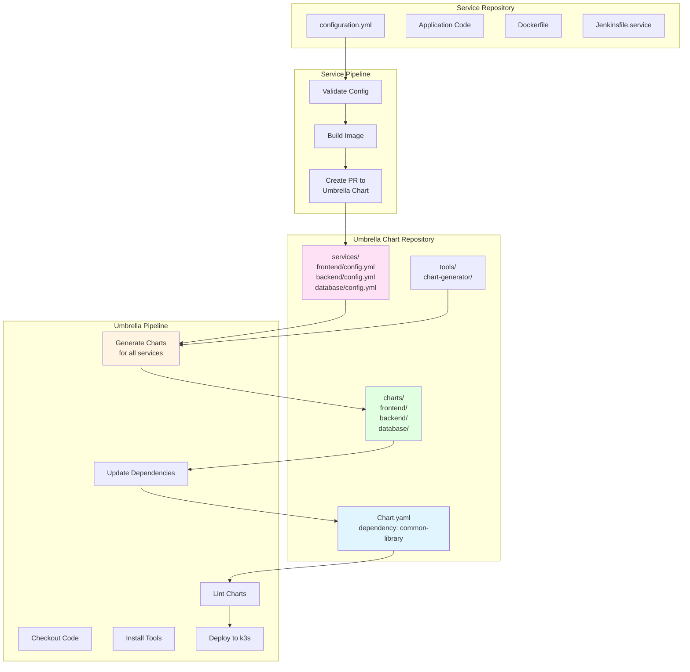
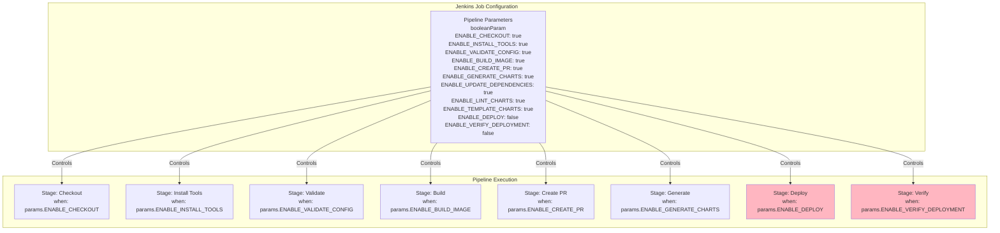

```mermaid
graph TB
    subgraph "Common Library"
        LC[common-library/<br/>Chart.yaml<br/>type: library]
        LC --> TEMPLATES[templates/<br/>_deployment.yaml<br/>_service.yaml<br/>_ingress.yaml<br/>_statefulset.yaml<br/>_daemonset.yaml<br/>_job.yaml<br/>etc.]
        LC --> VALUES[values.yaml<br/>Default values]
    end
    
    subgraph "Service Configuration"
        CFG[configuration.yml<br/>Service-specific values]
    end
    
    subgraph "Chart Generator"
        CG[chart-generator/<br/>main.py]
    end
    
    subgraph "Generated Service Chart"
        SCHART[service-name/<br/>Chart.yaml<br/>dependency: common-library]
        SCHART --> SVALS[values.yaml<br/>Merged config]
        SCHART --> STEMPLATES[templates/<br/>workload.yaml<br/>service.yaml<br/>ingress.yaml<br/>etc.]
    end
    
    CFG --> CG
    LC --> CG
    CG --> SCHART
    
    TEMPLATES -.->|Referenced by| STEMPLATES
    
    style LC fill:#e1f5ff
    style CFG fill:#ffcccc
    style CG fill:#fff4e1
    style SCHART fill:#e1ffe1
```

# Architecture Decision Records (ADR)

This document contains Architecture Decision Records (ADRs) for the Helm Chart Factory system. ADRs capture important architectural decisions along with their context, consequences, and alternatives considered.

## Table of Contents

- [Architecture Decision Records (ADR)](#architecture-decision-records-adr)
  - [Table of Contents](#table-of-contents)
  - [ADR-001: Library Chart Pattern for Platform Standardization](#adr-001-library-chart-pattern-for-platform-standardization)
    - [Context](#context)
    - [Decision](#decision)
    - [Architecture](#architecture)
    - [Consequences](#consequences)
    - [Alternatives Considered](#alternatives-considered)
  - [ADR-002: Multi-Repository Architecture](#adr-002-multi-repository-architecture)
    - [Context](#context-1)
    - [Decision](#decision-1)
    - [Architecture](#architecture-1)
    - [Consequences](#consequences-1)
    - [Alternatives Considered](#alternatives-considered-1)
  - [ADR-003: Configuration-Driven Chart Generation](#adr-003-configuration-driven-chart-generation)
    - [Context](#context-2)
    - [Decision](#decision-2)
    - [Architecture](#architecture-2)
    - [Consequences](#consequences-2)
    - [Alternatives Considered](#alternatives-considered-2)
  - [ADR-004: Pull Request-Based Workflow](#adr-004-pull-request-based-workflow)
    - [Context](#context-3)
    - [Decision](#decision-3)
    - [Architecture](#architecture-3)
    - [Consequences](#consequences-3)
    - [Alternatives Considered](#alternatives-considered-3)
  - [ADR-005: Support for Multiple Workload Types](#adr-005-support-for-multiple-workload-types)
    - [Context](#context-4)
    - [Decision](#decision-4)
    - [Architecture](#architecture-4)
    - [Consequences](#consequences-4)
    - [Alternatives Considered](#alternatives-considered-4)
  - [ADR-006: Stage Toggles for Pipeline Flexibility](#adr-006-stage-toggles-for-pipeline-flexibility)
    - [Context](#context-5)
    - [Decision](#decision-5)
    - [Architecture](#architecture-5)
    - [Consequences](#consequences-5)
    - [Alternatives Considered](#alternatives-considered-5)
  - [ADR-007: Umbrella Chart for Service Orchestration](#adr-007-umbrella-chart-for-service-orchestration)
    - [Context](#context-6)
    - [Decision](#decision-6)
    - [Architecture](#architecture-6)
    - [Consequences](#consequences-6)
    - [Alternatives Considered](#alternatives-considered-6)
  - [ADR-008: Local Development Environment with k3s](#adr-008-local-development-environment-with-k3s)
    - [Context](#context-7)
    - [Decision](#decision-7)
    - [Architecture](#architecture-7)
    - [Consequences](#consequences-7)
    - [Alternatives Considered](#alternatives-considered-7)
  - [ADR-009: Centralized Chart Generation in Umbrella Repository](#adr-009-centralized-chart-generation-in-umbrella-repository)
    - [Context](#context-8)
    - [Decision](#decision-8)
    - [Architecture](#architecture-8)
    - [Consequences](#consequences-8)
    - [Alternatives Considered](#alternatives-considered-8)
  - [ADR-010: Jenkins Pipeline Parameters for Stage Control](#adr-010-jenkins-pipeline-parameters-for-stage-control)
    - [Context](#context-9)
    - [Decision](#decision-9)
    - [Architecture](#architecture-9)
    - [Implementation Details](#implementation-details)
    - [Consequences](#consequences-9)
    - [Alternatives Considered](#alternatives-considered-9)
  - [Summary](#summary)

---

## ADR-001: Library Chart Pattern for Platform Standardization

**Status:** Accepted  
**Date:** 2024-11-14  
**Deciders:** Platform Team  
**Tags:** helm, charts, standardization

### Context

Service teams need to deploy applications to Kubernetes using Helm charts, but each team creating their own charts leads to:
- Inconsistent security practices
- Duplication of best practices code
- Difficulty maintaining standards across teams
- Risk of misconfiguration

### Decision

We will use Helm's **library chart pattern** to create a centralized `common-library` chart that contains reusable templates and best practices. Service teams submit a `configuration.yml` file (similar to `values.yaml`), and a chart generator tool automatically creates service-specific Helm charts that depend on the common library.

### Architecture



### Consequences

**Positive:**
- ✅ Centralized best practices enforcement
- ✅ Consistent security contexts, resource limits, and probes
- ✅ Easy to update standards across all services
- ✅ Service teams focus on application config, not Kubernetes manifests
- ✅ Reduced risk of misconfiguration
- ✅ Support for multiple workload types (Deployment, StatefulSet, DaemonSet)
- ✅ Support for pre-install and post-install Jobs

**Negative:**
- ⚠️ Platform team must maintain library chart
- ⚠️ Changes to library chart affect all services
- ⚠️ Service teams have less flexibility (by design)

**Neutral:**
- Service charts are generated, not manually maintained
- Requires chart generator tool

### Alternatives Considered

1. **Shared Templates Repository**: Teams copy templates manually
   - ❌ Rejected: No enforcement, templates get out of sync

2. **Helm Plugin**: Create a Helm plugin for standardization
   - ❌ Rejected: More complex, harder to maintain

3. **Kustomize Overlays**: Use Kustomize for standardization
   - ❌ Rejected: Less mature ecosystem, fewer features

---

## ADR-002: Multi-Repository Architecture

**Status:** Accepted  
**Date:** 2024-11-14  
**Deciders:** Platform Team, DevOps Team  
**Tags:** git, repositories, ci-cd

### Context

The system needs to support:
- Platform team maintaining library chart independently
- Service teams owning their service code and configuration
- Centralized umbrella chart for deployment orchestration
- CI/CD pipelines that can trigger independently

### Decision

We will use a **multi-repository architecture** with separate GitHub repositories:
- `common-library` - Platform team's library chart (renamed from platform-library)
- `*-service` repositories - Each service has its own repository
- `umbrella-chart` - Umbrella chart repository (contains all service configs and generated charts)
- `helm-chart-factory` - Tools and documentation repository (optional, tools can be cloned)

### Architecture



### Consequences

**Positive:**
- ✅ Clear ownership boundaries
- ✅ Independent versioning and releases
- ✅ Service teams can work independently
- ✅ Platform team controls library chart evolution
- ✅ Fine-grained access control per repository
- ✅ Independent CI/CD pipelines

**Negative:**
- ⚠️ More repositories to manage
- ⚠️ Requires coordination for cross-repo changes
- ⚠️ More complex webhook configuration

**Neutral:**
- Requires tooling to sync across repositories
- PR-based workflow adds review step

### Alternatives Considered

1. **Monorepo**: Single repository with all services
   - ❌ Rejected: Harder to manage permissions, all teams see all code

2. **Two Repositories**: Platform repo + Services repo
   - ❌ Rejected: Services repo becomes bottleneck, harder to scale

3. **Git Submodules**: Use submodules for library chart
   - ❌ Rejected: Submodules are complex and error-prone

---

## ADR-003: Configuration-Driven Chart Generation

**Status:** Accepted  
**Date:** 2024-11-14  
**Deciders:** Platform Team  
**Tags:** automation, code-generation, helm

### Context

Service teams need Helm charts but shouldn't need to:
- Write Helm templates
- Understand Kubernetes resource details
- Maintain chart structure
- Keep up with best practice changes

### Decision

We will use a **configuration-driven approach** where:
1. Service teams create a `configuration.yml` file (similar to `values.yaml`)
2. Configuration specifies features like `ingress: enable`, `mtls: enable`, `certificate: enable`
3. Chart generator merges configuration with library chart defaults
4. Generated charts reference common-library as dependency
5. Configuration supports workload types (Deployment, StatefulSet, DaemonSet)
6. Configuration supports pre-install and post-install Jobs with inline scripts or script files

### Architecture



### Consequences

**Positive:**
- ✅ Simple YAML configuration for service teams
- ✅ No Helm template knowledge required
- ✅ Configuration validation possible
- ✅ Easy to understand and modify
- ✅ Supports multiple workload types
- ✅ Supports Jobs with scripts

**Negative:**
- ⚠️ Less flexible than writing custom templates
- ⚠️ Configuration format must be documented
- ⚠️ Changes to configuration format require updates across services

**Neutral:**
- Configuration acts as values.yaml
- Generated charts are not manually edited

### Alternatives Considered

1. **Full Helm Charts**: Service teams write complete charts
   - ❌ Rejected: Too complex, inconsistent practices

2. **Helm Values Only**: Teams provide values.yaml
   - ⚠️ Considered: Less structured, harder to validate

3. **JSON Schema**: Use JSON Schema for configuration
   - ⚠️ Considered: More validation, but YAML is more readable

---

## ADR-004: Pull Request-Based Workflow

**Status:** Accepted  
**Date:** 2024-11-14  
**Deciders:** Platform Team, DevOps Team  
**Tags:** git, workflow, ci-cd

### Context

When service configurations change, the umbrella chart needs to be updated. We need a workflow that:
- Triggers on service configuration changes
- Updates umbrella chart with new configurations
- Allows for review and approval
- Maintains audit trail

### Decision

We will use a **Pull Request-based workflow**:
1. Service pipelines trigger on PRs and merges to main branch
2. When `configuration.yml` changes and merges to main, service pipeline creates a PR to umbrella chart repository
3. PR includes the updated `configuration.yml` in `services/{SERVICE_NAME}/`
4. Umbrella chart pipeline validates PR changes (lint, template)
5. On merge to main, umbrella chart pipeline generates charts and deploys to k3s

### Architecture



### Consequences

**Positive:**
- ✅ Changes are reviewed before deployment
- ✅ Clear audit trail
- ✅ Can validate changes before merging
- ✅ Follows GitOps best practices
- ✅ Service teams don't need direct access to umbrella repo

**Negative:**
- ⚠️ Additional PR step adds latency
- ⚠️ Requires GitHub API access
- ⚠️ More complex CI/CD setup

**Neutral:**
- PRs can be auto-merged if validation passes
- Can configure branch protection rules

### Alternatives Considered

1. **Direct Push**: Service pipelines push directly to umbrella repo
   - ❌ Rejected: No review process, risk of breaking changes

2. **Webhook Triggers**: Umbrella repo watches service repos
   - ⚠️ Considered: More complex, harder to debug

3. **Scheduled Sync**: Periodic sync job
   - ❌ Rejected: Delayed updates, not real-time

---

## ADR-005: Support for Multiple Workload Types

**Status:** Accepted  
**Date:** 2024-11-14  
**Deciders:** Platform Team  
**Tags:** kubernetes, workloads, flexibility

### Context

Different services have different requirements:
- Stateless services: Deployment (most common)
- Stateful services: StatefulSet (databases, stateful apps)
- Node-level services: DaemonSet (monitoring, logging)

### Decision

We will support **multiple workload types** in the common-library chart:
1. Developers specify `workload.type` in `configuration.yml` (default: `Deployment`)
2. Library chart includes templates for Deployment, StatefulSet, and DaemonSet
3. Chart generator creates appropriate templates based on workload type
4. HPA only supported for Deployment and StatefulSet
5. StatefulSet supports `volumeClaimTemplates` for persistent storage
6. DaemonSet supports `nodeSelector` and `tolerations`

### Architecture

```mermaid
graph TB
    subgraph "Configuration"
        CFG[configuration.yml<br/>workload:<br/>  type: StatefulSet]
    end
    
    subgraph "Chart Generator"
        CG[chart-generator<br/>Detects workload type]
    end
    
    subgraph "Common Library Templates"
        DEPLOY[_deployment.yaml]
        STATEFUL[_statefulset.yaml]
        DAEMON[_daemonset.yaml]
        HELPER[_helpers.tpl<br/>platform.workload]
    end
    
    subgraph "Generated Chart"
        TEMPLATE[workload.yaml<br/>{{- include "platform.workload" . }}]
    end
    
    CFG --> CG
    CG --> TEMPLATE
    
    HELPER -->|Selects| DEPLOY
    HELPER -->|Selects| STATEFUL
    HELPER -->|Selects| DAEMON
    
    TEMPLATE --> HELPER
    
    style CFG fill:#ffcccc
    style CG fill:#fff4e1
    style TEMPLATE fill:#e1ffe1
    style HELPER fill:#e1f5ff
```

### Consequences

**Positive:**
- ✅ Supports diverse service requirements
- ✅ Single library chart handles all workload types
- ✅ Consistent configuration across workload types
- ✅ Easy to switch workload types

**Negative:**
- ⚠️ More complex library chart templates
- ⚠️ Need to maintain multiple workload templates
- ⚠️ Some features (like HPA) don't apply to all workload types

**Neutral:**
- Default is Deployment (most common)
- Workload type can be changed by updating config

### Alternatives Considered

1. **Deployment Only**: Force all services to use Deployment
   - ❌ Rejected: Doesn't support stateful services or node-level services

2. **Separate Library Charts**: Different charts for each workload type
   - ❌ Rejected: Duplication, harder to maintain

3. **Custom Resources**: Use CRDs for workload types
   - ❌ Rejected: Too complex, requires operator

---

## ADR-006: Stage Toggles for Pipeline Flexibility

**Status:** Accepted  
**Date:** 2024-11-14  
**Deciders:** Platform Team, DevOps Team  
**Tags:** jenkins, ci-cd, flexibility

### Context

Jenkins pipelines need flexibility for different use cases:
- POC: Skip deployment and verification stages
- Testing: Enable all stages
- Production: Enable all stages with additional checks
- Debugging: Run individual stages

### Decision

We will use **Jenkins pipeline parameters** (boolean parameters) to toggle stages:
1. Each stage has a corresponding `ENABLE_*` boolean parameter
2. Parameters are defined in `parameters {}` block
3. Stages use `when { expression { params.ENABLE_* } }` conditions
4. Parameters have sensible defaults (deployment/verification disabled for POC)
5. Parameters are visible and toggleable in Jenkins UI

### Architecture



### Consequences

**Positive:**
- ✅ Native boolean semantics (no string comparison needed)
- ✅ Clear UI in Jenkins for toggling stages
- ✅ Better type safety
- ✅ Easier to understand and use
- ✅ Parameters persist across builds (can be configured per job)
- ✅ Supports different use cases (POC, testing, production)

**Negative:**
- ⚠️ Requires Jenkins job to be configured with parameters (first build)
- ⚠️ Parameters must be set correctly for each use case
- ⚠️ More parameters to document

**Neutral:**
- Defaults set for POC (deployment disabled)
- Can override per job or globally

### Alternatives Considered

1. **Environment Variables**: Use env vars with string comparison
   - ❌ Rejected: Less intuitive, string comparison needed, no UI

2. **Separate Pipelines**: Different pipelines for POC vs production
   - ❌ Rejected: Duplication, harder to maintain

3. **Feature Flags**: Use feature flag service
   - ❌ Rejected: Overkill for this use case

---

## ADR-007: Umbrella Chart for Service Orchestration

**Status:** Accepted  
**Date:** 2024-11-14  
**Deciders:** Platform Team  
**Tags:** helm, orchestration, deployment

### Context

We need to:
- Deploy multiple services together
- Manage dependencies between services
- Coordinate updates across services
- Provide single deployment point
- Store all service configurations centrally

### Decision

We will use an **umbrella chart** pattern where:
1. Umbrella chart has static dependency on common-library
2. Umbrella chart contains all service configurations in `services/` directory
3. Umbrella chart pipeline generates all service charts to `charts/` directory
4. Umbrella chart automatically updates dependencies for all generated charts
5. Single `helm install` deploys all services

### Architecture



### Consequences

**Positive:**
- ✅ Single deployment command
- ✅ Coordinated updates
- ✅ Centralized configuration management
- ✅ Dependency management
- ✅ Atomic deployments
- ✅ All service configs visible in one place

**Negative:**
- ⚠️ All services deploy together
- ⚠️ One failure affects all
- ⚠️ Umbrella repository becomes critical

**Neutral:**
- Can deploy individual charts if needed
- Chart generation happens in umbrella pipeline

### Alternatives Considered

1. **Individual Deployments**: Deploy each service separately
   - ❌ Rejected: No coordination, harder to manage

2. **Helmfile**: Use Helmfile for multi-chart deployment
   - ⚠️ Considered: Good alternative, but umbrella chart is more standard

3. **Kustomize**: Use Kustomize overlays
   - ❌ Rejected: Less mature, fewer features

---

## ADR-008: Local Development Environment with k3s

**Status:** Accepted  
**Date:** 2024-11-14  
**Deciders:** Platform Team, DevOps Team  
**Tags:** kubernetes, local-development, testing

### Context

We need a local Kubernetes environment for:
- Testing chart generation
- Validating deployments
- POC demonstrations
- Developer onboarding

Options include: minikube, kind, k3s, Docker Desktop Kubernetes.

### Decision

We will use **k3s** as the local Kubernetes environment because:
- Lightweight and fast startup
- Single binary, easy installation
- Full Kubernetes API compatibility
- Good for CI/CD pipelines
- Works well in containers
- Includes local Docker registry support

### Architecture



### Consequences

**Positive:**
- ✅ Fast startup (< 30 seconds)
- ✅ Low resource usage
- ✅ Full Kubernetes API
- ✅ Good for CI/CD
- ✅ Easy to reset/cleanup
- ✅ Includes local registry support

**Negative:**
- ⚠️ Some differences from production clusters
- ⚠️ Single node (no HA testing)
- ⚠️ Limited storage options

**Neutral:**
- Can switch to other solutions later
- Production can use different distribution

### Alternatives Considered

1. **minikube**: Local Kubernetes
   - ⚠️ Considered: Heavier, slower startup

2. **kind**: Kubernetes in Docker
   - ⚠️ Considered: Good for CI, but more complex setup

3. **Docker Desktop Kubernetes**: Built-in K8s
   - ❌ Rejected: Platform-specific, licensing issues

4. **Production-like Cluster**: Use cloud cluster
   - ❌ Rejected: Cost, complexity, not local

---

## ADR-009: Centralized Chart Generation in Umbrella Repository

**Status:** Accepted  
**Date:** 2024-11-14  
**Deciders:** Platform Team  
**Tags:** architecture, chart-generation, simplification

### Context

The original architecture had chart generation happening in service repositories. This led to:
- Duplication of chart generation logic across services
- Service repositories containing chart generation tools
- More complex service pipelines
- Difficulty maintaining consistency
- Service teams needing to understand chart generation

### Decision

We will move all chart generation to the **umbrella-chart repository**:
1. Service repositories only contain `configuration.yml` and application code
2. Service pipelines create PRs to umbrella chart with configuration changes
3. Umbrella chart pipeline generates all service charts centrally
4. Chart generator tools live in umbrella repository or are cloned during pipeline
5. Common-library is a static dependency in umbrella Chart.yaml
6. All service configurations stored in `services/` directory
7. All generated charts stored in `charts/` directory

### Architecture



### Consequences

**Positive:**
- ✅ Single source of truth for chart generation
- ✅ Simplified service repositories
- ✅ Easier to maintain chart generation logic
- ✅ Consistent chart generation across all services
- ✅ Centralized visibility of all service configurations
- ✅ Easier dependency management
- ✅ Service teams don't need chart generation knowledge

**Negative:**
- ⚠️ Service teams lose ability to generate charts locally (can be mitigated with local tools)
- ⚠️ Umbrella repository becomes more critical
- ⚠️ All chart generation happens in one place (single point of failure, mitigated by PR workflow)

**Neutral:**
- Chart generator can be run locally for testing
- Tools can be cloned or included in umbrella repo

### Alternatives Considered

1. **Distributed Generation**: Each service repo generates its own chart
   - ❌ Rejected: Duplication, inconsistency, complexity

2. **Centralized Service**: Separate service for chart generation
   - ⚠️ Considered: More infrastructure, but could work

3. **Hybrid**: Service repos generate, umbrella syncs
   - ❌ Rejected: Still has duplication and complexity

---

## ADR-010: Jenkins Pipeline Parameters for Stage Control

**Status:** Accepted  
**Date:** 2024-11-14  
**Deciders:** Platform Team, DevOps Team  
**Tags:** jenkins, ci-cd, parameters

### Context

Previously, stage toggles were implemented as environment variables with string comparisons (`env.ENABLE_STAGE == 'true'`). This approach:
- Required string comparisons in `when` conditions
- Was less intuitive in Jenkins UI
- Didn't provide clear boolean semantics
- Required environment variable setup

### Decision

We will use **Jenkins pipeline parameters** (boolean parameters) for stage toggles:
1. Each stage has a corresponding `ENABLE_*` boolean parameter
2. Parameters are defined in `parameters {}` block at pipeline top
3. Stages use `when { expression { params.ENABLE_* } }` conditions
4. Parameters have sensible defaults (deployment/verification disabled for POC)
5. Parameters are visible and toggleable in Jenkins UI
6. Parameters persist across builds and can be configured per job

### Architecture



### Implementation Details

**Service Pipeline Parameters:**
- `ENABLE_CHECKOUT` (default: true)
- `ENABLE_INSTALL_TOOLS` (default: true)
- `ENABLE_VALIDATE_CONFIG` (default: true)
- `ENABLE_BUILD_IMAGE` (default: true)
- `ENABLE_CREATE_PR` (default: true)

**Umbrella Pipeline Parameters:**
- `ENABLE_CHECKOUT` (default: true)
- `ENABLE_INSTALL_TOOLS` (default: true)
- `ENABLE_GENERATE_CHARTS` (default: true)
- `ENABLE_UPDATE_DEPENDENCIES` (default: true)
- `ENABLE_LINT_CHARTS` (default: true)
- `ENABLE_TEMPLATE_CHARTS` (default: true)
- `ENABLE_DEPLOY` (default: false)
- `ENABLE_VERIFY_DEPLOYMENT` (default: false)

### Consequences

**Positive:**
- ✅ Native boolean semantics (no string comparison needed)
- ✅ Clear UI in Jenkins for toggling stages
- ✅ Better type safety
- ✅ Easier to understand and use
- ✅ Parameters persist across builds (can be configured per job)
- ✅ Visible in Jenkins "Build with Parameters" UI
- ✅ Can be set via Jenkins API for automation

**Negative:**
- ⚠️ Requires Jenkins job to be configured with parameters (first build)
- ⚠️ Parameters must be set correctly for each use case
- ⚠️ More parameters to document
- ⚠️ Parameters need to be defined in Jenkinsfile (can't be changed without code change)

**Neutral:**
- Defaults set for POC (deployment disabled)
- Can override per job or globally
- Parameters are part of pipeline definition

### Alternatives Considered

1. **Environment Variables**: Use env vars with string comparison
   - ❌ Rejected: Less intuitive, string comparison needed, no UI

2. **Jenkins Job Properties**: Configure in Jenkins job settings
   - ⚠️ Considered: More flexible, but not version controlled

3. **Configuration File**: Read from config file in repo
   - ⚠️ Considered: Version controlled, but requires file management

---

## Summary

These ADRs document the key architectural decisions for the Helm Chart Factory system:

1. **Library Chart Pattern** - Centralized best practices with common-library
2. **Multi-Repository Architecture** - Clear ownership boundaries
3. **Configuration-Driven Generation** - Simplified developer experience
4. **Pull Request Workflow** - Review and audit trail
5. **Multiple Workload Types** - Flexibility for different services
6. **Stage Toggles** - Pipeline flexibility using Jenkins parameters
7. **Umbrella Chart** - Coordinated multi-service deployment with centralized generation
8. **k3s for Local Development** - Fast, lightweight testing environment
9. **Centralized Chart Generation** - All charts generated in umbrella repository
10. **Jenkins Pipeline Parameters** - Boolean parameters for stage control

Each decision balances trade-offs between flexibility, maintainability, and ease of use, with a focus on enabling service teams while maintaining platform standards.
