# Architecture Decision Records (ADR)

This document contains Architecture Decision Records (ADRs) for the Helm Chart Factory system. ADRs capture important architectural decisions along with their context, consequences, and alternatives considered.

## Table of Contents

- [Architecture Decision Records (ADR)](#architecture-decision-records-adr)
  - [Table of Contents](#table-of-contents)
  - [ADR-001: Library Chart Pattern for Platform Standardization](#adr-001-library-chart-pattern-for-platform-standardization)
    - [Context](#context)
    - [Decision](#decision)
    - [Architecture](#architecture)
    - [Consequences](#consequences)
    - [Alternatives Considered](#alternatives-considered)
  - [ADR-002: Multi-Repository Architecture](#adr-002-multi-repository-architecture)
    - [Context](#context-1)
    - [Decision](#decision-1)
    - [Architecture](#architecture-1)
    - [Consequences](#consequences-1)
    - [Alternatives Considered](#alternatives-considered-1)
  - [ADR-003: Configuration-Driven Chart Generation](#adr-003-configuration-driven-chart-generation)
    - [Context](#context-2)
    - [Decision](#decision-2)
    - [Architecture](#architecture-2)
    - [Consequences](#consequences-2)
    - [Alternatives Considered](#alternatives-considered-2)
  - [ADR-004: Pull Request-Based Workflow](#adr-004-pull-request-based-workflow)
    - [Context](#context-3)
    - [Decision](#decision-3)
    - [Architecture](#architecture-3)
    - [Consequences](#consequences-3)
    - [Alternatives Considered](#alternatives-considered-3)
  - [ADR-005: Support for Multiple Workload Types](#adr-005-support-for-multiple-workload-types)
    - [Context](#context-4)
    - [Decision](#decision-4)
    - [Architecture](#architecture-4)
    - [Consequences](#consequences-4)
    - [Alternatives Considered](#alternatives-considered-4)
  - [ADR-006: Stage Toggles for Pipeline Flexibility](#adr-006-stage-toggles-for-pipeline-flexibility)
    - [Context](#context-5)
    - [Decision](#decision-5)
    - [Architecture](#architecture-5)
    - [Consequences](#consequences-5)
    - [Alternatives Considered](#alternatives-considered-5)
  - [ADR-007: Umbrella Chart for Service Orchestration](#adr-007-umbrella-chart-for-service-orchestration)
    - [Context](#context-6)
    - [Decision](#decision-6)
    - [Architecture](#architecture-6)
    - [Consequences](#consequences-6)
    - [Alternatives Considered](#alternatives-considered-6)
  - [ADR-008: Kubernetes Cluster for Deployment](#adr-008-kubernetes-cluster-for-deployment)
    - [Context](#context-7)
    - [Decision](#decision-7)
    - [Architecture](#architecture-7)
    - [Consequences](#consequences-7)
    - [Alternatives Considered](#alternatives-considered-7)
  - [ADR-009: Chart Generation in Service Repositories](#adr-009-chart-generation-in-service-repositories)
    - [Context](#context-8)
    - [Decision](#decision-8)
    - [Architecture](#architecture-8)
    - [Consequences](#consequences-8)
    - [Alternatives Considered](#alternatives-considered-8)
  - [ADR-010: Jenkins Pipeline Parameters for Stage Control](#adr-010-jenkins-pipeline-parameters-for-stage-control)
    - [Context](#context-9)
    - [Decision](#decision-9)
    - [Architecture](#architecture-9)
    - [Implementation Details](#implementation-details)
    - [Consequences](#consequences-9)
    - [Alternatives Considered](#alternatives-considered-9)
  - [ADR-011: ECR-Based Container and Helm Chart Registry](#adr-011-ecr-based-container-and-helm-chart-registry)
    - [Context](#context-10)
    - [Decision](#decision-10)
    - [Architecture](#architecture-10)
    - [Consequences](#consequences-10)
    - [Alternatives Considered](#alternatives-considered-10)
  - [Summary](#summary)

---

## ADR-001: Library Chart Pattern for Platform Standardization

**Status:** Accepted  
**Date:** 2024-11-14  
**Deciders:** Platform Team  
**Tags:** helm, charts, standardization

### Context

Service teams need to deploy applications to Kubernetes using Helm charts, but each team creating their own charts leads to:
- Inconsistent security practices
- Duplication of best practices code
- Difficulty maintaining standards across teams
- Risk of misconfiguration

### Decision

We will use Helm's **library chart pattern** to create a centralized `common-library` chart that contains reusable templates and best practices. Service teams submit a `configuration.yml` file (similar to `values.yaml`), and a chart generator tool automatically creates service-specific Helm charts that depend on the common library.

### Architecture

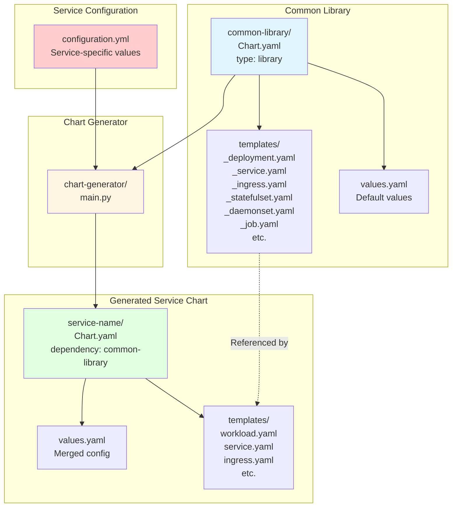

### Consequences

**Positive:**
- ✅ Centralized best practices enforcement
- ✅ Consistent security contexts, resource limits, and probes
- ✅ Easy to update standards across all services
- ✅ Service teams focus on application config, not Kubernetes manifests
- ✅ Reduced risk of misconfiguration
- ✅ Support for multiple workload types (Deployment, StatefulSet, DaemonSet)
- ✅ Support for pre-install and post-install Jobs

**Negative:**
- ⚠️ Platform team must maintain library chart
- ⚠️ Changes to library chart affect all services
- ⚠️ Service teams have less flexibility (by design)

**Neutral:**
- Service charts are generated, not manually maintained
- Requires chart generator tool

### Alternatives Considered

1. **Shared Templates Repository**: Teams copy templates manually
   - ❌ Rejected: No enforcement, templates get out of sync

2. **Helm Plugin**: Create a Helm plugin for standardization
   - ❌ Rejected: More complex, harder to maintain

3. **Kustomize Overlays**: Use Kustomize for standardization
   - ❌ Rejected: Less mature ecosystem, fewer features

---

## ADR-002: Multi-Repository Architecture

**Status:** Accepted  
**Date:** 2024-11-14  
**Deciders:** Platform Team, DevOps Team  
**Tags:** git, repositories, ci-cd

### Context

The system needs to support:
- Platform team maintaining library chart independently
- Service teams owning their service code and configuration
- Centralized umbrella chart for deployment orchestration
- CI/CD pipelines that can trigger independently

### Decision

We will use a **multi-repository architecture** with separate GitHub repositories:
- `common-library` - Platform team's library chart (renamed from platform-library)
- `*-service` repositories - Each service has its own repository
- `umbrella-chart` - Umbrella chart repository (contains all service configs and generated charts)
- `helm-chart-factory` - Tools and documentation repository (optional, tools can be cloned)

### Architecture

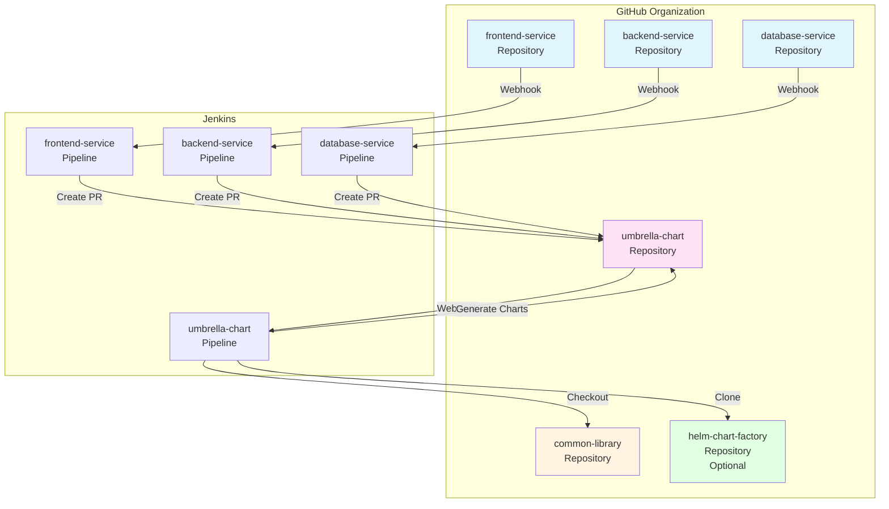

### Consequences

**Positive:**
- ✅ Clear ownership boundaries
- ✅ Independent versioning and releases
- ✅ Service teams can work independently
- ✅ Platform team controls library chart evolution
- ✅ Fine-grained access control per repository
- ✅ Independent CI/CD pipelines

**Negative:**
- ⚠️ More repositories to manage
- ⚠️ Requires coordination for cross-repo changes
- ⚠️ More complex webhook configuration

**Neutral:**
- Requires tooling to sync across repositories
- PR-based workflow adds review step

### Alternatives Considered

1. **Monorepo**: Single repository with all services
   - ❌ Rejected: Harder to manage permissions, all teams see all code

2. **Two Repositories**: Platform repo + Services repo
   - ❌ Rejected: Services repo becomes bottleneck, harder to scale

3. **Git Submodules**: Use submodules for library chart
   - ❌ Rejected: Submodules are complex and error-prone

---

## ADR-003: Configuration-Driven Chart Generation

**Status:** Accepted  
**Date:** 2024-11-14  
**Deciders:** Platform Team  
**Tags:** automation, code-generation, helm

### Context

Service teams need Helm charts but shouldn't need to:
- Write Helm templates
- Understand Kubernetes resource details
- Maintain chart structure
- Keep up with best practice changes

### Decision

We will use a **configuration-driven approach** where:
1. Service teams create a `configuration.yml` file (similar to `values.yaml`)
2. Configuration specifies features like `ingress: enable`, `mtls: enable`, `certificate: enable`
3. When `configuration.yml` changes, service pipeline parses it to create `Chart.yaml` and `values.yaml`
4. `common-library` is added as a dependency to the generated `Chart.yaml`
5. `helm dependency update` is run to resolve dependencies
6. App template (workload.yaml) is included referencing common-library templates
7. Chart validation: `helm lint` and `helm template` are executed
8. Chart is packaged using `helm package`
9. Packaged chart is pushed to ECR (OCI registry)
10. PR is opened against umbrella-chart repository with the generated chart
11. Configuration supports workload types (Deployment, StatefulSet, DaemonSet)
12. Configuration supports pre-install and post-install Jobs with inline scripts or script files

### Architecture

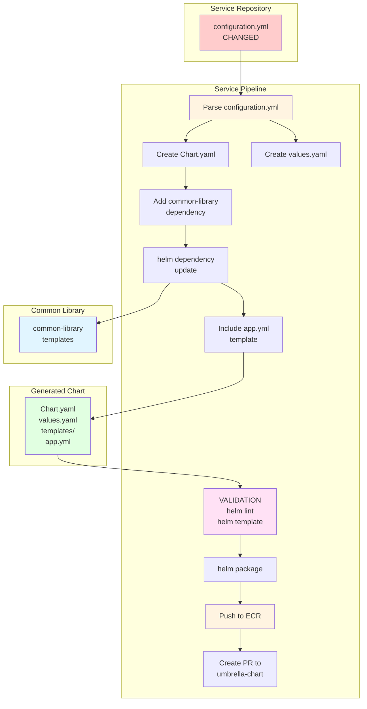

### Consequences

**Positive:**
- ✅ Simple YAML configuration for service teams
- ✅ No Helm template knowledge required
- ✅ Configuration validation possible
- ✅ Easy to understand and modify
- ✅ Supports multiple workload types
- ✅ Supports Jobs with scripts

**Negative:**
- ⚠️ Less flexible than writing custom templates
- ⚠️ Configuration format must be documented
- ⚠️ Changes to configuration format require updates across services

**Neutral:**
- Configuration acts as values.yaml
- Generated charts are not manually edited

### Alternatives Considered

1. **Full Helm Charts**: Service teams write complete charts
   - ❌ Rejected: Too complex, inconsistent practices

2. **Helm Values Only**: Teams provide values.yaml
   - ⚠️ Considered: Less structured, harder to validate

3. **JSON Schema**: Use JSON Schema for configuration
   - ⚠️ Considered: More validation, but YAML is more readable

---

## ADR-004: Pull Request-Based Workflow

**Status:** Accepted  
**Date:** 2024-11-14  
**Deciders:** Platform Team, DevOps Team  
**Tags:** git, workflow, ci-cd

### Context

When service configurations change, the umbrella chart needs to be updated. We need a workflow that:
- Triggers on service configuration changes
- Updates umbrella chart with new configurations
- Allows for review and approval
- Maintains audit trail

### Decision

We will use a **Pull Request-based workflow**:
1. Service pipelines trigger on PRs and merges to main branch
2. When `configuration.yml` changes and merges to main, service pipeline generates Helm chart
3. Service pipeline creates a PR to umbrella chart repository with generated chart
4. PR includes the generated chart in `charts/{SERVICE_NAME}/` and updated configuration in `services/{SERVICE_NAME}/`
5. Umbrella chart pipeline validates PR changes (build dependencies, lint)
6. On merge to main, umbrella chart pipeline builds Helm dependencies
7. If release condition is met, umbrella chart pipeline deploys to replicated SaaS provider

### Architecture

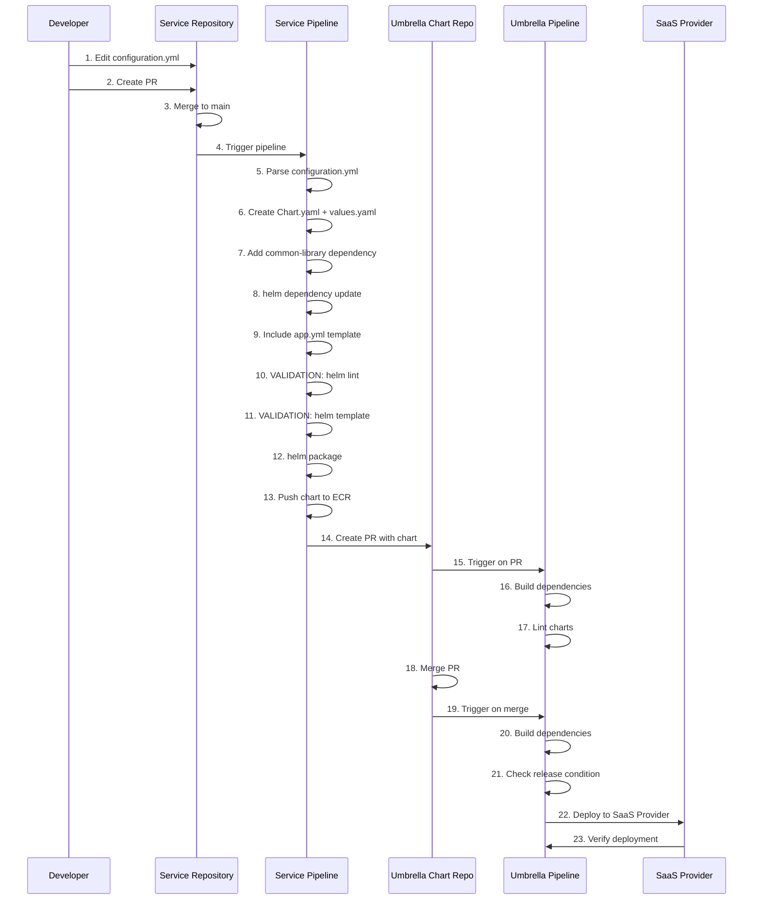

### Consequences

**Positive:**
- ✅ Changes are reviewed before deployment
- ✅ Clear audit trail
- ✅ Can validate changes before merging
- ✅ Follows GitOps best practices
- ✅ Service teams don't need direct access to umbrella repo

**Negative:**
- ⚠️ Additional PR step adds latency
- ⚠️ Requires GitHub API access
- ⚠️ More complex CI/CD setup

**Neutral:**
- PRs can be auto-merged if validation passes
- Can configure branch protection rules

### Alternatives Considered

1. **Direct Push**: Service pipelines push directly to umbrella repo
   - ❌ Rejected: No review process, risk of breaking changes

2. **Webhook Triggers**: Umbrella repo watches service repos
   - ⚠️ Considered: More complex, harder to debug

3. **Scheduled Sync**: Periodic sync job
   - ❌ Rejected: Delayed updates, not real-time

---

## ADR-005: Support for Multiple Workload Types

**Status:** Accepted  
**Date:** 2024-11-14  
**Deciders:** Platform Team  
**Tags:** kubernetes, workloads, flexibility

### Context

Different services have different requirements:
- Stateless services: Deployment (most common)
- Stateful services: StatefulSet (databases, stateful apps)
- Node-level services: DaemonSet (monitoring, logging)

### Decision

We will support **multiple workload types** in the common-library chart:
1. Developers specify `workload.type` in `configuration.yml` (default: `Deployment`)
2. Library chart includes templates for Deployment, StatefulSet, and DaemonSet
3. Chart generator creates appropriate templates based on workload type
4. HPA only supported for Deployment and StatefulSet
5. StatefulSet supports `volumeClaimTemplates` for persistent storage
6. DaemonSet supports `nodeSelector` and `tolerations`

### Architecture

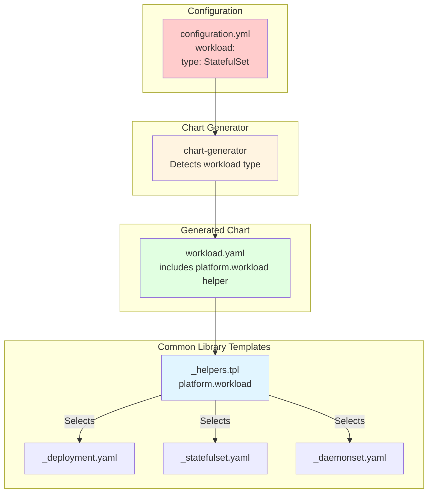

### Consequences

**Positive:**
- ✅ Supports diverse service requirements
- ✅ Single library chart handles all workload types
- ✅ Consistent configuration across workload types
- ✅ Easy to switch workload types

**Negative:**
- ⚠️ More complex library chart templates
- ⚠️ Need to maintain multiple workload templates
- ⚠️ Some features (like HPA) don't apply to all workload types

**Neutral:**
- Default is Deployment (most common)
- Workload type can be changed by updating config

### Alternatives Considered

1. **Deployment Only**: Force all services to use Deployment
   - ❌ Rejected: Doesn't support stateful services or node-level services

2. **Separate Library Charts**: Different charts for each workload type
   - ❌ Rejected: Duplication, harder to maintain

3. **Custom Resources**: Use CRDs for workload types
   - ❌ Rejected: Too complex, requires operator

---

## ADR-006: Stage Toggles for Pipeline Flexibility

**Status:** Accepted  
**Date:** 2024-11-14  
**Deciders:** Platform Team, DevOps Team  
**Tags:** jenkins, ci-cd, flexibility

### Context

Jenkins pipelines need flexibility for different use cases:
- POC: Skip deployment and verification stages
- Testing: Enable all stages
- Production: Enable all stages with additional checks
- Debugging: Run individual stages

### Decision

We will use **Jenkins pipeline parameters** (boolean parameters) to toggle stages:
1. Each stage has a corresponding `ENABLE_*` boolean parameter
2. Parameters are defined in `parameters {}` block
3. Stages use `when { expression { params.ENABLE_* } }` conditions
4. Parameters have sensible defaults (deployment/verification disabled for POC)
5. Parameters are visible and toggleable in Jenkins UI

### Architecture

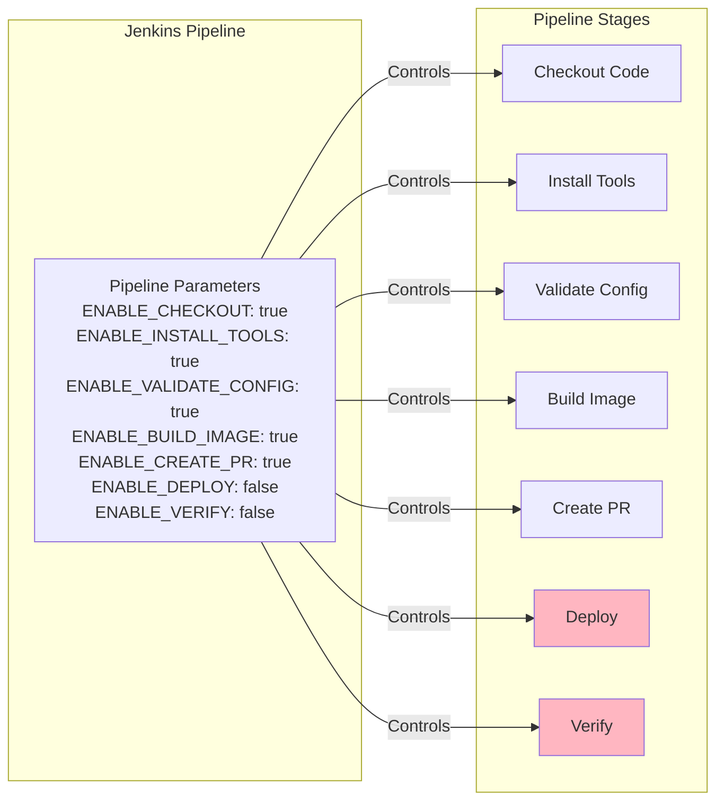

### Consequences

**Positive:**
- ✅ Native boolean semantics (no string comparison needed)
- ✅ Clear UI in Jenkins for toggling stages
- ✅ Better type safety
- ✅ Easier to understand and use
- ✅ Parameters persist across builds (can be configured per job)
- ✅ Supports different use cases (POC, testing, production)

**Negative:**
- ⚠️ Requires Jenkins job to be configured with parameters (first build)
- ⚠️ Parameters must be set correctly for each use case
- ⚠️ More parameters to document

**Neutral:**
- Defaults set for POC (deployment disabled)
- Can override per job or globally

### Alternatives Considered

1. **Environment Variables**: Use env vars with string comparison
   - ❌ Rejected: Less intuitive, string comparison needed, no UI

2. **Separate Pipelines**: Different pipelines for POC vs production
   - ❌ Rejected: Duplication, harder to maintain

3. **Feature Flags**: Use feature flag service
   - ❌ Rejected: Overkill for this use case

---

## ADR-007: Umbrella Chart for Service Orchestration

**Status:** Accepted  
**Date:** 2024-11-14  
**Deciders:** Platform Team  
**Tags:** helm, orchestration, deployment

### Context

We need to:
- Deploy multiple services together
- Manage dependencies between services
- Coordinate updates across services
- Provide single deployment point
- Store all service configurations centrally

### Decision

We will use an **umbrella chart** pattern where:
1. Umbrella chart has static dependency on common-library
2. Umbrella chart receives generated charts from service repositories via PRs
3. Umbrella chart stores service configurations in `services/` directory (copied from service repos)
4. Umbrella chart stores generated charts in `charts/` directory (from service PRs)
5. Umbrella chart pipeline builds Helm dependencies and validates charts
6. If release condition is met, umbrella chart deploys to replicated SaaS provider
7. Single `helm install` deploys all services

### Architecture

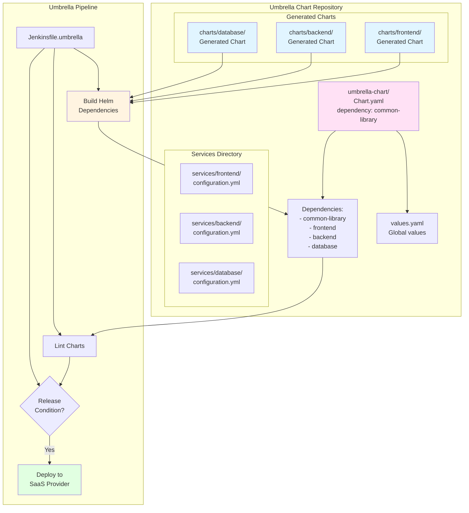

### Consequences

**Positive:**
- ✅ Single deployment command
- ✅ Coordinated updates
- ✅ Centralized configuration management
- ✅ Dependency management
- ✅ Atomic deployments
- ✅ All service configs visible in one place

**Negative:**
- ⚠️ All services deploy together
- ⚠️ One failure affects all
- ⚠️ Umbrella repository becomes critical

**Neutral:**
- Can deploy individual charts if needed
- Chart generation happens in umbrella pipeline

### Alternatives Considered

1. **Individual Deployments**: Deploy each service separately
   - ❌ Rejected: No coordination, harder to manage

2. **Helmfile**: Use Helmfile for multi-chart deployment
   - ⚠️ Considered: Good alternative, but umbrella chart is more standard

3. **Kustomize**: Use Kustomize overlays
   - ❌ Rejected: Less mature, fewer features

---

## ADR-008: Kubernetes Cluster for Deployment

**Status:** Accepted  
**Date:** 2024-11-14  
**Deciders:** Platform Team, DevOps Team  
**Tags:** kubernetes, deployment, infrastructure

### Context

We need Kubernetes clusters for:
- Testing chart generation
- Validating deployments
- QA and production deployments
- Developer onboarding

The system needs to support multiple environments (QA and Production) with appropriate approval gates.

### Decision

We will use **Kubernetes clusters** (generic, not specific to k3s) for deployment:
- Support for multiple environments (QA and Production)
- ECR (Elastic Container Registry) for container images
- ECR OCI registry for Helm charts
- Approval gates for production deployments
- Separate ECR registries for QA and Production environments

### Architecture

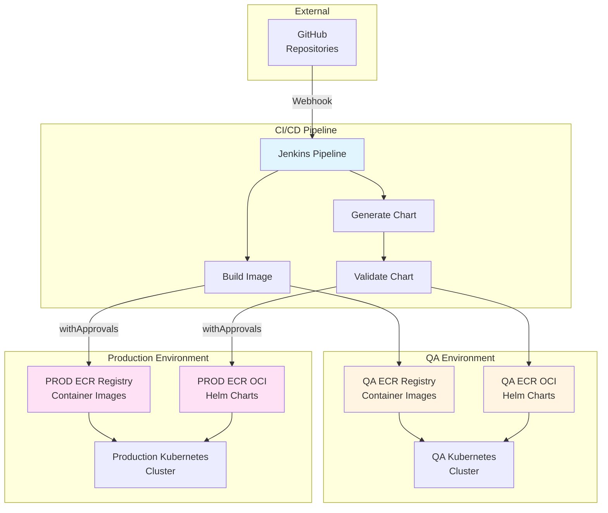

### Consequences

**Positive:**
- ✅ Supports multiple environments
- ✅ Clear separation between QA and Production
- ✅ Approval gates prevent accidental production deployments
- ✅ ECR provides secure, scalable registry
- ✅ OCI registry supports Helm charts natively
- ✅ Works with any Kubernetes distribution

**Negative:**
- ⚠️ Requires AWS ECR setup and credentials
- ⚠️ More complex than local development setup
- ⚠️ Production deployments require approvals (by design)

**Neutral:**
- Can use any Kubernetes distribution
- ECR can be replaced with other OCI-compatible registries

### Alternatives Considered

1. **Local Registry Only**: Use local Docker registry
   - ❌ Rejected: Not suitable for production, no multi-environment support

2. **Docker Hub**: Use Docker Hub for images
   - ⚠️ Considered: Less secure, rate limits, not suitable for enterprise

3. **Harbor**: Use Harbor registry
   - ⚠️ Considered: Good alternative, but ECR is AWS-native

4. **k3s for Production**: Use k3s in production
   - ❌ Rejected: Not suitable for production workloads, limited scalability

---

## ADR-009: Chart Generation in Service Repositories

**Status:** Accepted  
**Date:** 2024-11-14  
**Deciders:** Platform Team  
**Tags:** architecture, chart-generation, service-repos

### Context

We need to decide where Helm chart generation should occur:
- Option 1: Centralized in umbrella-chart repository
- Option 2: Distributed in each service repository
- Option 3: Separate service for chart generation

Each approach has trade-offs in terms of complexity, maintainability, and service team autonomy.

### Decision

We will perform chart generation in **individual service repositories**:
1. Service repositories contain `configuration.yml`, application code, and chart generation capability
2. When `configuration.yml` changes, service pipeline parses it to create `Chart.yaml` and `values.yaml`
3. `common-library` is added as a dependency to the generated `Chart.yaml`
4. `helm dependency update` is executed to resolve dependencies
5. `app.yml` template (workload.yaml) is included, referencing common-library templates
6. Chart validation: `helm lint` and `helm template` are executed
7. Chart is packaged using `helm package`
8. Packaged chart is pushed to ECR (OCI registry)
9. Service pipeline creates PR to umbrella-chart repository with generated chart and updated configuration.yml
10. Umbrella chart repository receives PRs and validates changes
11. If release condition is met, umbrella chart deploys to replicated SaaS provider
12. Common-library is a static dependency in both service charts and umbrella Chart.yaml

### Architecture

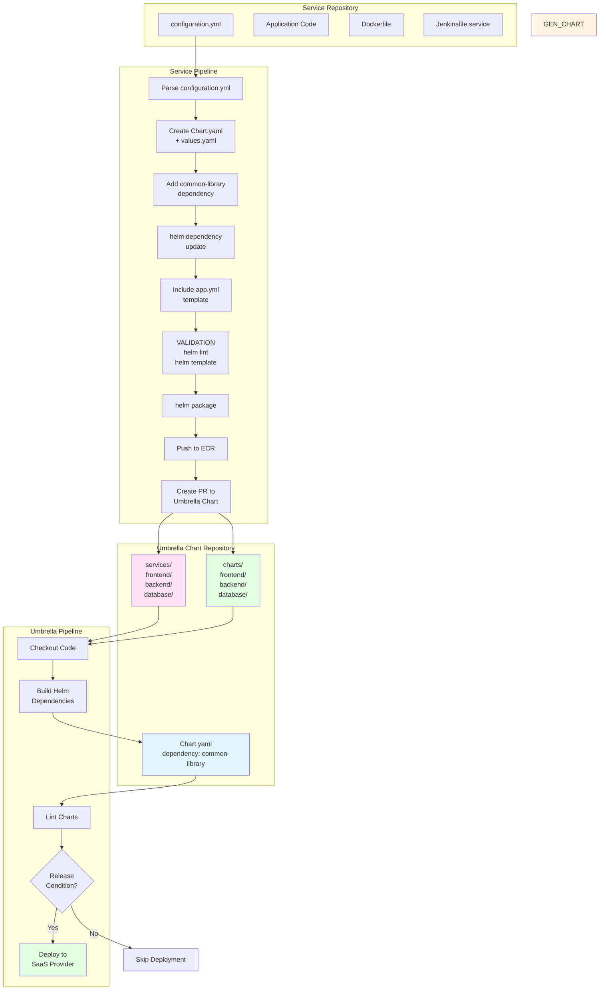

### Consequences

**Positive:**
- ✅ Service teams have full control over their chart generation
- ✅ Charts generated close to service code and configuration
- ✅ Service teams can test chart generation locally
- ✅ Parallel chart generation across services
- ✅ Service repositories are self-contained
- ✅ Umbrella repository focuses on orchestration and deployment

**Negative:**
- ⚠️ Chart generation logic duplicated across service repos (mitigated by shared tooling)
- ⚠️ Service teams need to understand chart generation process
- ⚠️ More complex service pipelines
- ⚠️ Need to ensure consistency across service chart generation

**Neutral:**
- Chart generation tools can be shared via common library or templates
- Umbrella repository validates and orchestrates deployments
- Release conditions control when deployments occur

### Alternatives Considered

1. **Centralized Generation**: Generate charts in umbrella-chart repository
   - ⚠️ Considered: Simpler service repos, but less service team autonomy

2. **Separate Service**: Dedicated service for chart generation
   - ❌ Rejected: Additional infrastructure, more complexity

3. **Hybrid**: Service repos generate, umbrella validates and syncs
   - ⚠️ Considered: Current approach balances autonomy and consistency

---

## ADR-010: Jenkins Pipeline Parameters for Stage Control

**Status:** Accepted  
**Date:** 2024-11-14  
**Deciders:** Platform Team, DevOps Team  
**Tags:** jenkins, ci-cd, parameters

### Context

Previously, stage toggles were implemented as environment variables with string comparisons (`env.ENABLE_STAGE == 'true'`). This approach:
- Required string comparisons in `when` conditions
- Was less intuitive in Jenkins UI
- Didn't provide clear boolean semantics
- Required environment variable setup

### Decision

We will use **Jenkins pipeline parameters** (boolean parameters) for stage toggles:
1. Each stage has a corresponding `ENABLE_*` boolean parameter
2. Parameters are defined in `parameters {}` block at pipeline top
3. Stages use `when { expression { params.ENABLE_* } }` conditions
4. Parameters have sensible defaults (deployment/verification disabled for POC)
5. Parameters are visible and toggleable in Jenkins UI
6. Parameters persist across builds and can be configured per job

### Architecture

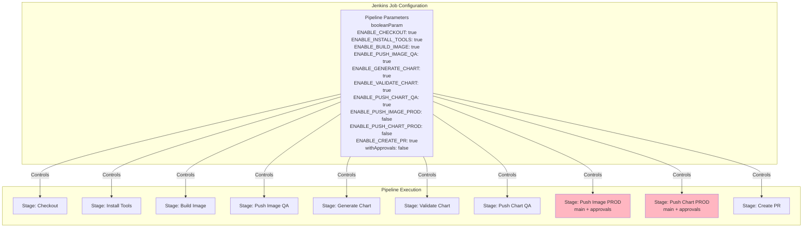

### Implementation Details

**Service Pipeline Parameters:**
- `ENABLE_CHECKOUT` (default: true)
- `ENABLE_INSTALL_TOOLS` (default: true)
- `ENABLE_BUILD_IMAGE` (default: true)
- `ENABLE_PUSH_IMAGE_QA` (default: true)
- `ENABLE_GENERATE_CHART` (default: true)
- `ENABLE_VALIDATE_CHART` (default: true)
- `ENABLE_PUSH_CHART_QA` (default: true)
- `ENABLE_PUSH_IMAGE_PROD` (default: false)
- `ENABLE_PUSH_CHART_PROD` (default: false)
- `ENABLE_CREATE_PR` (default: true)
- `withApprovals` (default: false) - Required for production deployments

**Service Pipeline Stages:**
1. **Checkout Code** - Checkout service repository
2. **Install Tools** - Install uv (via pip3), yq, Helm, and other required tools
3. **Build Docker Image** - Build image using `dockerTasks` groovy function
4. **Push Image to QA ECR** - Push image to QA ECR registry
5. **Parse Configuration** - Parse changed `configuration.yml` file
6. **Create Chart Files** - Generate `Chart.yaml` and `values.yaml` from configuration
7. **Add Dependency** - Add `common-library` as dependency to `Chart.yaml`
8. **Update Dependencies** - Run `helm dependency update` to resolve dependencies
9. **Include Template** - Include `app.yml` template (workload.yaml) referencing common-library
10. **VALIDATION: Lint Chart** - Run `helm lint` to validate chart structure
11. **VALIDATION: Template Chart** - Run `helm template` to validate templates render correctly
12. **Package Chart** - Run `helm package` to create chart tarball
13. **Push Chart to QA ECR** - Push packaged chart to QA ECR OCI registry
14. **Push Image to PROD ECR** - Conditional on main branch and `withApprovals`
15. **Push Chart to PROD ECR** - Conditional on main branch and `withApprovals`
16. **Create PR to Umbrella Chart** - Create PR with generated chart and updated configuration.yml

**Umbrella Pipeline Stages:**
1. **Checkout Code** - Checkout umbrella-chart repository
2. **Build Helm Dependencies** - Run `helm dependency build` to resolve dependencies
3. **Lint Charts** - Lint all charts using `helm lint`
4. **Check Release Condition** - Evaluate if release condition is met
5. **Deploy to SaaS Provider** - Deploy to replicated SaaS provider if condition is met

### Consequences

**Positive:**
- ✅ Native boolean semantics (no string comparison needed)
- ✅ Clear UI in Jenkins for toggling stages
- ✅ Better type safety
- ✅ Easier to understand and use
- ✅ Parameters persist across builds (can be configured per job)
- ✅ Visible in Jenkins "Build with Parameters" UI
- ✅ Can be set via Jenkins API for automation
- ✅ Approval gates prevent accidental production deployments
- ✅ Clear separation between QA and Production stages

**Negative:**
- ⚠️ Requires Jenkins job to be configured with parameters (first build)
- ⚠️ Parameters must be set correctly for each use case
- ⚠️ More parameters to document
- ⚠️ Parameters need to be defined in Jenkinsfile (can't be changed without code change)
- ⚠️ Production deployments require manual approval step

**Neutral:**
- Defaults set appropriately (production disabled by default)
- Can override per job or globally
- Parameters are part of pipeline definition
- Approval gates add safety but also latency

### Alternatives Considered

1. **Environment Variables**: Use env vars with string comparison
   - ❌ Rejected: Less intuitive, string comparison needed, no UI

2. **Jenkins Job Properties**: Configure in Jenkins job settings
   - ⚠️ Considered: More flexible, but not version controlled

3. **Configuration File**: Read from config file in repo
   - ⚠️ Considered: Version controlled, but requires file management

4. **Separate Pipelines**: Different pipelines for QA and Production
   - ⚠️ Considered: Could work, but adds duplication

---

## ADR-011: ECR-Based Container and Helm Chart Registry

**Status:** Accepted  
**Date:** 2024-11-14  
**Deciders:** Platform Team, DevOps Team  
**Tags:** aws, ecr, registry, helm

### Context

We need to store:
- Docker container images
- Helm charts
- Support multiple environments (QA and Production)
- Secure, scalable, and enterprise-ready solution

Options include: Docker Hub, Harbor, ECR, Artifactory, Nexus.

### Decision

We will use **AWS ECR (Elastic Container Registry)** for both container images and Helm charts:
1. ECR for container images (standard Docker registry)
2. ECR OCI registry for Helm charts (Helm 3.8+ supports OCI registries)
3. Separate ECR registries/repositories for QA and Production environments
4. AWS IAM for authentication and authorization
5. Image scanning and lifecycle policies supported

### Architecture

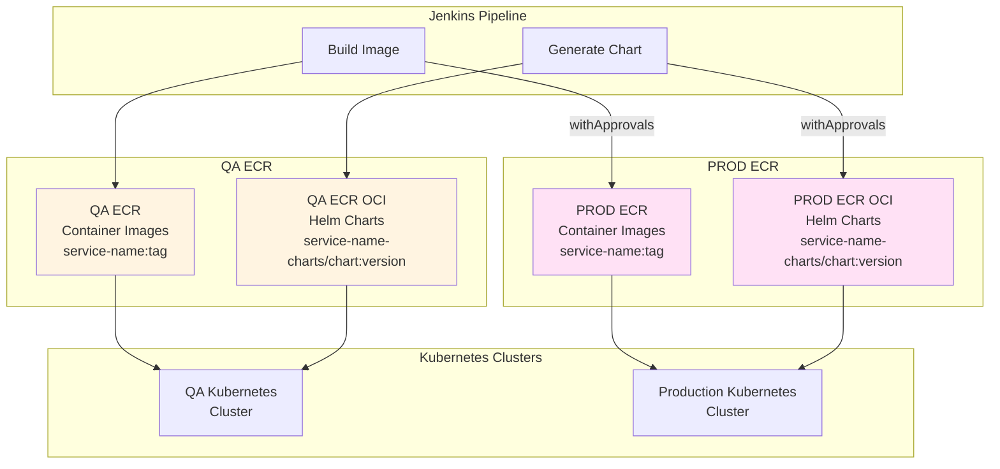

### Consequences

**Positive:**
- ✅ Native AWS integration
- ✅ IAM-based authentication and authorization
- ✅ Image scanning and vulnerability detection
- ✅ Lifecycle policies for automatic cleanup
- ✅ OCI registry support for Helm charts (Helm 3.8+)
- ✅ High availability and scalability
- ✅ Cost-effective (pay per GB stored and transferred)
- ✅ Supports both container images and Helm charts

**Negative:**
- ⚠️ AWS-specific (vendor lock-in)
- ⚠️ Requires AWS credentials and IAM setup
- ⚠️ ECR OCI support requires Helm 3.8+
- ⚠️ Network egress costs for pulling images

**Neutral:**
- Can migrate to other OCI-compatible registries if needed
- ECR supports both public and private repositories

### Alternatives Considered

1. **Docker Hub**: Use Docker Hub for images
   - ❌ Rejected: Rate limits, less secure, not suitable for enterprise

2. **Harbor**: Self-hosted registry
   - ⚠️ Considered: Good alternative, but requires infrastructure management

3. **Artifactory**: JFrog Artifactory
   - ⚠️ Considered: Feature-rich but expensive, more complex setup

4. **Nexus**: Sonatype Nexus
   - ⚠️ Considered: Good alternative, but ECR is simpler for AWS-native deployments

---

## Summary

These ADRs document the key architectural decisions for the Helm Chart Factory system:

1. **Library Chart Pattern** - Centralized best practices with common-library
2. **Multi-Repository Architecture** - Clear ownership boundaries
3. **Configuration-Driven Generation** - Simplified developer experience
4. **Pull Request Workflow** - Review and audit trail
5. **Multiple Workload Types** - Flexibility for different services
6. **Stage Toggles** - Pipeline flexibility using Jenkins parameters
7. **Umbrella Chart** - Coordinated multi-service deployment with dependency management
8. **Kubernetes Cluster for Deployment** - Multi-environment deployment with ECR
9. **Chart Generation in Service Repos** - Charts generated in individual service repositories
10. **Jenkins Pipeline Parameters** - Boolean parameters for stage control with approval gates
11. **ECR-Based Registry** - AWS ECR for container images and Helm charts (OCI)

Each decision balances trade-offs between flexibility, maintainability, and ease of use, with a focus on enabling service teams while maintaining platform standards.
