# Helm Chart Factory - Comprehensive System Diagrams

This document contains detailed mermaid diagrams explaining how the Helm Chart Factory system works, including all workflows and component interactions.

## Table of Contents

1. [System Architecture Overview](#system-architecture-overview)
2. [Component Relationships](#component-relationships)
3. [Developer Workflow](#developer-workflow)
4. [Chart Generation Process](#chart-generation-process)
5. [Umbrella Chart Sync Flow](#umbrella-chart-sync-flow)
6. [Jenkins Pipeline Flow](#jenkins-pipeline-flow)
7. [Deployment Flow](#deployment-flow)
8. [Library Chart Structure](#library-chart-structure)
9. [Service Lifecycle](#service-lifecycle)
10. [Complete End-to-End Flow](#complete-end-to-end-flow)

---

## System Architecture Overview

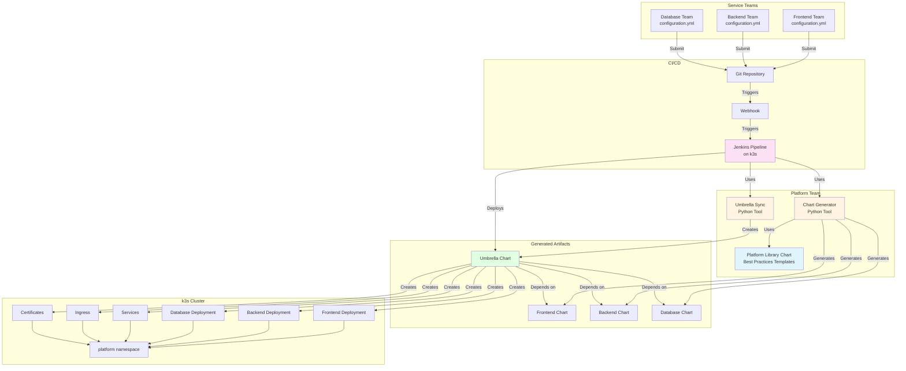

---

## Component Relationships

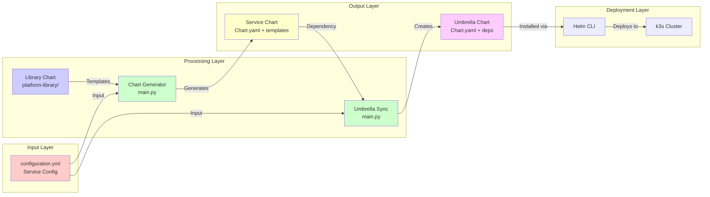

---

## Developer Workflow

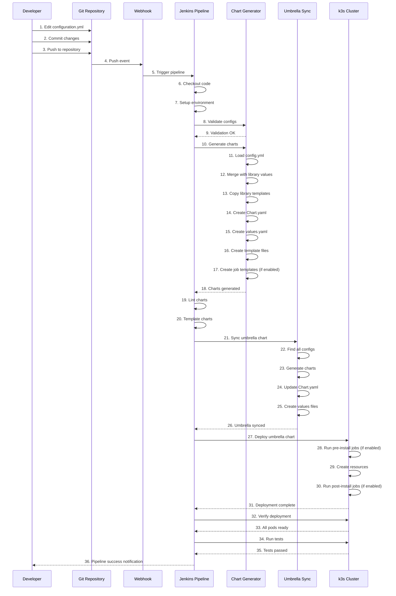

---

## Chart Generation Process

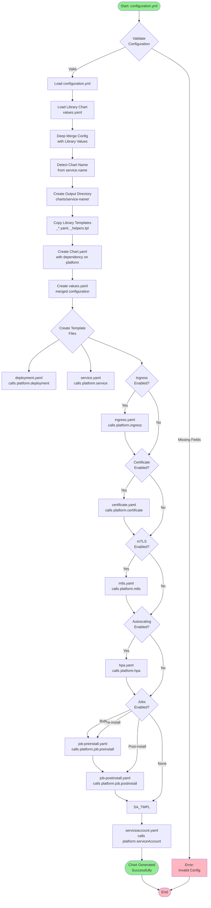

---

## Umbrella Chart Sync Flow

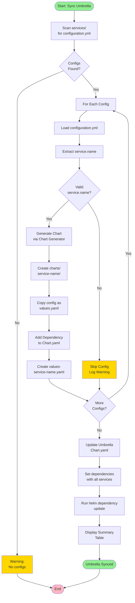

---

## Jenkins Pipeline Flow

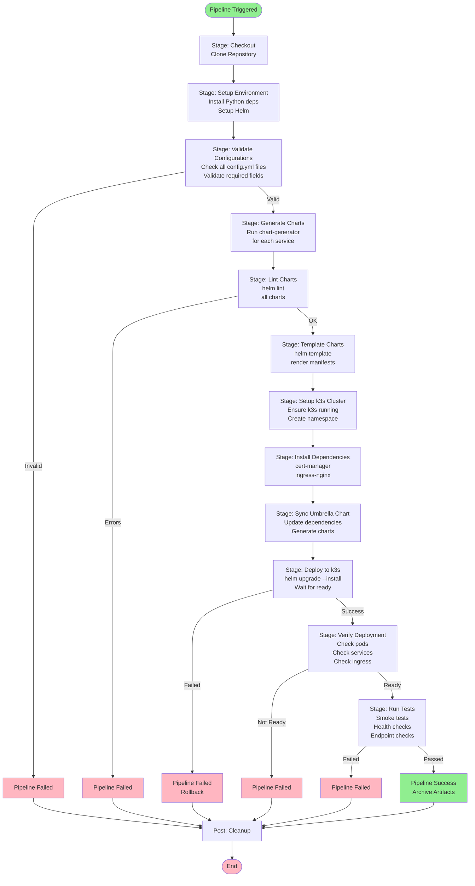

---

## Deployment Flow

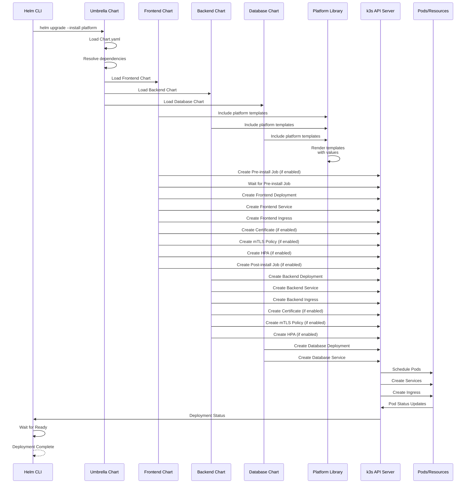

---

## Library Chart Structure

```mermaid
graph TB
    subgraph "Platform Library Chart"
        ROOT[platform-library/<br/>Chart.yaml<br/>type: library]
        
        ROOT --> VALUES[values.yaml<br/>Default Values]
        ROOT --> TEMPLATES[templates/]
        
        TEMPLATES --> HELPERS[_helpers.tpl<br/>Template Functions]
        TEMPLATES --> DEF_DEP[_deployment.yaml<br/>Define platform.deployment]
        TEMPLATES --> DEF_SVC[_service.yaml<br/>Define platform.service]
        TEMPLATES --> DEF_ING[_ingress.yaml<br/>Define platform.ingress]
        TEMPLATES --> DEF_CERT[_certificate.yaml<br/>Define platform.certificate]
        TEMPLATES --> DEF_MTLS[_mtls.yaml<br/>Define platform.mtls]
        TEMPLATES --> DEF_HPA[_hpa.yaml<br/>Define platform.autoscaling]
        TEMPLATES --> DEF_SA[_serviceaccount.yaml<br/>Define platform.serviceAccount]
        
        DEF_DEP --> DEP[deployment.yaml<br/>Include platform.deployment]
        DEF_SVC --> SVC[service.yaml<br/>Include platform.service]
        DEF_ING --> ING[ingress.yaml<br/>Include platform.ingress]
        DEF_CERT --> CERT[certificate.yaml<br/>Include platform.certificate]
        DEF_MTLS --> MTLS[mtls.yaml<br/>Include platform.mtls]
        DEF_HPA --> HPA[hpa.yaml<br/>Include platform.hpa]
        DEF_SA --> SA[serviceaccount.yaml<br/>Include platform.serviceAccount]
    end
    
    subgraph "Generated Service Chart"
        SCHART[service-name/<br/>Chart.yaml<br/>dependency: platform]
        SCHART --> SVALS[values.yaml<br/>Merged Config]
        SCHART --> STEMPLATES[templates/]
        
        STEMPLATES --> SHELPERS[_helpers.tpl<br/>Copied from Library]
        STEMPLATES --> SDEP[deployment.yaml<br/>include platform.deployment]
        STEMPLATES --> SSVC[service.yaml<br/>include platform.service]
        STEMPLATES --> SING[ingress.yaml<br/>include platform.ingress]
        STEMPLATES --> SCERT[certificate.yaml<br/>include platform.certificate]
        STEMPLATES --> SMTLS[mtls.yaml<br/>include platform.mtls]
        STEMPLATES --> SHPA[hpa.yaml<br/>include platform.hpa]
        STEMPLATES --> SSA[serviceaccount.yaml<br/>include platform.serviceAccount]
    end
    
    HELPERS -.->|Used by| SDEP
    DEF_DEP -.->|Called by| SDEP
    DEF_SVC -.->|Called by| SSVC
    DEF_ING -.->|Called by| SING
    DEF_CERT -.->|Called by| SCERT
    DEF_MTLS -.->|Called by| SMTLS
    DEF_HPA -.->|Called by| SHPA
    DEF_SA -.->|Called by| SSA
    
    style ROOT fill:#e1f5ff
    style SCHART fill:#fff4e1
    style HELPERS fill:#ffe1f5
    style SHELPERS fill:#ffe1f5
```

---

## Service Lifecycle

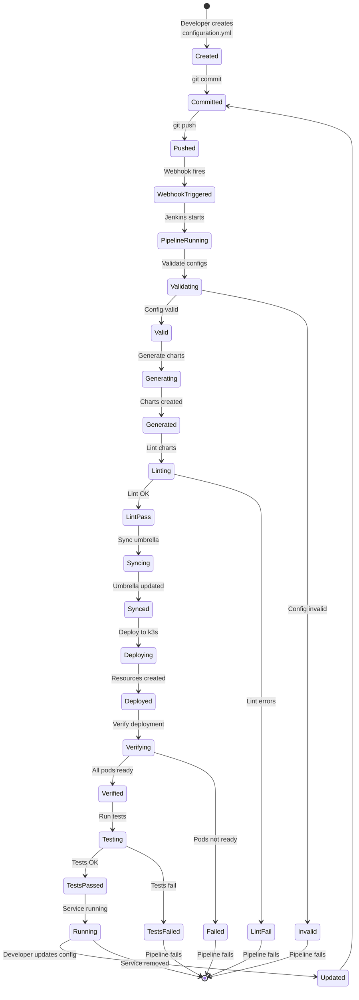

---

## Complete End-to-End Flow

```mermaid
graph TB
    subgraph "Phase 1: Development"
        DEV1[Developer edits<br/>services/my-service/<br/>configuration.yml]
        DEV2[Commit changes]
        DEV3[Push to repository]
    end
    
    subgraph "Phase 2: CI/CD Trigger"
        GH1[GitHub/GitLab<br/>receives push]
        WH1[Webhook triggered]
        JN1[Jenkins pipeline<br/>starts]
    end
    
    subgraph "Phase 3: Validation & Generation"
        VAL1[Validate all<br/>configurations]
        GEN1[Generate charts<br/>for each service]
        LINT1[Lint generated<br/>charts]
        TEMP1[Template charts<br/>render manifests]
    end
    
    subgraph "Phase 4: Cluster Setup"
        K3S1[Ensure k3s<br/>cluster running]
        DEPS1[Install cert-manager<br/>ingress-nginx]
        NS1[Create platform<br/>namespace]
    end
    
    subgraph "Phase 5: Umbrella Sync"
        SYNC1[Scan all service<br/>configurations]
        SYNC2[Generate charts<br/>for each]
        SYNC3[Update umbrella<br/>Chart.yaml]
        SYNC4[Create values-*.yaml<br/>files]
    end
    
    subgraph "Phase 6: Deployment"
        DEP1[helm upgrade<br/>--install platform]
        DEP2[Create Deployments]
        DEP3[Create Services]
        DEP4[Create Ingress]
        DEP5[Create Certificates]
        DEP6[Create mTLS Policies]
        DEP7[Create HPA]
    end
    
    subgraph "Phase 7: Verification"
        VER1[Wait for pods<br/>to be ready]
        VER2[Check service<br/>endpoints]
        VER3[Verify ingress<br/>configuration]
        VER4[Check certificate<br/>status]
    end
    
    subgraph "Phase 8: Testing"
        TEST1[Run smoke tests]
        TEST2[Check pod health]
        TEST3[Verify endpoints]
        TEST4[Test ingress<br/>connectivity]
    end
    
    subgraph "Phase 9: Completion"
        SUCC1[Pipeline success]
        SUCC2[Archive artifacts]
        SUCC3[Notify developer]
    end
    
    DEV1 --> DEV2
    DEV2 --> DEV3
    DEV3 --> GH1
    GH1 --> WH1
    WH1 --> JN1
    
    JN1 --> VAL1
    VAL1 --> GEN1
    GEN1 --> LINT1
    LINT1 --> TEMP1
    
    TEMP1 --> K3S1
    K3S1 --> DEPS1
    DEPS1 --> NS1
    
    NS1 --> SYNC1
    SYNC1 --> SYNC2
    SYNC2 --> SYNC3
    SYNC3 --> SYNC4
    
    SYNC4 --> DEP1
    DEP1 --> DEP2
    DEP2 --> DEP3
    DEP3 --> DEP4
    DEP4 --> DEP5
    DEP5 --> DEP6
    DEP6 --> DEP7
    
    DEP7 --> VER1
    VER1 --> VER2
    VER2 --> VER3
    VER3 --> VER4
    
    VER4 --> TEST1
    TEST1 --> TEST2
    TEST2 --> TEST3
    TEST3 --> TEST4
    
    TEST4 --> SUCC1
    SUCC1 --> SUCC2
    SUCC2 --> SUCC3
    
    style DEV1 fill:#e1f5ff
    style JN1 fill:#ffe1f5
    style GEN1 fill:#fff4e1
    style DEP1 fill:#e1ffe1
    style SUCC1 fill:#90EE90
```

---

## Data Flow Diagram

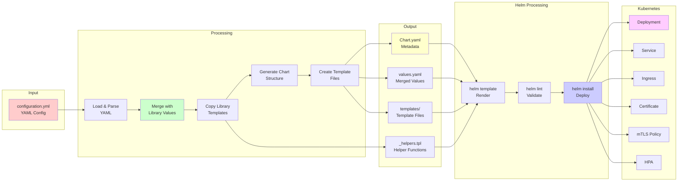

---

## Component Interaction Diagram

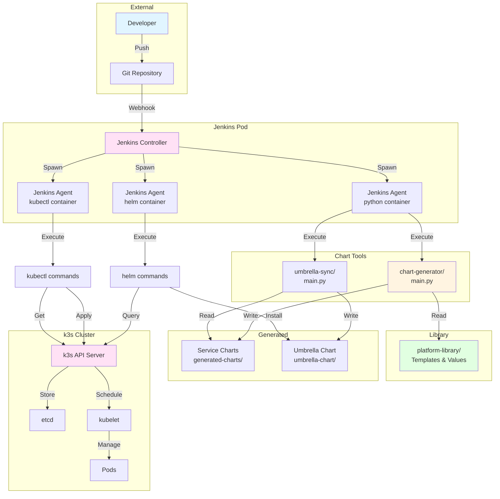

---

## Error Handling Flow

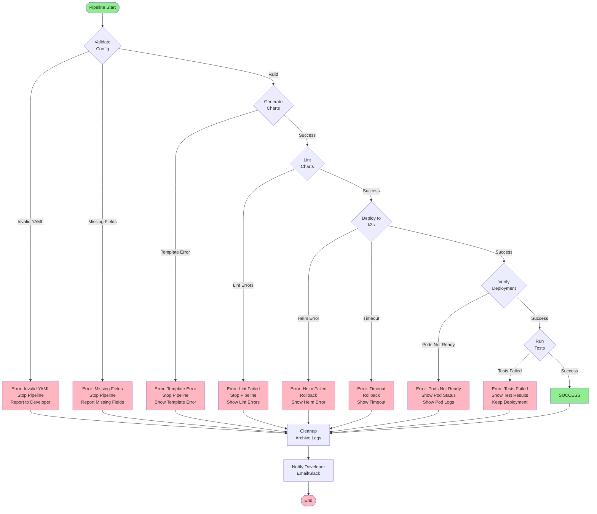

---

## Resource Creation Flow

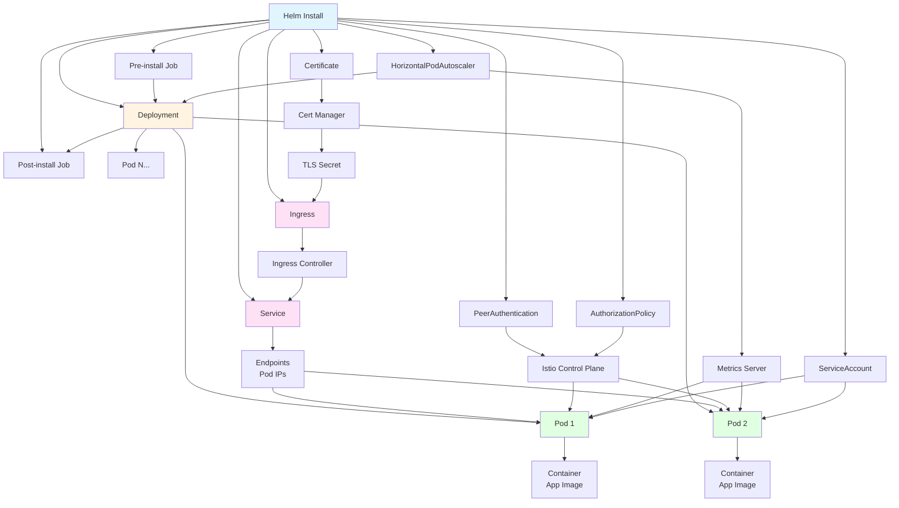

---

These diagrams provide a comprehensive view of how the Helm Chart Factory system works, covering all workflows, components, and interactions. Each diagram focuses on a specific aspect of the system to provide detailed understanding.

---

## Multi-Repository Architecture Diagram

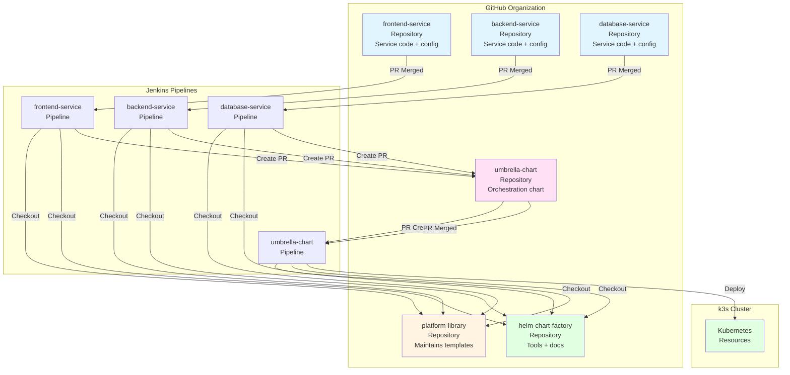

---

## Pull Request Workflow Diagram

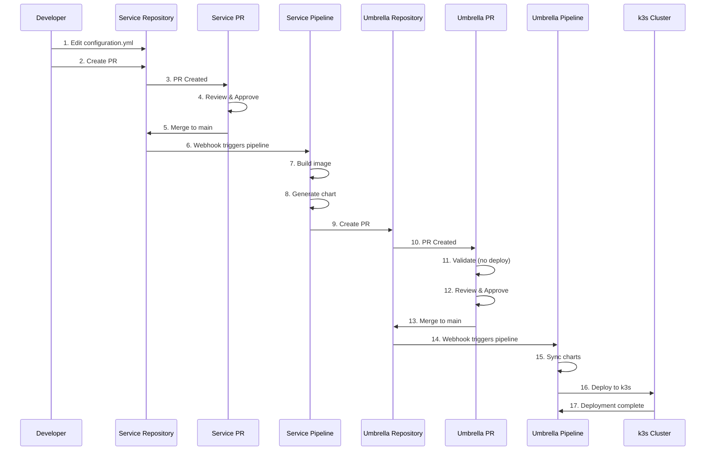

---

## Workload Type Selection Diagram

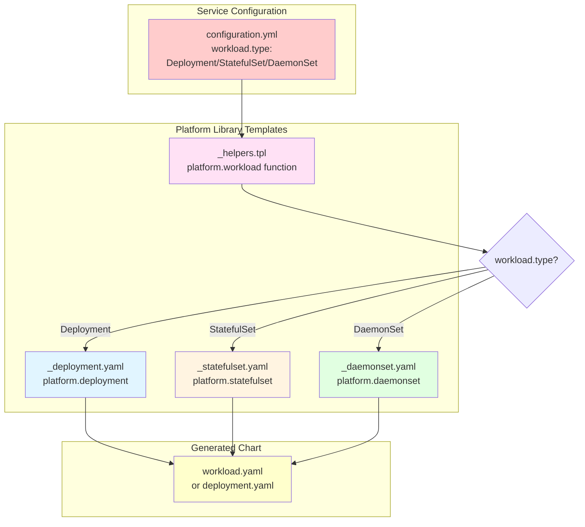

---

## Stage Toggle Control Flow

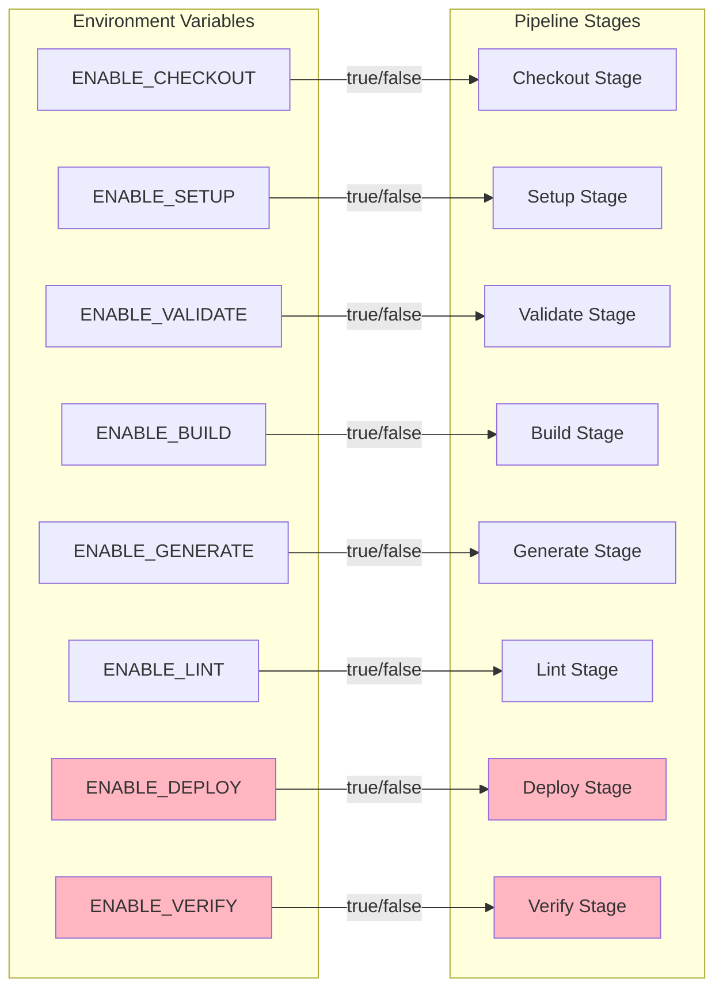

---

## Umbrella Chart Sync Process

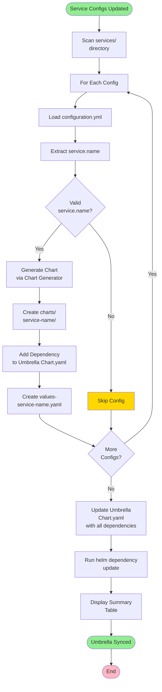

---

## Local Development Environment

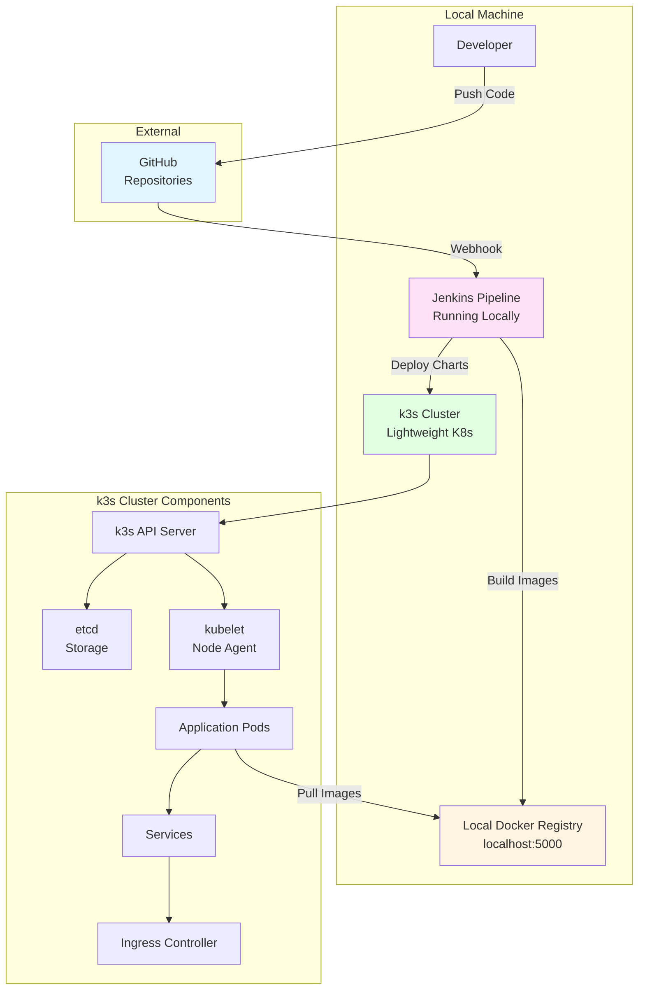

---

These diagrams provide a comprehensive view of how the Helm Chart Factory system works, covering all workflows, components, and interactions. Each diagram focuses on a specific aspect of the system to provide detailed understanding.

For Architecture Decision Records (ADRs) documenting the rationale behind these design decisions, see [ADR.md](ADR.md).

