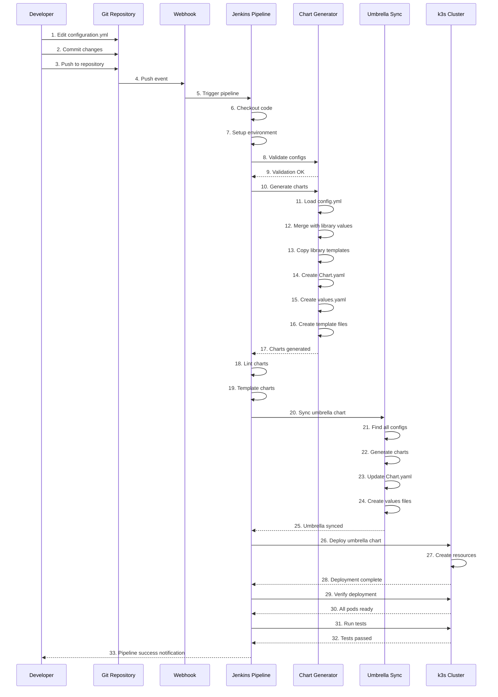
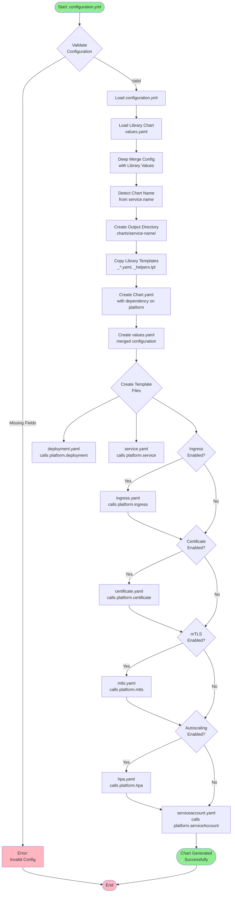
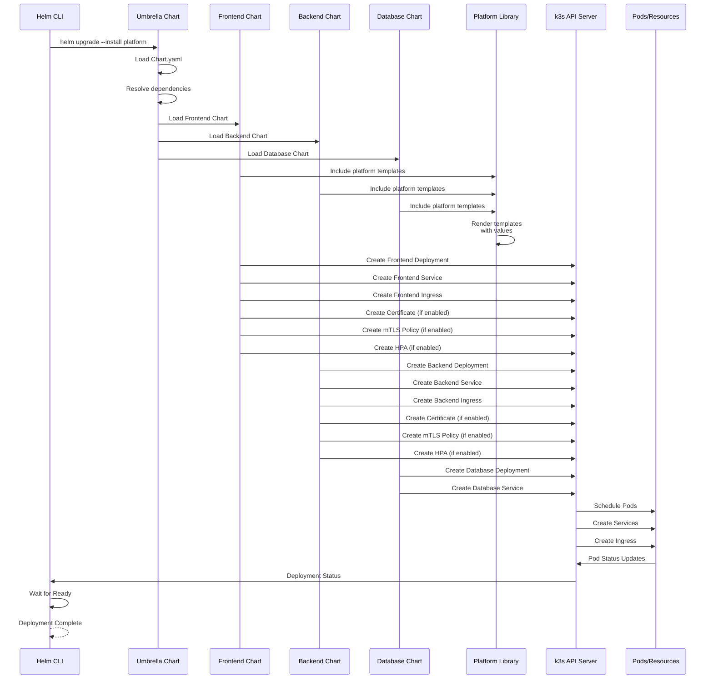
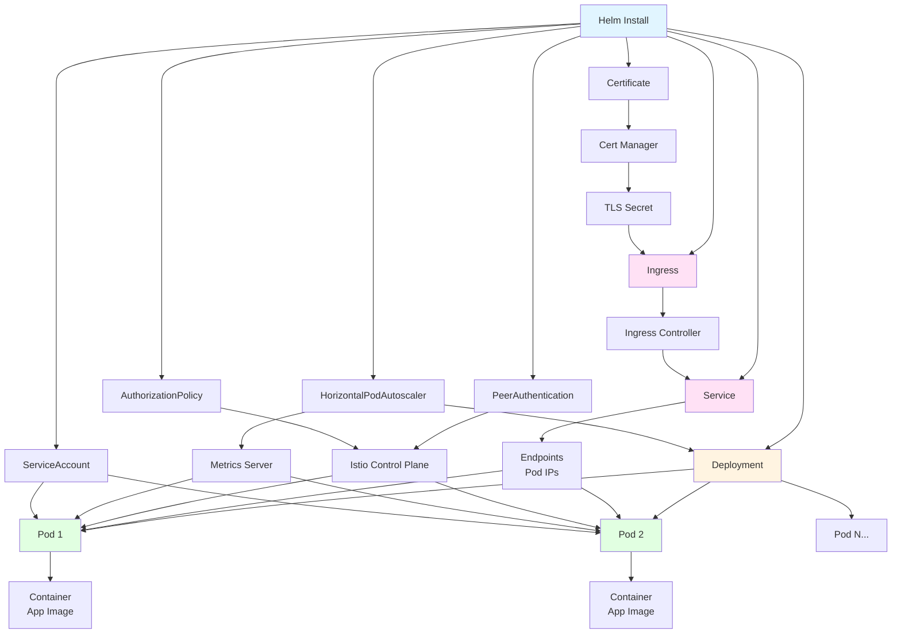

# Helm Chart Factory - Comprehensive System Diagrams

This document contains detailed mermaid diagrams explaining how the Helm Chart Factory system works, including all workflows and component interactions.

## Table of Contents

1. [System Architecture Overview](#system-architecture-overview)
2. [Component Relationships](#component-relationships)
3. [Developer Workflow](#developer-workflow)
4. [Chart Generation Process](#chart-generation-process)
5. [Umbrella Chart Sync Flow](#umbrella-chart-sync-flow)
6. [Jenkins Pipeline Flow](#jenkins-pipeline-flow)
7. [Deployment Flow](#deployment-flow)
8. [Library Chart Structure](#library-chart-structure)
9. [Service Lifecycle](#service-lifecycle)
10. [Complete End-to-End Flow](#complete-end-to-end-flow)

---

## System Architecture Overview


---

## Component Relationships


---

## Developer Workflow



---

## Chart Generation Process



---

## Umbrella Chart Sync Flow

```mermaid
flowchart TD
    START([Start: Sync Umbrella]) --> SCAN[Scan services/<br/>for configuration.yml]
    
    SCAN --> FOUND{Configs<br/>Found?}
    FOUND -->|No| WARN[Warning:<br/>No configs]
    FOUND -->|Yes| LOOP[For Each Config]
    
    LOOP --> LOAD[Load configuration.yml]
    LOAD --> EXTRACT[Extract service.name]
    
    EXTRACT --> VALID{Valid<br/>service.name?}
    VALID -->|No| SKIP[Skip Config<br/>Log Warning]
    VALID -->|Yes| GEN[Generate Chart<br/>via Chart Generator]
    
    GEN --> CHARTDIR[Create charts/<br/>service-name/]
    CHARTDIR --> COPYVAL[Copy config as<br/>values.yaml]
    
    COPYVAL --> DEPEND[Add Dependency<br/>to Chart.yaml]
    
    DEPEND --> VALUESFILE[Create values-<br/>service-name.yaml]
    
    VALUESFILE --> NEXT{More<br/>Configs?}
    NEXT -->|Yes| LOOP
    NEXT -->|No| UPDATE[Update Umbrella<br/>Chart.yaml]
    
    UPDATE --> DEPS[Set dependencies[]<br/>with all services]
    
    DEPS --> HELMUPDATE[Run helm dependency<br/>update]
    
    HELMUPDATE --> SUMMARY[Display Summary<br/>Table]
    
    SUMMARY --> COMPLETE([Umbrella Synced])
    
    WARN --> END([End])
    SKIP --> NEXT
    COMPLETE --> END
    
    style START fill:#90EE90
    style COMPLETE fill:#90EE90
    style WARN fill:#FFD700
    style SKIP fill:#FFD700
    style END fill:#FFB6C1
```

---

## Jenkins Pipeline Flow


---

## Deployment Flow



---

## Library Chart Structure


---

## Service Lifecycle


---

## Complete End-to-End Flow


---

## Data Flow Diagram


---

## Component Interaction Diagram


---

## Error Handling Flow


---

## Resource Creation Flow



---

These diagrams provide a comprehensive view of how the Helm Chart Factory system works, covering all workflows, components, and interactions. Each diagram focuses on a specific aspect of the system to provide detailed understanding.

