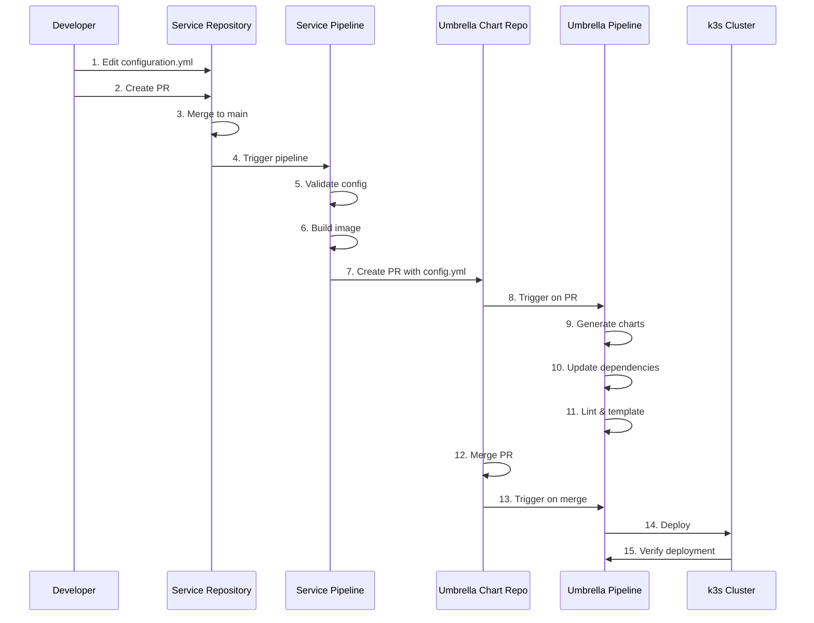

# Product Requirements Document (PRD)
# Helm Chart Factory - Simplified Architecture

## Version
2.0.0

## Date
2024-11-14

## Overview

This PRD describes a simplified Helm Chart Factory architecture where chart generation is localized entirely within the umbrella-chart repository. Service repositories only contain their configuration files and trigger PRs to the umbrella chart when configurations change.

## Architecture

### Repository Structure

```
┌─────────────────────────────────────────────────────────────┐
│                    Service Repositories                     │
│  (frontend-service, backend-service, database-service)     │
│                                                             │
│  ├── configuration.yml  ← Only config file                 │
│  ├── Dockerfile                                            │
│  ├── Jenkinsfile.service  ← Creates PR to umbrella         │
│  └── Application code                                      │
└─────────────────────────────────────────────────────────────┘
                          │
                          │ PR with configuration.yml
                          ▼
┌─────────────────────────────────────────────────────────────┐
│              Umbrella Chart Repository                      │
│                                                             │
│  ├── Chart.yaml  ← Static dependency on common-library     │
│  ├── values.yaml                                            │
│  ├── services/  ← Service configurations                    │
│  │   ├── frontend/configuration.yml                        │
│  │   ├── backend/configuration.yml                         │
│  │   └── database/configuration.yml                        │
│  ├── charts/  ← Generated service charts                   │
│  │   ├── frontend/  ← Generated by umbrella pipeline      │
│  │   ├── backend/                                          │
│  │   └── database/                                         │
│  ├── Jenkinsfile.umbrella  ← Generates charts              │
│  └── tools/  ← Chart generator tools                       │
└─────────────────────────────────────────────────────────────┘
                          │
                          │ Uses
                          ▼
┌─────────────────────────────────────────────────────────────┐
│              Common Library Repository                      │
│  (Static dependency, not platform-library)                  │
│                                                             │
│  ├── Chart.yaml  ← type: library                          │
│  ├── values.yaml                                           │
│  └── templates/  ← Reusable templates                      │
└─────────────────────────────────────────────────────────────┘
```

## Key Changes from Previous Architecture

### 1. Chart Generation Location
- **Previous**: Chart generation happened in service repositories
- **New**: Chart generation happens entirely in umbrella-chart repository
- **Benefit**: Centralized chart management, easier to maintain dependencies

### 2. Library Chart
- **Previous**: Used `platform-library` chart
- **New**: Uses `common-library` chart (static dependency in umbrella Chart.yaml)
- **Benefit**: Simpler dependency management, single source of truth

### 3. Service Repository Responsibilities
- **Previous**: Service repos generated charts, built images, deployed
- **New**: Service repos only:
  - Store `configuration.yml`
  - Build Docker images
  - Create PRs to umbrella chart when config changes
- **Benefit**: Reduced complexity in service repos

### 4. Umbrella Chart Responsibilities
- **Previous**: Umbrella chart just orchestrated dependencies
- **New**: Umbrella chart:
  - Stores all service configurations
  - Generates all service charts
  - Manages dependencies
  - Deploys everything
- **Benefit**: Single place for all chart-related operations

## Workflow

### Service Configuration Change Flow



## Jenkins Pipeline Structure

### Service Pipeline (`Jenkinsfile.service`)

#### Stage 1: Checkout Code (Always First)
- Checkout service repository code
- Required for all subsequent stages

#### Stage 2: Install Tools (Always Second)
- Install tools to `${WORKSPACE}/tools` directory
- Set `TOOLS_DIR = ${WORKSPACE}/tools`
- Update PATH to include tools directory
- Install: Python3, uv, Helm (if needed)
- GitHub credentials available in environment block

#### Stage 3: Validate Configuration
- Validate `configuration.yml` syntax
- Check required fields
- Fail pipeline if invalid

#### Stage 4: Build Image
- Build Docker image from Dockerfile
- Tag image appropriately
- Push to registry (if available)

#### Stage 5: Create PR to Umbrella Chart
- Only runs on `main`/`master` branch
- Clone umbrella chart repository
- Copy `configuration.yml` to `services/{SERVICE_NAME}/`
- Create branch: `update-{SERVICE_NAME}-{BUILD_NUMBER}`
- Commit and push changes
- Create PR using GitHub API
- Include build information in PR description

### Umbrella Chart Pipeline (`Jenkinsfile.umbrella`)

#### Stage 1: Checkout Code (Always First)
- Checkout umbrella chart repository
- Checkout common-library repository

#### Stage 2: Install Tools (Always Second)
- Install tools to `${WORKSPACE}/tools` directory
- Set `TOOLS_DIR = ${WORKSPACE}/tools`
- Update PATH to include tools directory
- Clone chart-generator tool
- Install chart-generator dependencies
- GitHub credentials available in environment block

#### Stage 3: Generate Charts
- Scan `services/` directory for `configuration.yml` files
- For each service configuration:
  - Run chart-generator tool
  - Generate chart to `charts/{SERVICE_NAME}/`
  - Use common-library as the library chart

#### Stage 4: Update Dependencies
- Update `Chart.yaml` with:
  - Static dependency on common-library
  - Dynamic dependencies for all generated service charts
- Run `helm dependency update`

#### Stage 5: Lint Charts
- Lint umbrella chart
- Lint all generated service charts
- Fail if linting errors found

#### Stage 6: Template Charts
- Template umbrella chart
- Verify manifests render correctly
- Show summary

#### Stage 7: Deploy to k3s (Optional)
- Only runs on `main`/`master` branch
- Deploy umbrella chart to k3s cluster
- Wait for deployment to complete

#### Stage 8: Verify Deployment (Optional)
- Only runs on `main`/`master` branch
- Check pod status
- Verify services are running
- Run health checks

## Configuration

### Service Configuration (`configuration.yml`)

Service teams only need to provide a `configuration.yml` file:

```yaml
service:
  name: frontend
  type: ClusterIP
  port: 80
  targetPort: 80

workload:
  type: Deployment

deployment:
  replicas: 2
  image:
    repository: localhost:5000/frontend
    tag: "latest"
    pullPolicy: Always
  # ... other deployment config
```

### Umbrella Chart Structure

```
umbrella-chart/
├── Chart.yaml              # Static dependency on common-library
├── values.yaml             # Umbrella chart values
├── services/               # Service configurations
│   ├── frontend/
│   │   └── configuration.yml
│   ├── backend/
│   │   └── configuration.yml
│   └── database/
│       └── configuration.yml
├── charts/                 # Generated service charts
│   ├── frontend/
│   ├── backend/
│   └── database/
├── Jenkinsfile.umbrella    # Umbrella pipeline
└── tools/                  # Chart generator tools (optional)
```

### Common Library Dependency

The umbrella chart's `Chart.yaml` has a static dependency:

```yaml
apiVersion: v2
name: umbrella
description: Umbrella chart for all services
type: application
version: 0.1.0

dependencies:
  - name: common-library
    version: 1.0.0
    repository: file://../common-library
    condition: common-library.enabled
```

## Benefits

1. **Centralized Chart Management**: All charts generated in one place
2. **Simplified Service Repos**: Service repos only manage their config and code
3. **Easier Dependency Management**: Single Chart.yaml manages all dependencies
4. **Better Visibility**: All service configurations visible in umbrella repo
5. **Consistent Tooling**: Chart generator tools in one location
6. **Simpler CI/CD**: Clear separation of concerns

## Migration Path

### From Previous Architecture

1. **Move service configurations**:
   - Copy `configuration.yml` from each service repo to `umbrella-chart/services/{SERVICE_NAME}/`

2. **Update service Jenkinsfiles**:
   - Replace existing `Jenkinsfile.service` with new version
   - Remove chart generation stages
   - Add PR creation stage

3. **Update umbrella chart**:
   - Add chart generator tools
   - Update `Jenkinsfile.umbrella` with chart generation stages
   - Update `Chart.yaml` with common-library dependency

4. **Rename platform-library**:
   - Rename `platform-library` to `common-library`
   - Update all references

## Environment Variables

### Service Pipeline

- `TOOLS_DIR`: `${WORKSPACE}/tools` - Tools installation directory
- `SERVICE_NAME`: Extracted from job name
- `UMBRELLA_CHART_REPO`: Umbrella chart repository URL
- `GITHUB_CREDENTIALS`: GitHub credentials ID

### Umbrella Pipeline

- `TOOLS_DIR`: `${WORKSPACE}/tools` - Tools installation directory
- `COMMON_LIBRARY_REPO`: Common library repository URL
- `GITHUB_CREDENTIALS`: GitHub credentials ID

## Stage Toggles

All stages support toggles via environment variables:

- `ENABLE_CHECKOUT`: Enable/disable checkout stage
- `ENABLE_INSTALL_TOOLS`: Enable/disable tools installation
- `ENABLE_VALIDATE_CONFIG`: Enable/disable config validation
- `ENABLE_BUILD_IMAGE`: Enable/disable image building
- `ENABLE_CREATE_PR`: Enable/disable PR creation
- `ENABLE_GENERATE_CHARTS`: Enable/disable chart generation
- `ENABLE_UPDATE_DEPENDENCIES`: Enable/disable dependency updates
- `ENABLE_LINT_CHARTS`: Enable/disable chart linting
- `ENABLE_TEMPLATE_CHARTS`: Enable/disable chart templating
- `ENABLE_DEPLOY`: Enable/disable deployment (default: false)
- `ENABLE_VERIFY_DEPLOYMENT`: Enable/disable deployment verification (default: false)

## Success Criteria

1. ✅ Service repos can create PRs to umbrella chart with configuration.yml
2. ✅ Umbrella chart pipeline generates charts for all services
3. ✅ Umbrella chart updates dependencies automatically
4. ✅ Charts can be deployed to k3s cluster
5. ✅ All stages have toggles for POC/production use
6. ✅ Tools are installed to dedicated directory
7. ✅ GitHub credentials available in environment block

## Future Enhancements

1. **Chart Versioning**: Automatic version bumping for service charts
2. **Rollback Support**: Easy rollback of service configurations
3. **Multi-Environment**: Support for dev/staging/prod environments
4. **Chart Testing**: Automated chart testing before deployment
5. **Dependency Updates**: Automatic updates to common-library

## Notes

- Chart generation is now entirely in umbrella-chart repository
- Service repositories are simplified to only manage their configuration
- Common-library is a static dependency, not dynamically fetched
- All tools are installed to a dedicated tools directory
- PATH is set to include tools directory for all stages

