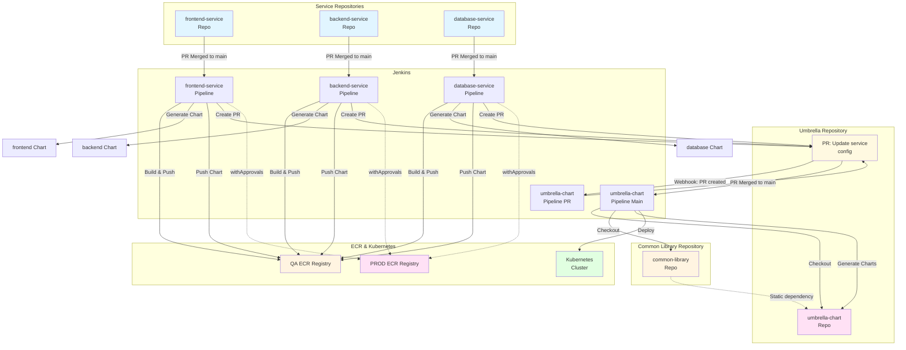

# Repository Structure and CI/CD Flow

This document describes the multi-repository structure and how files should be organized across GitHub repositories for the end-to-end CI/CD flow.

## Repository Structure

```
┌─────────────────────────────────────────────────────────────────┐
│                    GitHub Repositories                           │
├─────────────────────────────────────────────────────────────────┤
│                                                                 │
│  ┌──────────────────────────────────────────────────────────┐  │
│  │  common-library Repository                                │  │
│  │  https://github.com/companyinfo/common-library            │  │
│  ├──────────────────────────────────────────────────────────┤  │
│  │  common-library/                                         │  │
│  │  ├── Chart.yaml                                          │  │
│  │  ├── values.yaml                                         │  │
│  │  └── templates/                                           │  │
│  │      ├── _helpers.tpl                                    │  │
│  │      ├── _deployment.yaml                               │  │
│  │      ├── _statefulset.yaml                               │  │
│  │      ├── _daemonset.yaml                                 │  │
│  │      ├── _service.yaml                                    │  │
│  │      ├── _ingress.yaml                                    │  │
│  │      ├── _certificate.yaml                                │  │
│  │      ├── _mtls.yaml                                       │  │
│  │      ├── _hpa.yaml                                        │  │
│  │      ├── _job.yaml                                        │  │
│  │      └── ...                                              │  │
│  └──────────────────────────────────────────────────────────┘  │
│                                                                 │
│  ┌──────────────────────────────────────────────────────────┐  │
│  │  frontend-service Repository                             │  │
│  │  https://github.com/companyinfo/frontend-service         │  │
│  ├──────────────────────────────────────────────────────────┤  │
│  │  frontend-service/                                       │  │
│  │  ├── configuration.yml  ← Jenkins triggers on change   │  │
│  │  ├── Dockerfile                                         │  │
│  │  ├── nginx.conf                                         │  │
│  │  ├── package.json                                       │  │
│  │  ├── src/                                               │  │
│  │  │   ├── App.js                                         │  │
│  │  │   └── ...                                            │  │
│  │  ├── public/                                            │  │
│  │  └── Jenkinsfile  ← Service pipeline                    │  │
│  └──────────────────────────────────────────────────────────┘  │
│                                                                 │
│  ┌──────────────────────────────────────────────────────────┐  │
│  │  backend-service Repository                              │  │
│  │  https://github.com/companyinfo/backend-service          │  │
│  ├──────────────────────────────────────────────────────────┤  │
│  │  backend-service/                                       │  │
│  │  ├── configuration.yml  ← Jenkins triggers on change   │  │
│  │  ├── Dockerfile                                         │  │
│  │  ├── main.py                                            │  │
│  │  ├── requirements.txt                                   │  │
│  │  └── Jenkinsfile                                        │  │
│  └──────────────────────────────────────────────────────────┘  │
│                                                                 │
│  ┌──────────────────────────────────────────────────────────┐  │
│  │  database-service Repository                             │  │
│  │  https://github.com/companyinfo/database-service         │  │
│  ├──────────────────────────────────────────────────────────┤  │
│  │  database-service/                                      │  │
│  │  ├── configuration.yml  ← Jenkins triggers on change   │  │
│  │  ├── Dockerfile                                         │  │
│  │  ├── init.sql                                           │  │
│  │  └── Jenkinsfile                                        │  │
│  └──────────────────────────────────────────────────────────┘  │
│                                                                 │
│  ┌──────────────────────────────────────────────────────────┐  │
│  │  umbrella-chart Repository                              │  │
│  │  https://github.com/companyinfo/umbrella-chart          │  │
│  ├──────────────────────────────────────────────────────────┤  │
│  │  umbrella-chart/                                        │  │
│  │  ├── Chart.yaml  ← Static dependency on common-library │  │
│  │  ├── values.yaml                                       │  │
│  │  ├── services/                                         │  │
│  │  │   ├── frontend/                                     │  │
│  │  │   │   └── configuration.yml  ← Copied from service │  │
│  │  │   ├── backend/                                      │  │
│  │  │   │   └── configuration.yml                        │  │
│  │  │   └── database/                                     │  │
│  │  │       └── configuration.yml                        │  │
│  │  ├── src/  ← Chart generation and validation tools    │  │
│  │  │   └── chart-generator/                              │  │
│  │  │       ├── main.py                                   │  │
│  │  │       └── requirements.txt                          │  │
│  │  ├── charts/  ← Generated charts (gitignored)        │  │
│  │  │   ├── frontend/                                     │  │
│  │  │   ├── backend/                                      │  │
│  │  │   └── database/                                     │  │
│  │  └── Jenkinsfile  ← Umbrella pipeline                  │  │
│  └──────────────────────────────────────────────────────────┘  │
│                                                                 │
│  ┌──────────────────────────────────────────────────────────┐  │
│  │  helm-chart-factory Repository (This Repo)              │  │
│  │  https://github.com/companyinfo/helm-chart-factory     │  │
│  ├──────────────────────────────────────────────────────────┤  │
│  │  factory/                                               │  │
│  │  ├── chart-generator/  ← Source code (copy to umbrella) │  │
│  │  ├── common-library/   ← Source code (copy to repo)     │  │
│  │  ├── services/         ← Example service configs        │  │
│  │  ├── scripts/          ← Setup and utility scripts      │  │
│  │  ├── Jenkinsfile.service.new  ← Template for services  │  │
│  │  ├── Jenkinsfile.umbrella.new  ← Template for umbrella │  │
│  │  └── Documentation                                     │  │
│  └──────────────────────────────────────────────────────────┘  │
│                                                                 │
└─────────────────────────────────────────────────────────────────┘
```

## File Distribution Across Repositories

### common-library Repository
**Purpose:** Platform team maintains best practices templates

**Files:**
- `Chart.yaml` - Library chart metadata
- `values.yaml` - Default values
- `templates/` - All Helm templates
  - `_helpers.tpl`
  - `_deployment.yaml`
  - `_statefulset.yaml`
  - `_daemonset.yaml`
  - `_service.yaml`
  - `_ingress.yaml`
  - `_certificate.yaml`
  - `_mtls.yaml`
  - `_hpa.yaml`
  - `_serviceaccount.yaml`
  - `_job.yaml`
  - etc.

**Copy from:** `factory/common-library/` → `common-library/`

**CI/CD:** 
- Platform team updates templates
- Changes trigger regeneration of all service charts

### Service Repositories (frontend-service, backend-service, database-service, etc.)
**Purpose:** Service teams maintain their service code and configuration

**Files per service:**
- `configuration.yml` - Service Helm chart configuration
- `Dockerfile` - Container image definition
- Application source code (React, Python, etc.)
- `Jenkinsfile` - Service-specific CI/CD pipeline (from `Jenkinsfile.service.new`)
- `.dockerignore`
- `.gitignore`
- `README.md` - Service-specific documentation

**Copy from:**
- `factory/services/{service}/` → `{service}-service/`
- `factory/Jenkinsfile.service.new` → `{service}-service/Jenkinsfile`

**CI/CD:**
- Webhook triggers on `configuration.yml` changes merged to main
- Jenkins pipeline:
  1. Checks out service repository
  2. Installs tools (uv, yq)
  3. Builds Docker image using `dockerTasks` function
  4. Pushes image to QA ECR
  5. Generates Helm chart using chart-generator (cloned from helm-chart-factory)
  6. Validates Helm chart
  7. Pushes Helm chart to QA ECR (OCI)
  8. Conditionally pushes image/chart to PROD ECR (if main branch + withApprovals)
  9. Creates PR to umbrella-chart repository with updated `configuration.yml`

### umbrella-chart Repository
**Purpose:** Central repository for all service configurations, chart generation, and umbrella chart

**Files:**
- `Chart.yaml` - Umbrella chart metadata (static dependency on common-library)
- `values.yaml` - Umbrella chart default values
- `services/` - Directory containing service configurations
  - `frontend/configuration.yml` - Copied from frontend-service repo
  - `backend/configuration.yml` - Copied from backend-service repo
  - `database/configuration.yml` - Copied from database-service repo
- `src/chart-generator/` - Chart generation and validation tools
  - `main.py` - Chart generator script
  - `requirements.txt` - Python dependencies
- `charts/` - Generated service charts (gitignored)
- `Jenkinsfile` - Umbrella chart CI/CD pipeline (from `Jenkinsfile.umbrella.new`)

**Copy from:**
- `factory/chart-generator/` → `umbrella-chart/src/chart-generator/`
- `factory/Jenkinsfile.umbrella.new` → `umbrella-chart/Jenkinsfile`

**CI/CD:**
- Receives PRs from service pipelines with updated configurations
- On PR: Validates changes (generates charts, lints, templates)
- On merge to main: Jenkins pipeline:
  1. Checks out umbrella-chart repository
  2. Checks out common-library repository
  3. Installs tools (Python, uv, Helm)
  4. Generates charts for all services in `services/` directory
  5. Updates dependencies in `Chart.yaml`
  6. Lints all charts
  7. Templates charts for validation
  8. Deploys to Kubernetes (if enabled)
  9. Verifies deployment (if enabled)

### helm-chart-factory Repository (This Repository)
**Purpose:** Source code, templates, and documentation for the chart factory system

**Files:**
- `chart-generator/` - Chart generation tool source code
- `common-library/` - Common library chart source code
- `services/` - Example service configurations
- `scripts/` - Setup and utility scripts
- `Jenkinsfile.service.new` - Template Jenkinsfile for services
- `Jenkinsfile.umbrella.new` - Template Jenkinsfile for umbrella
- Documentation files

## CI/CD Flow Diagram



## Setup Instructions

### 1. Create GitHub Repositories

```bash
# Common library
gh repo create companyinfo/common-library --public
git clone https://github.com/companyinfo/common-library.git
cd common-library
# Copy factory/common-library/ contents from this repo
git add .
git commit -m "Initial common library chart"
git push

# Service repositories
gh repo create companyinfo/frontend-service --public
gh repo create companyinfo/backend-service --public
gh repo create companyinfo/database-service --public

# Umbrella chart
gh repo create companyinfo/umbrella-chart --public
git clone https://github.com/companyinfo/umbrella-chart.git
cd umbrella-chart
# Copy chart-generator to src/ and create services/ directory
mkdir -p src/chart-generator
cp -r ../factory/chart-generator/* src/chart-generator/
mkdir -p services/{frontend,backend,database}
git add .
git commit -m "Initial umbrella chart"
git push
```

### 2. Setup Service Repositories

For each service repository (frontend, backend, database):

```bash
# Clone service repo
git clone https://github.com/companyinfo/frontend-service.git
cd frontend-service

# Copy service files
cp ../factory/services/frontend/configuration.yml .
cp ../factory/services/frontend/Dockerfile .
# ... copy other service files ...

# Copy Jenkinsfile (use the new version)
cp ../factory/Jenkinsfile.service.new ./Jenkinsfile

git add .
git commit -m "Initial service configuration"
git push
```

### 3. Setup Umbrella Chart Repository

```bash
git clone https://github.com/companyinfo/umbrella-chart.git
cd umbrella-chart

# Copy chart generator to src/
mkdir -p src
cp -r ../factory/chart-generator src/

# Copy Jenkinsfile (use the new version)
cp ../factory/Jenkinsfile.umbrella.new ./Jenkinsfile

# Create services directory structure
mkdir -p services/{frontend,backend,database}

# Copy initial service configs
cp ../factory/services/frontend/configuration.yml services/frontend/
cp ../factory/services/backend/configuration.yml services/backend/
cp ../factory/services/database/configuration.yml services/database/

# Create Chart.yaml with common-library dependency
# Create values.yaml
# Create .gitignore

git add .
git commit -m "Initial umbrella chart with chart generator"
git push
```

### 4. Configure Jenkins

#### Create Service Pipeline Jobs

For each service (frontend, backend, database):

1. **New Item** → **Pipeline**
2. **Pipeline definition**: Pipeline script from SCM
3. **SCM**: Git
4. **Repository URL**: `https://github.com/companyinfo/frontend-service.git`
5. **Script Path**: `Jenkinsfile`
6. **Branches**: `*/main`

#### Create Umbrella Pipeline Job

1. **New Item** → **Pipeline**
2. **Pipeline definition**: Pipeline script from SCM
3. **SCM**: Git
4. **Repository URL**: `https://github.com/companyinfo/umbrella-chart.git`
5. **Script Path**: `Jenkinsfile`
6. **Branches**: `*/main`

### 5. Configure Webhooks

#### Service Repository Webhooks

For each service repository, add webhook:
- **URL**: `http://jenkins-url:30080/github-webhook/`
- **Events**: Push events
- **Branch filter**: `main`

#### Umbrella Repository Webhook

- **URL**: `http://jenkins-url:30080/github-webhook/`
- **Events**: Push events and Pull request events
- **Branch filter**: All branches

### 6. Configure Credentials in Jenkins

1. **GitHub Credentials**: Username with password (token)
   - **ID**: `github-credentials`

2. **AWS Credentials**: AWS credentials for ECR
   - **ID**: `aws-credentials`

## Workflow Examples

### Developer Updates Service Configuration

1. Developer edits `configuration.yml` in `frontend-service` repo
2. Commits and pushes to main: `git commit -m "Update frontend config" && git push`
3. Webhook triggers `frontend-service` Jenkins pipeline
4. Pipeline:
   - Checks out frontend-service repo
   - Installs tools (uv, yq)
   - Builds Docker image
   - Pushes image to QA ECR
   - Generates Helm chart
   - Validates Helm chart
   - Pushes chart to QA ECR
   - Creates PR to umbrella-chart repo with updated `configuration.yml`
5. Umbrella chart repo receives PR
6. Webhook triggers umbrella-chart pipeline (PR validation)
7. PR merged to main
8. Webhook triggers umbrella-chart pipeline (main branch)
9. Umbrella pipeline generates charts and deploys to Kubernetes

### Platform Team Updates Library Chart

1. Platform team edits templates in `common-library` repo
2. Commits and pushes
3. Umbrella chart pipeline regenerates charts with new templates
4. Deployment uses updated templates

## File Mapping Reference

| File/Directory | Repository | Copy From | Purpose |
|---------------|-----------|-----------|---------|
| `common-library/` | `common-library` | `factory/common-library/` | Platform templates |
| `services/*/configuration.yml` | `*-service` | `factory/services/*/configuration.yml` | Service configs |
| `services/*/Dockerfile` | `*-service` | `factory/services/*/Dockerfile` | Container images |
| `services/*/src/` | `*-service` | `factory/services/*/src/` | Application code |
| `Jenkinsfile` | `*-service` | `factory/Jenkinsfile.service.new` | Service pipeline |
| `umbrella-chart/Chart.yaml` | `umbrella-chart` | Create manually | Umbrella metadata |
| `umbrella-chart/services/` | `umbrella-chart` | Copied by pipelines | Service configs (copied) |
| `umbrella-chart/src/chart-generator/` | `umbrella-chart` | `factory/chart-generator/` | Chart generation tools |
| `umbrella-chart/charts/` | `umbrella-chart` | Generated | Generated charts |
| `umbrella-chart/Jenkinsfile` | `umbrella-chart` | `factory/Jenkinsfile.umbrella.new` | Umbrella pipeline |
| `chart-generator/` | `helm-chart-factory` | Source code | Tools source |
| `common-library/` | `helm-chart-factory` | Source code | Library source |

## Best Practices

1. **Service Repos**: Keep only service-specific files (config, code, Dockerfile)
2. **Common Library Repo**: Only platform team can modify
3. **Umbrella Repo**: Auto-updated by pipelines, manual PR review
4. **Chart Generator**: Lives in `umbrella-chart/src/chart-generator/`
5. **Webhooks**: Configure path filters to avoid unnecessary builds
6. **Credentials**: Use GitHub tokens and AWS credentials with minimal required permissions
7. **Branch Strategy**: Use PR branches for umbrella chart updates
8. **Production Deployments**: Require `withApprovals` parameter
