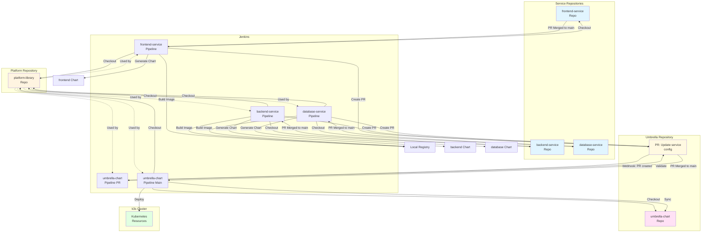

# Repository Structure and CI/CD Flow

This document describes the multi-repository structure and how files should be organized across GitHub repositories for the end-to-end CI/CD flow.

## Repository Structure

```
┌─────────────────────────────────────────────────────────────────┐
│                    GitHub Repositories                           │
├─────────────────────────────────────────────────────────────────┤
│                                                                 │
│  ┌──────────────────────────────────────────────────────────┐  │
│  │  platform-library Repository                              │  │
│  │  https://github.com/companyinfo/platform-library          │  │
│  ├──────────────────────────────────────────────────────────┤  │
│  │  platform-library/                                       │  │
│  │  ├── Chart.yaml                                          │  │
│  │  ├── values.yaml                                         │  │
│  │  └── templates/                                          │  │
│  │      ├── _helpers.tpl                                   │  │
│  │      ├── _deployment.yaml                               │  │
│  │      ├── _statefulset.yaml                               │  │
│  │      ├── _daemonset.yaml                                 │  │
│  │      ├── _service.yaml                                   │  │
│  │      ├── _ingress.yaml                                   │  │
│  │      ├── _certificate.yaml                               │  │
│  │      ├── _mtls.yaml                                      │  │
│  │      ├── _hpa.yaml                                       │  │
│  │      └── ...                                             │  │
│  └──────────────────────────────────────────────────────────┘  │
│                                                                 │
│  ┌──────────────────────────────────────────────────────────┐  │
│  │  frontend-service Repository                             │  │
│  │  https://github.com/companyinfo/frontend-service         │  │
│  ├──────────────────────────────────────────────────────────┤  │
│  │  frontend-service/                                       │  │
│  │  ├── configuration.yml  ← Jenkins triggers on change    │  │
│  │  ├── Dockerfile                                         │  │
│  │  ├── nginx.conf                                         │  │
│  │  ├── package.json                                       │  │
│  │  ├── src/                                               │  │
│  │  │   ├── App.js                                         │  │
│  │  │   └── ...                                            │  │
│  │  └── Jenkinsfile.service  ← Service-specific pipeline   │  │
│  └──────────────────────────────────────────────────────────┘  │
│                                                                 │
│  ┌──────────────────────────────────────────────────────────┐  │
│  │  backend-service Repository                              │  │
│  │  https://github.com/companyinfo/backend-service          │  │
│  ├──────────────────────────────────────────────────────────┤  │
│  │  backend-service/                                       │  │
│  │  ├── configuration.yml  ← Jenkins triggers on change    │  │
│  │  ├── Dockerfile                                         │  │
│  │  ├── main.py                                            │  │
│  │  ├── requirements.txt                                   │  │
│  │  └── Jenkinsfile.service                                │  │
│  └──────────────────────────────────────────────────────────┘  │
│                                                                 │
│  ┌──────────────────────────────────────────────────────────┐  │
│  │  database-service Repository                             │  │
│  │  https://github.com/companyinfo/database-service        │  │
│  ├──────────────────────────────────────────────────────────┤  │
│  │  database-service/                                      │  │
│  │  ├── configuration.yml  ← Jenkins triggers on change    │  │
│  │  ├── Dockerfile                                         │  │
│  │  ├── init.sql                                           │  │
│  │  └── Jenkinsfile.service                                │  │
│  └──────────────────────────────────────────────────────────┘  │
│                                                                 │
│  ┌──────────────────────────────────────────────────────────┐  │
│  │  umbrella-chart Repository                               │  │
│  │  https://github.com/companyinfo/umbrella-chart          │  │
│  ├──────────────────────────────────────────────────────────┤  │
│  │  umbrella-chart/                                        │  │
│  │  ├── Chart.yaml                                        │  │
│  │  ├── values.yaml                                       │  │
│  │  ├── services/                                         │  │
│  │  │   ├── frontend/                                    │  │
│  │  │   │   └── configuration.yml  ← Copied from service │  │
│  │  │   ├── backend/                                     │  │
│  │  │   │   └── configuration.yml                        │  │
│  │  │   └── database/                                    │  │
│  │  │       └── configuration.yml                        │  │
│  │  ├── charts/  ← Generated charts (gitignored)        │  │
│  │  ├── values-*.yaml  ← Generated values files          │  │
│  │  └── Jenkinsfile.umbrella  ← Umbrella pipeline        │  │
│  └──────────────────────────────────────────────────────────┘  │
│                                                                 │
│  ┌──────────────────────────────────────────────────────────┐  │
│  │  helm-chart-factory Repository (This Repo)              │  │
│  │  https://github.com/companyinfo/helm-chart-factory     │  │
│  ├──────────────────────────────────────────────────────────┤  │
│  │  factory/                                               │  │
│  │  ├── chart-generator/  ← Tools for generating charts  │  │
│  │  ├── umbrella-sync/     ← Tools for syncing umbrella   │  │
│  │  ├── scripts/          ← Setup and utility scripts     │  │
│  │  ├── cert-manager/     ← Cert-manager configs         │  │
│  │  ├── jenkins/          ← Jenkins manifests             │  │
│  │  ├── Jenkinsfile.service  ← Template for services     │  │
│  │  ├── Jenkinsfile.umbrella  ← Template for umbrella    │  │
│  │  └── Documentation                                     │  │
│  └──────────────────────────────────────────────────────────┘  │
│                                                                 │
└─────────────────────────────────────────────────────────────────┘
```

## File Distribution Across Repositories

### platform-library Repository
**Purpose:** Platform team maintains best practices templates

**Files:**
- `Chart.yaml` - Library chart metadata
- `values.yaml` - Default values
- `templates/` - All Helm templates
  - `_helpers.tpl`
  - `_deployment.yaml`
  - `_statefulset.yaml`
  - `_daemonset.yaml`
  - `_service.yaml`
  - `_ingress.yaml`
  - `_certificate.yaml`
  - `_mtls.yaml`
  - `_hpa.yaml`
  - `_serviceaccount.yaml`
  - `workload.yaml`
  - `deployment.yaml`
  - `service.yaml`
  - etc.

**CI/CD:** 
- Platform team updates templates
- Changes trigger regeneration of all service charts

### Service Repositories (frontend-service, backend-service, database-service, etc.)
**Purpose:** Service teams maintain their service code and configuration

**Files per service:**
- `configuration.yml` - Service Helm chart configuration
- `Dockerfile` - Container image definition
- Application source code (React, Python, etc.)
- `Jenkinsfile.service` - Service-specific CI/CD pipeline
- `.dockerignore`
- `.gitignore`
- `README.md` - Service-specific documentation

**CI/CD:**
- Webhook triggers on `configuration.yml` changes
- Jenkins pipeline:
  1. Builds Docker image
  2. Pushes to local registry
  3. Generates Helm chart
  4. Updates umbrella chart repository

### umbrella-chart Repository
**Purpose:** Central repository for all service configurations and umbrella chart

**Files:**
- `Chart.yaml` - Umbrella chart metadata
- `values.yaml` - Umbrella chart default values
- `services/` - Directory containing service configurations
  - `frontend/configuration.yml` - Copied from frontend-service repo
  - `backend/configuration.yml` - Copied from backend-service repo
  - `database/configuration.yml` - Copied from database-service repo
- `charts/` - Generated service charts (gitignored)
- `values-*.yaml` - Generated values files
- `Jenkinsfile.umbrella` - Umbrella chart CI/CD pipeline

**CI/CD:**
- Receives updates from service pipelines
- Jenkins pipeline:
  1. Syncs all service configurations
  2. Generates charts
  3. Updates dependencies
  4. Deploys to k3s

### helm-chart-factory Repository (This Repository)
**Purpose:** Tools, scripts, and documentation for the chart factory system

**Files:**
- `chart-generator/` - Chart generation tool
- `umbrella-sync/` - Umbrella sync tool
- `scripts/` - Setup and utility scripts
- `cert-manager/` - Cert-manager configurations
- `jenkins/` - Jenkins Kubernetes manifests
- `Jenkinsfile.service` - Template Jenkinsfile for services
- `Jenkinsfile.umbrella` - Template Jenkinsfile for umbrella
- Documentation files

## CI/CD Flow Diagram



## Setup Instructions

### 1. Create GitHub Repositories

```bash
# Platform library
gh repo create companyinfo/platform-library --public
git clone https://github.com/companyinfo/platform-library.git
cd platform-library
# Copy platform-library/ contents from this repo
git add .
git commit -m "Initial platform library chart"
git push

# Service repositories
gh repo create companyinfo/frontend-service --public
gh repo create companyinfo/backend-service --public
gh repo create companyinfo/database-service --public

# Umbrella chart
gh repo create companyinfo/umbrella-chart --public
git clone https://github.com/companyinfo/umbrella-chart.git
cd umbrella-chart
# Copy umbrella-chart/ contents and create services/ directory
mkdir -p services
git add .
git commit -m "Initial umbrella chart"
git push
```

### 2. Setup Service Repositories

For each service repository (frontend, backend, database):

```bash
# Clone service repo
git clone https://github.com/companyinfo/frontend-service.git
cd frontend-service

# Copy service files
# - configuration.yml
# - Dockerfile
# - Application code
# - Jenkinsfile.service (from this repo)

git add .
git commit -m "Initial service configuration"
git push
```

### 3. Configure Jenkins

#### Create Service Pipeline Jobs

For each service (frontend, backend, database):

1. **New Item** → **Pipeline**
2. **Pipeline definition**: Pipeline script from SCM
3. **SCM**: Git
4. **Repository URL**: `https://github.com/companyinfo/frontend-service.git`
5. **Script Path**: `Jenkinsfile.service`
6. **Branches**: `*/main`

#### Create Umbrella Pipeline Job

1. **New Item** → **Pipeline**
2. **Pipeline definition**: Pipeline script from SCM
3. **SCM**: Git
4. **Repository URL**: `https://github.com/companyinfo/umbrella-chart.git`
5. **Script Path**: `Jenkinsfile.umbrella`
6. **Branches**: `*/main`

### 4. Configure Webhooks

#### Service Repository Webhooks

For each service repository, add webhook:
- **URL**: `http://jenkins-url:30080/github-webhook/`
- **Events**: Push events
- **Path filter**: `configuration.yml`

#### Umbrella Repository Webhook

- **URL**: `http://jenkins-url:30080/github-webhook/`
- **Events**: Push events
- **Path filter**: `Chart.yaml` or `services/**/configuration.yml`

### 5. Configure GitHub Credentials in Jenkins

1. **Manage Jenkins** → **Credentials**
2. Add GitHub credentials:
   - **Kind**: Username with password
   - **ID**: `github-credentials`
   - **Username**: GitHub username
   - **Password**: GitHub personal access token

## Workflow Examples

### Developer Updates Service Configuration

1. Developer edits `configuration.yml` in `frontend-service` repo
2. Commits and pushes: `git commit -m "Update frontend config" && git push`
3. Webhook triggers `frontend-service` Jenkins pipeline
4. Pipeline:
   - Checks out frontend-service repo
   - Checks out platform-library repo
   - Builds Docker image
   - Generates Helm chart
   - Updates umbrella-chart repo (creates PR branch)
5. Umbrella chart repo receives update
6. Webhook triggers umbrella-chart pipeline
7. Umbrella pipeline deploys to k3s

### Platform Team Updates Library Chart

1. Platform team edits templates in `platform-library` repo
2. Commits and pushes
3. All service pipelines regenerate charts (if triggered)
4. Umbrella chart pipeline redeploys with new templates

## File Mapping Reference

| File/Directory | Repository | Purpose |
|---------------|-----------|---------|
| `platform-library/` | `platform-library` | Platform templates |
| `services/*/configuration.yml` | `*-service` | Service configs |
| `services/*/Dockerfile` | `*-service` | Container images |
| `services/*/src/` | `*-service` | Application code |
| `umbrella-chart/Chart.yaml` | `umbrella-chart` | Umbrella metadata |
| `umbrella-chart/services/` | `umbrella-chart` | Service configs (copied) |
| `umbrella-chart/charts/` | `umbrella-chart` | Generated charts |
| `chart-generator/` | `helm-chart-factory` | Tools |
| `umbrella-sync/` | `helm-chart-factory` | Tools |
| `scripts/` | `helm-chart-factory` | Utilities |
| `Jenkinsfile.service` | `*-service` | Service pipeline |
| `Jenkinsfile.umbrella` | `umbrella-chart` | Umbrella pipeline |

## Best Practices

1. **Service Repos**: Keep only service-specific files
2. **Platform Repo**: Only platform team can modify
3. **Umbrella Repo**: Auto-updated by pipelines, manual PR review
4. **Tools Repo**: Contains reusable tools and documentation
5. **Webhooks**: Configure path filters to avoid unnecessary builds
6. **Credentials**: Use GitHub tokens with minimal required permissions
7. **Branch Strategy**: Use PR branches for umbrella chart updates

