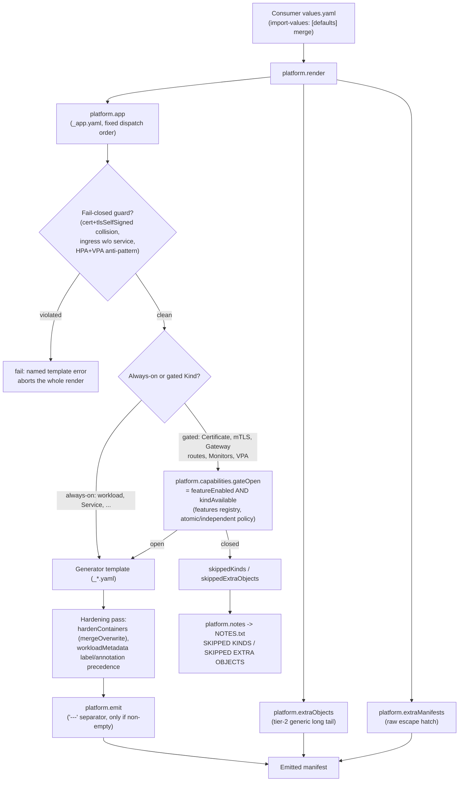
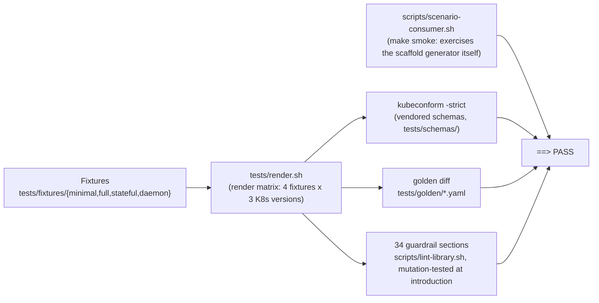

# Architecture Spec — `platform` Helm Library v2

> Refreshed 2026-08-04 against `main` (`platform-library/Chart.yaml` at
> `version: 2.2.0`). This revision adds the diagrams that were previously
> missing entirely, folds in the 2026-07 correctness waves (capability
> feature-registry unification, annotation-precedence fix, the managed
> headless Service, negotiated Gateway API versions, three new fail-closed
> guards), and corrects drift in the render-order table and validation-gate
> description. Every claim below is grounded in the template source
> (`templates/_capabilities.tpl`, `templates/_util.tpl`, `templates/_app.yaml`,
> `templates/_helpers.tpl`, `values.yaml`, `Chart.yaml`) or in
> `scripts/lint-library.sh`; nothing here describes aspirational behavior.

This document describes the engineering design of the `platform` library
chart (directory `platform-library/`).

## 1. Chart identity

```yaml
# platform-library/Chart.yaml
apiVersion: v2
name: platform
type: library
version: 2.2.0
appVersion: "2.2.0"
kubeVersion: ">=1.34.0-0 <1.37.0-0"   # Kubernetes 1.34 – 1.36
```

- Pure `type: library`: not installable, contains only `_`-prefixed templates.
- Targets Helm 4.0–4.2 (verified on Helm v4.2.0) and Kubernetes 1.34–1.36
  (n-2 policy: the latest supported minor plus two behind).

## 2. Rendering model

### 2.1 The single entrypoint: `platform.render`

A consumer chart's only template file is `templates/app.yaml`:

```yaml
{{ include "platform.render" . }}
```

`platform.render` (in `_util.tpl`) composes three layers, in order:

```
platform.render
├── platform.app            # tier-1: opinionated "primary app" objects
├── platform.extraObjects   # tier-2: generic, declarative long tail
└── platform.extraManifests # raw escape hatch (verbatim / tpl)
```

### 2.2 Render pipeline



Only the workload generators route their containers through the hardening
pass (`hardenContainers`); non-workload generators (Service, Ingress, RBAC,
...) have no containers to harden and go straight from generator to
`platform.emit`. The diagram folds both paths into one box for readability.

### 2.3 Tier-1: `platform.app`

Defined in `_app.yaml`. It walks the enabled features in a fixed order and
includes the matching generator, each wrapped in `platform.emit`. Three
cross-field guards `fail` the render outright if a consumer's values combine
into a configuration that would either dangle or double-act on a resource.
The full order (from the source):

| # | Object(s) | Gate |
|---|---|---|
| 1 | ConfigMap | `configMap.enabled` |
| 2 | Pre/post-install script ConfigMaps | `jobs.{preInstall,postInstall}.enabled` and a `script`/`scriptFile` present |
| 3 | Secret | `secret.enabled` |
| — | **[FAIL-CLOSED]** | `certificate.enabled` and `tlsSelfSigned.enabled` name the same Secret |
| 4 | Certificate (cert-manager) | `certificate.enabled` and `gateOpen "Certificate"` |
| 5 | TLS secrets (provided certs) | `ingress.enabled` and `ingress.secrets` |
| 6 | Self-signed TLS | `tlsSelfSigned.enabled` |
| 7 | mTLS (Istio PeerAuthentication + AuthorizationPolicy) | `mtls.enabled` and `gateOpen "PeerAuthentication"` (atomic: proves both APIs) |
| 8 | PersistentVolumeClaim | `persistence.enabled` |
| 9 | Workload (Deployment/StatefulSet/DaemonSet) | always |
| 10 | HorizontalPodAutoscaler | `autoscaling.enabled` |
| — | **[FAIL-CLOSED]** | HPA scales on CPU/memory **and** `verticalAutoscaling.updateMode != "Off"` (HPA/VPA anti-pattern) |
| 11 | VerticalPodAutoscaler | `verticalAutoscaling.enabled` and `gateOpen "VerticalPodAutoscaler"` |
| 12 | Service | `service.enabled` |
| 13 | Headless Service (managed) | `platform.statefulset.needsManagedHeadless` (StatefulSet, no explicit `statefulSet.serviceName`, primary Service isn't already headless) |
| — | **[FAIL-CLOSED]** | `ingress.enabled` and `service.enabled` is false (dangling backend) |
| 14 | Ingress | `ingress.enabled` |
| 15 | Gateway API (HTTPRoute/GRPCRoute) | `gatewayApi.enabled` and `gateOpen "HTTPRoute"` (HTTPRoute/GRPCRoute negotiate independently — see §3.6) |
| 16 | NetworkPolicy | `networkPolicy.enabled` |
| 17 | PodDisruptionBudget | `podDisruptionBudget.enabled` |
| 18 | ResourceQuota | `resourceQuota.enabled` |
| 19 | LimitRange | `limitRange.enabled` |
| 20 | ServiceAccount | `serviceAccount.create` or `serviceAccount.name` |
| 21 | Hook ServiceAccount (distinctly named, `<fullname>-preinstall`) | `serviceAccount.create` and `jobs.preInstall.enabled` |
| 22 | RBAC (Role/RoleBinding) | `rbac.enabled` |
| 23 | ServiceMonitor | `gateOpen "ServiceMonitor"` |
| 24 | PodMonitor | `gateOpen "PodMonitor"` |
| 25 | PrometheusRule | `gateOpen "PrometheusRule"` |
| 26 | CronJob | `cronJob.enabled` |
| 27 | Pre-install hook Job | `jobs.preInstall.enabled` |
| 28 | Post-install hook Job | `jobs.postInstall.enabled` |

Note the two-part gate on CRD-backed tier-1 objects (Certificate, mTLS,
Gateway routes, ServiceMonitor, PodMonitor, PrometheusRule,
VerticalPodAutoscaler): the feature flag **and** `gateOpen` (§3.6). This is
what lets those objects skip cleanly when the CRD is absent, and what feeds
the NOTES `SKIPPED KINDS` warning instead of a hard failure.

### 2.4 The separator invariant: `platform.emit`

Because everything in v2 renders from a *single* template file (unlike v1's
one-file-per-object layout), adjacent YAML documents would merge without an
explicit separator and cause duplicate-key errors. `platform.emit` prefixes a
`---` to each **non-empty** rendered document:

```gotemplate
{{- define "platform.emit" -}}
{{- $content := . | trim -}}
{{- if $content }}
---
{{ $content }}
{{- end }}
{{- end -}}
```

The non-empty check matters: a generator that renders nothing (e.g. gated
out) must not emit a bare `---` with no body. `platform.extraObjects` and
`platform.extraManifests` apply the same "separator only when non-empty" rule
inline.

## 3. Capability negotiation (`_capabilities.tpl`)

### 3.1 `platform.capabilities.has (list $top "group/version[/Kind]")`

Returns `"true"` (else `""`) when the cluster serves the given API. It unions
two sources:

1. Live discovery: `$top.Capabilities.APIVersions.Has $gvk`.
2. A force-assume override list at `.Values.capabilities.apiVersions`.

Entries in the override list may be `group/version` **or** `group/version/Kind`;
both forms match (the helper compares the full GVK and the group/version prefix).

### 3.2 `platform.capabilities.apiVersion (list $top $prefList)`

Walks an ordered preference list of `group/version/Kind` strings and returns
the first available `group/version` (e.g. `autoscaling/v2`), or `""` if none
is served.

### 3.3 `platform.capabilities.registry`

The canonical `Kind -> ordered preference list` table (a YAML block parsed
with `fromYaml`). The **first** entry per Kind is the preferred (newest GA)
version; betas/older versions follow. Full contents:

**core/v1** (all `["v1/<Kind>"]`): Pod, Service, ConfigMap, Secret,
PersistentVolumeClaim, PersistentVolume, ServiceAccount, Namespace, ResourceQuota,
LimitRange, Endpoints, Event, ReplicationController, PodTemplate.

**apps/v1**: Deployment, StatefulSet, DaemonSet, ReplicaSet, ControllerRevision.

**batch**: Job `["batch/v1"]`; CronJob `["batch/v1"]`.

The registry's floor is Kubernetes 1.34 (`Chart.yaml` `kubeVersion`). Fallback
entries are only kept for `apiVersion`s still served somewhere in the
1.34–1.36 support window; versions removed before 1.34 (`batch/v1beta1`,
`policy/v1beta1`, `autoscaling/v2beta1`, `autoscaling/v2beta2`,
`networking.k8s.io/v1beta1`, `extensions/v1beta1`,
`flowcontrol.apiserver.k8s.io/v1beta3`) are pruned rather than carried as dead
weight. `autoscaling/v1` is kept as the HPA fallback because that version was
never removed upstream.

| Kind | Group | Preference order |
|---|---|---|
| HorizontalPodAutoscaler | autoscaling | `v2`, `v1` |
| PodDisruptionBudget | policy | `v1` |
| Ingress | networking.k8s.io | `v1` |
| IngressClass, NetworkPolicy | networking.k8s.io | `v1` |
| Role, RoleBinding, ClusterRole, ClusterRoleBinding | rbac.authorization.k8s.io | `v1` |
| StorageClass, VolumeAttachment, CSIDriver, CSINode, CSIStorageCapacity | storage.k8s.io | `v1` |
| PriorityClass | scheduling.k8s.io | `v1` |
| RuntimeClass | node.k8s.io | `v1` |
| Lease | coordination.k8s.io | `v1` |
| EndpointSlice | discovery.k8s.io | `v1` |
| ValidatingWebhookConfiguration, MutatingWebhookConfiguration | admissionregistration.k8s.io | `v1` |
| ValidatingAdmissionPolicy, ValidatingAdmissionPolicyBinding | admissionregistration.k8s.io | `v1`, `v1beta1` |
| MutatingAdmissionPolicy, MutatingAdmissionPolicyBinding | admissionregistration.k8s.io | `v1`, `v1beta1` |
| CustomResourceDefinition | apiextensions.k8s.io | `v1` |
| CertificateSigningRequest | certificates.k8s.io | `v1` |
| APIService | apiregistration.k8s.io | `v1` |
| FlowSchema, PriorityLevelConfiguration | flowcontrol.apiserver.k8s.io | `v1` |
| GatewayClass, Gateway, HTTPRoute | gateway.networking.k8s.io | `v1`, `v1beta1` |
| GRPCRoute | gateway.networking.k8s.io | `v1`, `v1alpha2` |
| ReferenceGrant | gateway.networking.k8s.io | `v1beta1`, `v1alpha2` |
| Certificate, Issuer, ClusterIssuer, CertificateRequest | cert-manager.io | `v1` |
| PeerAuthentication, AuthorizationPolicy, RequestAuthentication | security.istio.io | `v1`, `v1beta1` |
| VirtualService | networking.istio.io | `v1`, `v1beta1`, `v1alpha3` |
| DestinationRule, ServiceEntry, Sidecar | networking.istio.io | `v1`, `v1beta1` |
| ServiceMonitor, PodMonitor, PrometheusRule, Probe | monitoring.coreos.com | `v1` |
| VerticalPodAutoscaler | autoscaling.k8s.io | `v1` |
| VolumeSnapshot, VolumeSnapshotClass, VolumeSnapshotContent | snapshot.storage.k8s.io | `v1` |
| ResourceClaim, ResourceClaimTemplate, DeviceClass | resource.k8s.io | `v1` |

### 3.4 The two negotiation modes — and why

Two Kind-name helpers sit on top of the registry:

- **`platform.capabilities.apiVersionFor (list $top "Kind")`** — *strict*.
  Negotiates from the registry; returns `""` when nothing is served.
  **Skip-if-absent.** Used for CRDs and optional objects: a missing API must
  mean "do not render", so a deploy never conflicts.

- **`platform.capabilities.apiVersionForOrDefault (list $top "Kind")`** —
  negotiate, else fall back to the **first (preferred GA)** registry entry.
  **Never empty.** Used for always-present built-in Kinds so a core workload
  is never silently dropped.

The selector between them is:

- **`platform.capabilities.isStable (list $top "Kind")`** — returns `"true"`
  when the Kind's group (derived from the group of its first registry
  preference) is in the built-in Kubernetes group set (core, apps, batch,
  autoscaling, policy, extensions, networking.k8s.io, rbac.*, storage.k8s.io,
  scheduling.k8s.io, node.k8s.io, coordination.k8s.io, discovery.k8s.io,
  admissionregistration.k8s.io, apiextensions.k8s.io, certificates.k8s.io,
  apiregistration.k8s.io, flowcontrol.apiserver.k8s.io, authentication.k8s.io,
  authorization.k8s.io, events.k8s.io). CRD families
  (gateway/cert-manager/istio/monitoring) and optional built-in groups that
  require cluster feature support (snapshot.storage.k8s.io, resource.k8s.io)
  return `""`.

**Why the split (the core rationale to preserve):** under bare
`helm template` with no cluster, Helm's default API discovery set is
*minimal* — it does not report the full built-in group set, and reports no
CRDs at all. If GA built-ins were gated *strictly*, negotiation would wrongly
return `""` and a core workload (Deployment, Service, ...) would be dropped
from a plain `helm template`. So:

- **Built-ins → `OrDefault`**: always render, at the best available version,
  falling back to preferred GA when discovery is silent.
- **CRDs/optional → strict `apiVersionFor`**: never render when absent, so
  they never conflict on a real deploy.

CI and local dev bridge the gap for CRDs by **force-assuming** their groups
via `.Values.capabilities.apiVersions` (see the `full` fixture, which lists
`gateway.networking.k8s.io/v1`, `cert-manager.io/v1`,
`security.istio.io/v1beta1`, `monitoring.coreos.com/v1`).

### 3.5 Cluster-scope handling

`platform.capabilities.isClusterScoped "Kind"` returns `"true"` for the
cluster-scoped set (Namespace, Node, PersistentVolume, ClusterRole,
ClusterRoleBinding, StorageClass, VolumeAttachment, CSIDriver, CSINode,
PriorityClass, RuntimeClass, IngressClass, CustomResourceDefinition,
APIService, CertificateSigningRequest, ValidatingWebhookConfiguration,
MutatingWebhookConfiguration, ValidatingAdmissionPolicy,
ValidatingAdmissionPolicyBinding, MutatingAdmissionPolicy,
MutatingAdmissionPolicyBinding, FlowSchema, PriorityLevelConfiguration,
GatewayClass, ClusterIssuer, ComponentStatus, VolumeSnapshotClass,
VolumeSnapshotContent, DeviceClass). The generic renderer uses it to decide
whether to stamp a `metadata.namespace`.

### 3.6 The features registry: composition-aware gating (2026-07)

The registry (§3.3) answers "what apiVersion does this one Kind negotiate
to?". It does not answer a harder question the library actually needs: some
features are single-Kind (ServiceMonitor), some are **multi-Kind and must be
all-or-nothing** (mTLS needs both PeerAuthentication and AuthorizationPolicy —
rendering one without the other is a broken policy), and some are
**multi-Kind but genuinely independent** (`gatewayApi` covers HTTPRoute and
GRPCRoute, two unrelated CRDs — losing GRPCRoute's API should not block
HTTPRoute). Four earlier, separately-maintained representations (the
Kind→apiVersion registry, the `isStable` built-in-group classification, an
older single-representative-Kind gating table, and the cluster-scoped list)
made this composition policy implicit and easy to get wrong — see
`plans/010-capability-registry-unification.md` (follows the surgical fix in
`plans/005-capability-gate-secondary-kinds.md`, which first closed the gap
for originally-ungated secondary Kinds AuthorizationPolicy and GRPCRoute).
`plans/010` replaced all four with one structured registry:

```yaml
certificate:
  composition: atomic
  kinds: [Certificate]
mtls:
  composition: atomic
  kinds: [PeerAuthentication, AuthorizationPolicy]
gatewayApi:
  composition: independent
  kinds: [HTTPRoute, GRPCRoute]
  requires:
    GRPCRoute: gatewayApi.grpcRoute
serviceMonitor:
  composition: atomic
  kinds: [ServiceMonitor]
podMonitor:
  composition: atomic
  kinds: [PodMonitor]
prometheusRule:
  composition: atomic
  kinds: [PrometheusRule]
verticalAutoscaling:
  composition: atomic
  kinds: [VerticalPodAutoscaler]
```

Helpers built on this registry (`platform.capabilities.features`, all in
`_capabilities.tpl`):

- **`kindRequires (list $top "Kind")`** — resolves a Kind to its owning
  feature's dotted values path (e.g. `GRPCRoute` → `gatewayApi.grpcRoute`).
- **`featureEnabled (list $top "path")`** — walks a dotted path
  (`gatewayApi.grpcRoute`) and requires every segment along the way to be a
  map with a truthy `.enabled` — a feature nested under a disabled parent is
  not enabled.
- **`kindAvailable (list $top "Kind")`** — composition-aware:
  - `atomic` — every Kind in the feature's set must have a negotiable API, or
    none of them render (mTLS's AuthorizationPolicy going missing takes
    PeerAuthentication down with it, rather than shipping half a policy).
  - `independent` — only the queried Kind's own API matters (GRPCRoute's
    absence never blocks HTTPRoute, and vice versa).
  - Any other composition value is a template-authoring bug and `fail`s
    immediately rather than gating silently wrong.
- **`gateOpen (list $top "Kind")`** — `featureEnabled AND kindAvailable`. This
  is the single emitter gate `_app.yaml` now calls for every CRD-backed
  object (§2.3); no generator hand-rolls its own enabled-and-available check.
- **`skippedKinds $top`** — the exact complement of `gateOpen`, sorted
  alphabetically: every Kind whose feature is enabled but whose composition
  policy held it back (including an atomic Kind skipped only because its
  *partner* Kind's API is missing). Feeds the NOTES `SKIPPED KINDS` warning.
- **`skippedExtraObjects $top`** — the tier-2 mirror of the same idea, for
  `extraObjects` entries whose Kind has no negotiable API.
- **`apiVersionsFor (list $top "Kind")`** — the comma-separated list of
  versions that were tried, for NOTES detail text (e.g. "(tried
  security.istio.io/v1, security.istio.io/v1beta1)").

`platform.mtls` (`_mtls.yaml`) is worth reading as a concrete example of the
atomic policy in practice: the `_app.yaml` wrapper gate already proved both
PeerAuthentication and AuthorizationPolicy are available before the template
runs, but the AuthorizationPolicy block re-checks its own API with a plain
`apiVersionFor` anyway — documented in-template as defense-in-depth, keeping
the per-Kind skip-if-absent doctrine local to the emitter should the feature
ever be redeclared `independent`. `_gateway-api.yaml` is the independent
counterpart: HTTPRoute negotiates via `apiVersionForOrDefault` (safe — the
wrapper already proved it), GRPCRoute negotiates its **own** API via a
strict, separate `coalesce` (an explicit `grpcRoute.apiVersion` override, then
`gatewayApi.apiVersion`, then `apiVersionFor "GRPCRoute"`) — HTTPRoute's
availability proves nothing about GRPCRoute, and this per-Kind check is
exactly the mechanism the `independent` composition policy relies on.

## 4. The generic renderer (`platform.genericResource`)

`_util.tpl` defines the one renderer that backs the entire long tail:

```gotemplate
include "platform.genericResource" (dict "root" $top "kind" "Role" "resource" $spec)
```

Contract:

1. **apiVersion resolution.** If the spec carries an explicit `apiVersion`,
   use it. Otherwise negotiate: `OrDefault` when `isStable` is true
   (built-in), strict `apiVersionFor` otherwise (CRD). **If no apiVersion is
   available, emit nothing** (skip-if-absent).
2. **Identity.** Sets `apiVersion`, `kind`, `metadata.name` (`required` —
   errors with `extraObjects.<Kind>[].name is required` if missing).
3. **Namespace.** Adds `metadata.namespace` (defaulting to
   `.Release.Namespace`) **unless** the Kind is cluster-scoped or the spec
   sets `clusterScoped: true`.
4. **Labels/annotations.** Stamps `platform.labels` (standard chart labels),
   merges any `labels`/`annotations` from the spec.
5. **Passthrough.** Every top-level key except the reserved set (`name`,
   `namespace`, `labels`, `annotations`, `apiVersion`, `kind`,
   `clusterScoped`, `metadata`) is emitted verbatim — maps/slices via
   `toYaml`, scalars inline. This is what makes `rules`, `subjects`,
   `roleRef`, `spec`, `data`, `webhooks`, `value`, etc. all work through one
   renderer with no per-Kind code.

### 4.1 `platform.extraObjects`

Iterates `.Values.extraObjects` (a map of `Kind -> [specs]`), calling
`genericResource` per entry and prefixing `---` only when the render is
non-empty (so absent-API objects leave no stray separator). Two fail-closed
checks run ahead of the render:

- **Unknown Kind, no explicit `apiVersion`.** If the Kind isn't in the
  capability registry and the entry doesn't supply its own `apiVersion`, the
  entry `fail`s the render rather than silently dropping the object — the
  error names the Kind and points at `extraManifests` as the escape hatch.
- **Cluster-scoped Kind, `allowClusterScopedExtras` not set.** Refused by
  default (`fail`); the values key exists specifically to opt in.

### 4.2 `platform.extraManifests`

Iterates `.Values.extraManifests` (a list). String entries are rendered
through `tpl $manifest $top` (so they may contain template expressions); map
entries are emitted with `toYaml`. Entries that render to nothing (a string
whose template collapses to empty, or an empty map `{}`) are skipped so no
separator-only or bare `{}` document is emitted. The consumer supplies the
full `apiVersion`/`kind` — this layer does **no** negotiation, labelling, or
namespacing.

## 5. The "gate outside `fromYaml`" invariant

**Invariant — gate outside `fromYaml`:** capability/enable gating must happen
in the *wrapper* **before** invoking a generator at all. `fromYaml ""` yields
`{}`, which would serialize to a bogus empty document. The wrapper must
decide "render or not" first; a generator assumes it is only ever called when
a document is actually wanted. This is the same reasoning behind
`platform.emit`'s non-empty guard.

> A `platform.util.merge` overlay helper (bitnami-common style) previously
> lived in `_util.tpl` and was described here as public API for advanced
> consumers. It had no call sites anywhere in the library and was removed on
> 2026-07-12 (bead `helm-factory-b01`). The invariant above outlived it.

## 6. Precedence: labels, annotations, imagePullSecrets

"Specific beats common beats global" is a design invariant (project
`CLAUDE.md` invariant 3), but it is **not** implemented by one shared helper —
three different call sites use three different idioms, and `imagePullSecrets`
follows a materially different mechanism entirely. Conflating any of these is
a real way to misread the code, so they're kept distinct below.

| Precedence (low → high, later wins on key collision) | Labels | Annotations |
|---|---|---|
| 1. Structural (chart-standard, not user-overridable) | `platform.labels` | — |
| 2. Common (chart-wide) | `commonLabels` | `commonAnnotations` |
| 3. Resource-specific | `.Values.labels` (workload) / `ingress.labels` / `gatewayApi.labels` → per-route `labels` | `.Values.annotations` (workload) / `ingress.annotations` / `gatewayApi.annotations` → per-route `annotations` |

Three distinct code idioms all land on this same "later wins" outcome:

1. **`platform.workloadMetadata`** (`_helpers.tpl`) — sequential range-emit:
   `platform.labels`, then `commonLabels`, then `labels` (specific emitted
   last in the YAML mapping, so it wins on collision); the same pattern for
   `commonAnnotations` then `annotations`.
2. **`platform.ingress` / Gateway API routes** (`_ingress.yaml`,
   `_gateway-api.yaml`) — a `dict`-based range+set: build a map by ranging
   `commonAnnotations` first, then the resource-specific block second; later
   `set` calls win on key collision. Before bead `hf-tyw` (CHANGELOG
   `2.1.0`), these sites used bare Sprig `merge`, which keeps the
   *destination* map's keys — `commonAnnotations` silently won over a
   resource-specific override. The fix switched to the range+set idiom
   specifically because it makes the winner visually obvious in the template
   (last range wins), rather than depending on which argument position a
   merge call happens to take.
3. **`platform.service.headless`** (`_service-headless.yaml`) — a single
   fixed label, `platform/service-role: "headless"`, emitted **last** after
   ranging over `commonLabels`, with an explicit code comment: "Emitted last
   so a commonLabels collision cannot shadow it."

**The `merge`-vs-`mergeOverwrite` trap.** Sprig's `merge $dst $src` keeps
`$dst`'s keys on collision (destination wins); `mergeOverwrite $dst $src`
lets `$src` win (last-argument wins). Getting this backwards is exactly the
bug the annotation-precedence fix above corrected. `platform.hardenContainers`
(`_helpers.tpl`) deliberately uses `mergeOverwrite $default (default (dict)
$container.securityContext)` — with the code comment: "The container's own
securityContext keys win on conflict: mergeOverwrite lets the LAST map
override, whereas sprig's `merge` prefers the destination and would silently
discard the user's override." One helper needs source-wins
(`mergeOverwrite`), the other class of site needed a visually-explicit
range+set instead of either merge function — there is no single "correct"
merge call, only a correct call for each direction of override.

**`imagePullSecrets` is not a precedence case.**
`platform.podPolicy.imagePullSecrets` (`_helpers.tpl`) concatenates
`global.imagePullSecrets` then `image.pullSecrets` and applies `uniq`, which
keeps the **first** occurrence — global entries stay first and deduped, not
"overridden" by anything. This is list concatenation with stable
deduplication, not a map-key-collision override; it happens to be discussed
alongside the labels/annotations precedence story only because the CHANGELOG
(`hf-k9c`) fixed a dedup bug in it during the same release wave. Don't read
"specific beats common" into it — there is no common/specific tier here, just
global-then-local with duplicates removed.

## 7. Fresh-install hook ordering

Pre-install hooks run in ascending `helm.sh/hook-weight` order. The script
ConfigMap (`_configmap-script.yaml`, pre-install variant only — the
post-install script ConfigMap gets no hook annotations, since post-install
hooks run after normal resources already exist) and the hook ServiceAccount
(`platform.serviceAccount.hook`, `_helpers.tpl`) are both annotated
`helm.sh/hook-weight: "{{ sub $hookWeight 1 }}"` — **the same weight** (Helm
does not order same-weight hooks relative to each other; both simply
complete, in whichever order, strictly before anything at a higher weight).
The Job itself carries the un-adjusted `hookWeight` (default `-5`), so it
always runs after both.

```mermaid
sequenceDiagram
    participant U as helm install
    participant CM as ConfigMap (script)<br/>weight hookWeight-1
    participant SA as ServiceAccount (hook)<br/>&lt;fullname&gt;-preinstall<br/>weight hookWeight-1
    participant J as Job<br/>weight hookWeight (default -5)
    participant RSA as Release ServiceAccount<br/>&lt;fullname&gt; (running pods' identity)

    Note over CM,SA: before-hook-creation clears any leftover from a prior failed attempt
    par same weight - relative order between these two not guaranteed
        U->>CM: create
        U->>SA: create
    end
    Note over RSA: never touched - distinct name from the hook SA
    U->>J: create (strictly after CM/SA - higher weight)
    J->>CM: mount script.sh
    J->>SA: run as this identity (not RSA)
    alt Job succeeds
        U->>CM: hook-succeeded delete
        U->>SA: hook-succeeded delete
        U->>J: hook-succeeded delete
        Note over RSA: still live - tokens of running pods stay valid
    else Job fails
        Note over CM,J: left behind for debugging
        Note over U: next attempt's before-hook-creation clears them
    end
```

**Why the hook ServiceAccount is distinctly named.** `platform.hookServiceAccountName`
resolves to `<fullname>-preinstall`, never the release ServiceAccount's own
name. The code comment (`_helpers.tpl`) is the exact rationale to preserve:
"It carries a distinct name rather than shadowing the release
ServiceAccount: a same-named hook copy would make
`helm.sh/hook-delete-policy` delete the LIVE ServiceAccount on every helm
upgrade, invalidating the bound tokens of the pods still running.
hook-succeeded reaps it once the hook phase is done; a failed hook leaves it
behind for debugging and before-hook-creation clears it on the next attempt."

The Job carries the same `before-hook-creation,hook-succeeded` delete policy
as the ConfigMap and the hook SA — on a successful install all three hook
resources are removed; on failure all three are left in place for
inspection until the next `helm install`/`upgrade` attempt clears them.

## 8. StatefulSet governing headless Service

`platform.statefulset.needsManagedHeadless` (`_helpers.tpl`) is true when
`workload.type` is StatefulSet, no explicit `statefulSet.serviceName` is set,
and the primary Service isn't already a headless ClusterIP (`clusterIP:
None`). When true, `_service-headless.yaml` renders a second Service named
via `platform.headlessServiceName` (`<fullname>-headless`): `ClusterIP` type,
`clusterIP: None`, the same selector as the primary Service
(`platform.selectorLabels`), ports falling back to
`platform.primaryServicePort`, and a `platform/service-role: "headless"`
label emitted last (§6, idiom 3) so a `commonLabels` collision can't shadow
it. `platform.statefulset.serviceName` resolves the StatefulSet's own
`spec.serviceName` with the same three-tier priority: an explicit
`statefulSet.serviceName` verbatim, else the primary Service if it's already
headless, else the library-managed `<fullname>-headless`.

Because the managed headless Service carries the same selector as the
primary Service, the default `ServiceMonitor` selector adds a
`matchExpressions: [{key: platform/service-role, operator: NotIn}]` clause
(`_servicemonitor.yaml`) so Prometheus Operator does not generate duplicate
scrape targets for the same pods (bead `helm-factory-75c`). An explicit
`serviceMonitor.selector` is a full override and is used verbatim, without
the exclusion grafted on.

## 9. Values contract (`exports.defaults` + `import-values: [defaults]`)

All defaults live under `exports.defaults` in the library's `values.yaml`. A
consumer's `import-values: [defaults]` merges them into the consumer's
**root** scope. The contract has three tiers:

- **Tier-1 (opinionated blocks):** `workload`, `image`, `ports`, `service`,
  `ingress`, `gatewayApi`, `autoscaling`, `verticalAutoscaling`,
  `podDisruptionBudget`, `persistence`, `configMap`, `secret`, `certificate`,
  `mtls`, `tlsSelfSigned`, `jobs`, `cronJob`, `serviceAccount`,
  `serviceMonitor`, `podMonitor`, `prometheusRule`, `networkPolicy`,
  `resourceQuota`, `limitRange`, `highAvailability`, security contexts,
  scheduling, labels, etc. Each has an `enabled` flag where applicable.
- **Tier-2 — `extraObjects`:** a **map** of
  `Kind: [ {name, namespace?, labels?, annotations?, clusterScoped?, …passthrough} ]`.
  Default `{}`.
- **Raw — `extraManifests`:** a **list** of full manifest maps or template
  strings. Default `[]`.
- **`capabilities.apiVersions`:** the force-assume list. Default `[]`.

### 9.1 Value-schema validation (`values.schema.reference.json`)

The root-contract JSON Schema ships as
`platform-library/values.schema.reference.json` — deliberately **not** as a
magic `values.schema.json` at the library root. Helm auto-validates a
chart's values against a `values.schema.json` in that chart's directory; the
library's own values are wrapped under `exports.defaults`, so a root schema
describing the *post-import* (unwrapped) contract would validate against the
wrapped structure and fail. The reference file (`$schema` draft-07 — Helm's
built-in `gojsonschema` validator only implements draft-04 through draft-07,
so the declared dialect must match what Helm actually enforces
(helm/helm#13069) — `title: "platform-library consumer values"`,
`additionalProperties: true`) instead documents the contract for
**consumers**: the scaffold generator copies it into each consumer chart as
`values.schema.json`, where the post-import root values do match it (e.g. it
requires `image.repository`, constrains `workload.type` to the three
workload Kinds, `image.pullPolicy` to the pull-policy enum, and
`podSecurityContext`/`containerSecurityContext`/`networkPolicy.policyTypes`/
`serviceAccount.name`/`ingress.hostname` to typed, pattern-constrained
shapes, etc.). `scripts/lint-library.sh` validates the reference file against
its metaschema and every fixture's values against it (`check-jsonschema`),
and `tests/render.sh` copies it into each fixture as `values.schema.json` so
Helm itself enforces the contract on every rendered fixture.

**Naming note (collision avoidance):** container resource requests/limits
stay under `resources:` (a tier-1 block). The tier-2 long tail is
deliberately named `extraObjects`, **not** `resources`, so the two never
collide.

## 10. Scaffold generator (`scripts/new-app-chart.sh`)

`scripts/new-app-chart.sh <name>` scaffolds a ready-to-render consumer chart.

```
scripts/new-app-chart.sh <name> \
  [--dir <path>] \
  [--repo <url, default file://../platform-library>] \
  [--version <range, default ">=2.0.0-0">] \
  [--app-version <v>]
```

It produces a consumer chart wired with:

- a `Chart.yaml` declaring the `platform` dependency **with**
  `import-values: [defaults]` (using the `--repo`/`--version`/`--app-version`
  values),
- `templates/app.yaml` = `{{ include "platform.render" . }}`,
- an overrides-only `values.yaml`,
- a `.helmignore`,
- a `values.schema.json` copied from
  `platform-library/values.schema.reference.json` (§9.1) so the consumer's
  post-import root values are schema-validated.

`scripts/scenario-consumer.sh` (`make smoke`) exercises this generator
end-to-end — scaffold → `helm dependency update` → `helm template` →
`kubeconform` — so a regression in the *scaffold itself* is caught, not just
in the hand-authored fixtures (§12 covers why that distinction matters).

## 11. Library validation gate (`scripts/lint-library.sh`)

`scripts/lint-library.sh` is the single validation gate for the pure library
(which, being uninstallable, is validated through the fixture consumers).
`make lint` runs it with CI's environment already set; `make gate` is the
same lint-library leg in isolation.

### 11.1 What it runs, in order

1. `helm lint` on `platform-library/`.
2. Reference schema sanity (`values.schema.reference.json` parses).
3. The render matrix — `tests/render.sh <fixture> --kube-version <kv>` for
   all four fixtures (`minimal`, `full`, `stateful`, `daemon`) across
   `--kube-version 1.34 … 1.36` — plus, per fixture render:
   - **kubeconform**, `-strict -summary -kubernetes-version <kv>.0`, against
     the **vendored** native + CRD schemas in `tests/schemas/`
     (`-ignore-missing-schemas` is opt-in per leg, only for a Kind the
     vendored catalog documents it cannot supply a schema for — never a
     blanket flag).
   - a **golden-snapshot diff** against `tests/golden/<fixture>.yaml`
     (`UPDATE_GOLDEN=1 scripts/lint-library.sh` regenerates all four when a
     render change is intended — project invariant 4: goldens are the
     contract, never regenerate to make red green without explaining the
     diff).
   - values-contract validation: `check-jsonschema` against the metaschema
     and against the reference schema, plus helm-side schema enforcement
     (the schema copied into the fixture as `values.schema.json`).
4. **34 named guardrail sections** exercising the invariants this document
   describes elsewhere — negative renders (CRDs must drop without
   force-assume, partially-served composition policy per §3.6), rollout
   checksum propagation, imagePullSecrets dedup (§6), image pin enforcement,
   hook Job fail-closed/dependency-ordering (§7), passthrough container
   image resolution and hardening posture, PodDisruptionBudget fail-closed
   checks, posture guardrails and every `NOTES.txt` warning path, the
   capability anti-drift check (features registry vs. gate sites vs.
   emitters, `hf-vh8`), pod-policy single-source checks, selector stability,
   annotation precedence (§6), Gateway API apiVersion negotiation, the three
   `_app.yaml` fail-closed guards (§2.3), ResourceQuota/LimitRange/
   PrometheusRule empty-spec guardrails, RBAC self-binding, and the managed
   headless Service plus its ServiceMonitor exclusion (§8).
5. `if [[ $fail -ne 0 ]]` → `"==> FAIL"`; else if any validator was missing
   under `ALLOW_MISSING_VALIDATORS=1` → `"==> DEGRADED PASS (missing: ...)"`;
   else `"==> PASS"`. `REQUIRE_KUBECONFORM=1`/`REQUIRE_CHECK_JSONSCHEMA=1`
   (CI's mode) turn a missing validator into a hard `FAIL` instead of a
   degraded pass.

`FIXTURES`/`KUBE_VERSIONS` accept space-separated subsets for a fast local
loop (`make fast`, ~14s vs. ~4min); a subset run covers only the per-fixture
legs (values validation, render matrix, kubeconform, golden diff) and
**skips the guardrail suite**, ending `"==> PASS (subset)"` so it can never
be mistaken for full-gate evidence — the bare gate (`make lint`) is what CI
runs and what "done" means.

### 11.2 Why mutation-testing every new gate check is mandatory

A guardrail assertion that can't fail isn't testing anything — it's decoration.
Project invariant 5 requires every new lint-gate check to (a) use the guarded
`if out=$(...)` / `if ! neg=$(...)` idiom (a bare `var=$(...)` under `set -e`
silently swallows the failure it exists to catch and aborts the whole gate
instead of reporting it) and (b) be proven able to go **RED** by temporarily
reverting the fix it guards. Without the mutation proof, a check that always
passes — because of a logic bug, a shell quoting error, or an assertion that
tests the wrong condition — provides false confidence indefinitely; the gate
reports PASS while the invariant it was meant to protect silently regresses.
The 34 sections above exist because each one was born from a real regression
and was mutation-tested at introduction.

## 12. Test strategy

A pure library is not installable and renders only through a consumer, so
tests use fixture consumer charts under `tests/fixtures/`:

- **`minimal`** — workload + service only.
- **`full`** — broad tier-1 coverage plus all four CRD families
  (force-assumed via `capabilities.apiVersions`), pod-spec long-tail fields
  shared across the workload/CronJob/preinstall-hook-Job pod specs, a broad
  `extraObjects` map, and an `extraManifests` entry. It does not attempt to
  exercise *every* tier-1 generator branch by itself — the StatefulSet and
  DaemonSet paths deliberately live in their own fixtures (below) rather than
  being folded into `full`, so a fixture stays readable and its golden stays
  reviewable.
- **`stateful`** — the StatefulSet path (`statefulSet.volumeClaimTemplates`,
  persistence, mounted ConfigMap, Secret, all three probes, the managed
  governing headless Service and its ServiceMonitor exclusion, §8).
- **`daemon`** — the DaemonSet path (passthrough init containers and
  sidecars, `daemonSet` nodeSelector/tolerations merge, `tlsSelfSigned`).

Each fixture has a committed golden snapshot under `tests/golden/` — a render
change to any of the four requires regenerating and reviewing *that*
fixture's golden, not just `minimal`/`full`.

`tests/render.sh <fixture> [helm args…]` removes any cached
`charts/`/`Chart.lock`, runs `helm dependency update`, then `helm template`.
All four fixture `Chart.yaml` files declare the `platform` dependency at
`version: ">=2.0.0-0"` with `repository: file://../../../platform-library`
and `import-values: [defaults]`. `scripts/lint-library.sh` (§11) wraps the
render matrix, kubeconform, golden diffs, and the guardrail suite together;
`scripts/scenario-consumer.sh` (`make smoke`, §10) separately proves the
scaffold generator produces a chart that survives the same pipeline.



## 13. Plan: current epic map

This section is a dated snapshot, not a live query — it reflects the
in-flight delegation batch as of the most recent orchestrator checkpoint
(2026-08-05) and will drift; check `bd ready` / `bd list` for current state.

| Bead | Status | Description |
|---|---|---|
| `helm-factory-uw8` | Closed (PR #83) | `sync-consumer-schema.sh --help` prints source |
| `hf-d97` | Closed (PR #84) | (rollout/scaffold correctness fix, current `main`) |
| `helm-factory-jdx` | In progress (this document) | Refresh this architecture spec with diagrams and 2026-07 correctness-wave content |
| `helm-factory-vxh` | Blocked on `helm-factory-jdx` | Docusaurus build-gate question for the docs site (out of scope for this refresh — GitHub rendering only) |
| `hf-j30` | In progress | Cosign artifact signing for the release pipeline |
| `helm-factory-q7t` | In progress, stacked on `hf-j30` | GitHub Release workflow integration |
| `helm-factory-1iw` | In progress | Packaged-artifact publishing |
| `helm-factory-0ou.2` / `.3` / `.4` | Not yet delegable | mTLS / webhooks / generated-Secrets follow-on work — collides on shared files (`_capabilities.tpl`, `_app.yaml`, schema, `lint-library.sh`) across sub-issues and needs an explicit values-contract sign-off before it can be split into parallel work |
| `helm-factory-107` | Fix implemented outside this repo, pending commit | Coverage-tooling fix, verified 2026-07-28 |
| `hf-hgr` | Stale — premise already satisfied | K8s support window already matches the fix this bead proposed |
| `helm-factory-cuk` | Premise false, no action needed | Assumed a gating dependency on a gitignored, regenerated fixture schema file that does not exist |

The two named correctness waves this refresh documents in depth —
`plans/010-capability-registry-unification.md` (§3.6) and the CHANGELOG
`[2.1.0]` entries (annotation precedence, managed headless Service,
negotiated Gateway API versions, the three `_app.yaml` fail-closed guards) —
are both already merged to `main` and are treated as current-state
architecture above, not as roadmap items.
