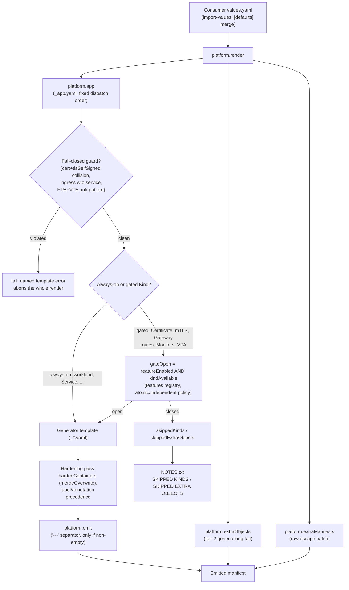

import { Callout } from 'nextra/components'

# Architecture

`platform.render` is the library's single entrypoint. It composes three
layers, always in this order:

```
platform.render
├── platform.app            # tier-1: opinionated "primary app" objects
├── platform.extraObjects   # tier-2: generic, declarative long tail
└── platform.extraManifests # raw escape hatch (verbatim / tpl)
```

**Tier 1** (`platform.app`) is a fixed-order walk over ~20 well-known
resource kinds — Deployment, Service, Ingress, HPA, and so on — each backed
by a purpose-built generator template that knows that Kind's shape.
**Tier 2** (`extraObjects`) is a single generic renderer that can produce
*any* Kind from a declarative spec, for cases tier 1 doesn't model.
**Tier 3** (`extraManifests`) is a raw string/map escape hatch with no
negotiation or labelling at all — the consumer supplies everything.

## Render pipeline



Only workload generators (Deployment/StatefulSet/DaemonSet/CronJob) route
containers through the hardening pass — non-workload generators (Service,
Ingress, RBAC, ...) have no containers to harden and go straight from
generator to `platform.emit`.

## Tier-1 dispatch order

`_app.yaml` walks the enabled features in this fixed order, wrapping each
included generator in `platform.emit`. Three cross-field guards abort the
render outright — named in the table below — if a consumer's values would
otherwise produce a dangling or self-contradictory object.

| # | Object(s) | Gate |
|---|---|---|
| 1 | ConfigMap | `configMap.enabled` |
| 2 | Pre/post-install script ConfigMaps | `jobs.{preInstall,postInstall}.enabled` with a script present |
| 3 | Secret | `secret.enabled` |
| — | **fail-closed** | `certificate.enabled` and `tlsSelfSigned.enabled` name the same Secret |
| 4 | Certificate (cert-manager) | `certificate.enabled` and `gateOpen "Certificate"` |
| 5 | TLS secrets (provided certs) | `ingress.enabled` and `ingress.secrets` |
| 6 | Self-signed TLS | `tlsSelfSigned.enabled` |
| 7 | mTLS (Istio PeerAuthentication + AuthorizationPolicy) | `mtls.enabled` and `gateOpen "PeerAuthentication"` |
| 8 | PersistentVolumeClaim | `persistence.enabled` |
| 9 | Workload (Deployment/StatefulSet/DaemonSet) | always |
| 10 | HorizontalPodAutoscaler | `autoscaling.enabled` |
| — | **fail-closed** | HPA scales CPU/memory *and* `verticalAutoscaling.updateMode != "Off"` |
| 11 | VerticalPodAutoscaler | `verticalAutoscaling.enabled` and `gateOpen "VerticalPodAutoscaler"` |
| 12 | Service | `service.enabled` |
| 13 | Headless Service (managed) | StatefulSet, no explicit `statefulSet.serviceName`, primary Service isn't already headless |
| — | **fail-closed** | `ingress.enabled` and `service.enabled` is false |
| 14 | Ingress | `ingress.enabled` |
| 15 | Gateway API (HTTPRoute/GRPCRoute) | `gatewayApi.enabled` and `gateOpen "HTTPRoute"` |
| 16 | NetworkPolicy | `networkPolicy.enabled` |
| 17 | PodDisruptionBudget | `podDisruptionBudget.enabled` |
| 18 | ResourceQuota | `resourceQuota.enabled` |
| 19 | LimitRange | `limitRange.enabled` |
| 20 | ServiceAccount | `serviceAccount.create` or `serviceAccount.name` |
| 21 | Hook ServiceAccount (`<fullname>-preinstall`) | `serviceAccount.create` and `jobs.preInstall.enabled` |
| 22 | RBAC (Role/RoleBinding) | `rbac.enabled` |
| 23 | ServiceMonitor | `gateOpen "ServiceMonitor"` |
| 24 | PodMonitor | `gateOpen "PodMonitor"` |
| 25 | PrometheusRule | `gateOpen "PrometheusRule"` |
| 26 | CronJob | `cronJob.enabled` |
| 27 | Pre-install hook Job | `jobs.preInstall.enabled` |
| 28 | Post-install hook Job | `jobs.postInstall.enabled` |

CRD-backed rows (4, 7, 11, 15, 23–25) carry a two-part gate: the feature
flag **and** `gateOpen`, which is `featureEnabled AND kindAvailable` against
the capability registry. This is what lets those objects skip cleanly when
the CRD is absent instead of rendering a manifest the cluster would reject —
full mechanics in [Capability catalog](/capability-catalog/).

<Callout type="info">
Row 21's hook ServiceAccount is deliberately named `<fullname>-preinstall`,
distinct from the release ServiceAccount at row 20. See
[Security model](/security-model/) for why a same-named copy would be
dangerous.
</Callout>

## The separator invariant: `platform.emit`

Every object in v2 renders from a single template file, so adjacent YAML
documents need an explicit separator or they merge and produce
duplicate-key errors. `platform.emit` prefixes `---` to each rendered
document, but only if it's non-empty:

```gotemplate
{{- define "platform.emit" -}}
{{- $content := . | trim -}}
{{- if $content }}
---
{{ $content }}
{{- end }}
{{- end -}}
```

The non-empty check matters: a generator that's gated out must not emit a
bare `---` with no body — `extraObjects` and `extraManifests` apply the
same "separator only when non-empty" rule inline.

## The generic renderer: `platform.genericResource`

Tier 2 (`extraObjects`) is backed by one renderer that produces any Kind
from a declarative spec:

```gotemplate
{{ include "platform.genericResource" (dict "root" $top "kind" "Role" "resource" $spec) }}
```

Its contract, in order:

1. **apiVersion resolution.** An explicit `apiVersion` in the spec wins.
   Otherwise it negotiates — `OrDefault` for stable built-ins, strict
   `apiVersionFor` for CRDs. If nothing negotiates, it emits nothing
   (skip-if-absent, same policy as tier 1).
2. **Identity.** Sets `apiVersion`, `kind`, and `metadata.name` — a missing
   `name` is a named error (`extraObjects.<Kind>[].name is required`).
3. **Namespace.** Stamps `metadata.namespace` (defaulting to the release
   namespace) unless the Kind is cluster-scoped or the spec sets
   `clusterScoped: true`.
4. **Labels/annotations.** Applies the standard chart labels, merged with
   any spec-supplied `labels`/`annotations`.
5. **Passthrough.** Every other top-level key — `rules`, `subjects`,
   `roleRef`, `spec`, `data`, `webhooks`, whatever the Kind needs — is
   emitted verbatim. This is what lets one renderer cover an open-ended set
   of Kinds with no per-Kind code.

Two checks run ahead of the render and fail closed rather than drop
objects silently: an unrecognized Kind with no explicit `apiVersion` fails
and points at `extraManifests` as the escape hatch, and a cluster-scoped
Kind is refused unless `allowClusterScopedExtras` opts in. See
[Examples & recipes](/examples-recipes/) for a worked `extraObjects` entry.

## Gate outside `fromYaml`

Capability and enable-flag gating always happens in the *wrapper*, before a
generator template runs at all — never inside it. `fromYaml ""` evaluates
to `{}`, which would serialize to a bogus empty YAML document if a
generator were allowed to run unconditionally and rely on its own content
being empty to suppress output. The wrapper decides "render or not" first;
a generator assumes it's only ever invoked when a document is genuinely
wanted. It's the same reasoning behind `platform.emit`'s non-empty guard
above, applied one level earlier in the pipeline.
