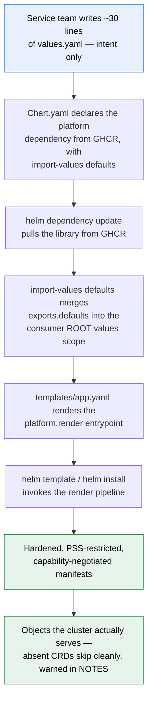
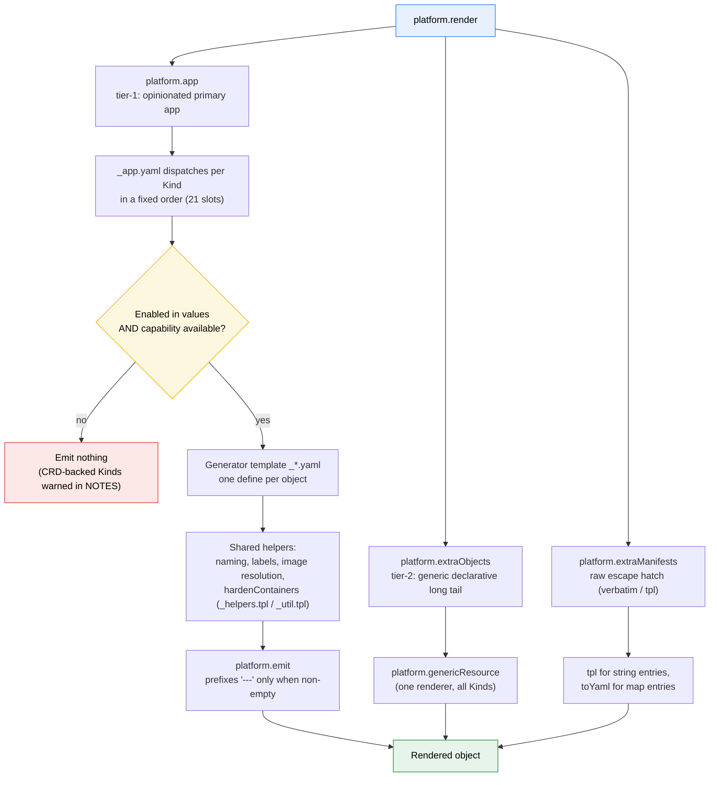
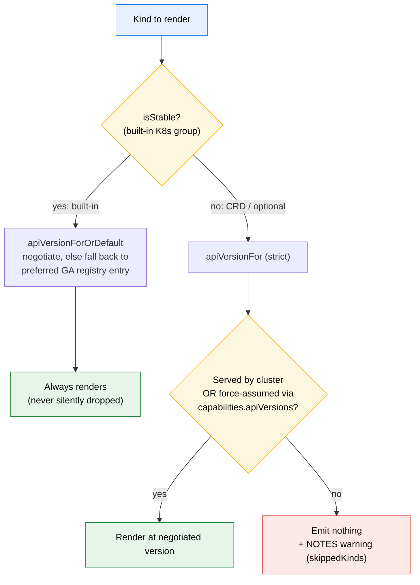

# How It Works

`platform` is a **pure library chart**. It ships no installable templates — a
consumer chart declares it as a dependency and renders *everything* through one
entrypoint, `{{ include "platform.render" . }}`. This page traces the whole path
twice: first the **user journey** (what a service team does), then the **render
pipeline** (what the library does when Helm calls it).

## The user journey

A service team never writes a manifest. They describe intent in ~30 lines of
values, and the library generates hardened, capability-negotiated objects.

The load-bearing step is `import-values: [defaults]`. Without it, the library's
defaults never reach your root values and nothing renders correctly — see
[Getting Started](/docs/getting-started/) for the exact dependency block.

## The render pipeline

`platform.render` (in `_util.tpl`) composes three layers in a fixed order. Tier-1
is the opinionated primary app; tier-2 and the raw layer are escape hatches for
the long tail.

### Tier-1 dispatch order

`platform.app` walks enabled features in a fixed order and includes the matching
generator, each wrapped in `platform.emit`. Order matters — TLS secrets exist
before the workload that mounts them, and hook Jobs land last.

| # | Object(s) | Gate |
|---|---|---|
| 1 | ConfigMap | `configMap.enabled` |
| 2 | Pre/post-install script ConfigMaps | `jobs.{preInstall,postInstall}.enabled` + a `script`/`scriptFile` |
| 3 | Secret | `secret.enabled` |
| 4 | Certificate (cert-manager) | `certificate.enabled` **and** `apiVersionFor "Certificate"` |
| 5 | TLS secrets (provided certs) | `ingress.enabled` + `ingress.secrets` |
| 6 | Self-signed TLS | `tlsSelfSigned.enabled` |
| 7 | mTLS (Istio PeerAuthentication/AuthorizationPolicy) | `mtls.enabled` **and** `apiVersionFor "PeerAuthentication"` |
| 8 | PersistentVolumeClaim | `persistence.enabled` |
| 9 | Workload (Deployment/StatefulSet/DaemonSet) | always |
| 10 | HorizontalPodAutoscaler | `autoscaling.enabled` |
| 11 | Service | `service.enabled` |
| 12 | Ingress | `ingress.enabled` |
| 13 | Gateway API (HTTPRoute/GRPCRoute) | `gatewayApi.enabled` **and** `apiVersionFor "HTTPRoute"` |
| 14 | NetworkPolicy | `networkPolicy.enabled` |
| 15 | PodDisruptionBudget | `podDisruptionBudget.enabled` |
| 16 | ServiceAccount | `serviceAccount.create` or `serviceAccount.name` |
| 17 | ServiceMonitor | `serviceMonitor.enabled` **and** `apiVersionFor "ServiceMonitor"` |
| 18 | PodMonitor | `podMonitor.enabled` **and** `apiVersionFor "PodMonitor"` |
| 19 | CronJob | `cronJob.enabled` |
| 20 | Pre-install hook Job | `jobs.preInstall.enabled` |
| 21 | Post-install hook Job | `jobs.postInstall.enabled` |

The two-part gate on CRD-backed objects (Certificate, mTLS, Gateway routes,
ServiceMonitor, PodMonitor) — the feature flag **and** a successful capability
negotiation — is what lets those objects skip cleanly when the CRD is absent.

## Capability negotiation

For each Kind, the library decides *which* `apiVersion` to emit — or whether to
emit at all — by class. Built-ins must always render (a plain `helm template`
with no cluster still needs a Deployment); CRDs must never render when their API
is absent (a deploy must not conflict).

Under bare `helm template` (no cluster), Helm's API discovery is minimal — it
reports neither the full built-in group set nor any CRD. That is exactly why
built-ins use `OrDefault` (fall back to preferred GA) and CRDs use strict
`apiVersionFor` (skip when absent). To render CRD-backed objects offline, in CI,
**force-assume** their groups via `capabilities.apiVersions` — full detail and
the exact-string `--api-versions` gotcha live in the
[Capability Catalog](/docs/capability-catalog/).

## Where to go next

- [Capability Catalog](/docs/capability-catalog/) — the full Kind → apiVersion registry.
- [Conventions & Tricks](/docs/conventions-and-tricks/) — the Helm idioms, primitives, and hacks the library leans on.
- [Values Reference](/docs/values-reference/) — every configurable key.
- [Security Model](/docs/security-model/) — hardening defaults and trust boundaries.
